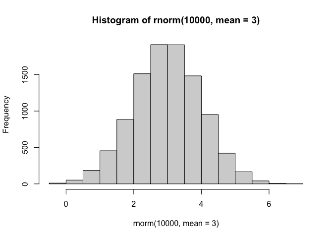
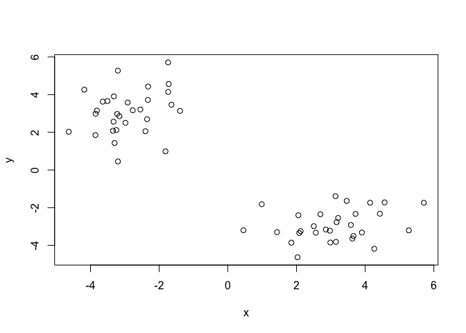
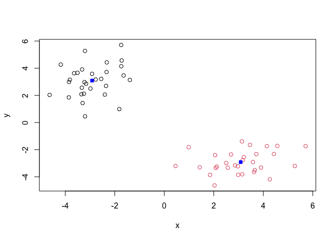
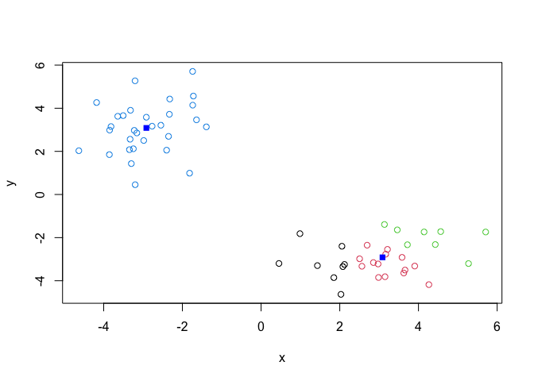
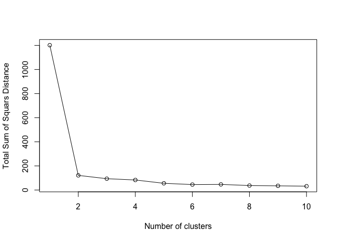
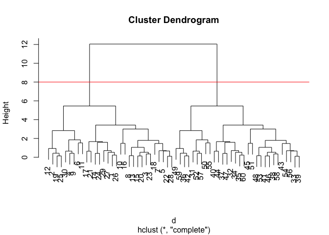
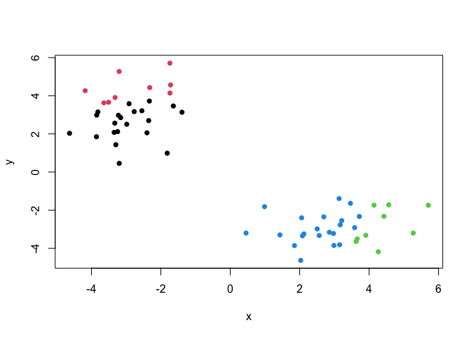
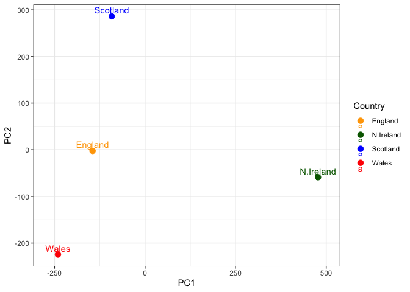

# Class 7: Machine Learning 1
Sofia Jaravata (A19160915)

- [Background](#background)
- [K-means clustering](#k-means-clustering)
- [Hierarchical Clustering](#hierarchical-clustering)
- [Principal Component Analysis
  (PCA)](#principal-component-analysis-pca)
  - [Analysis of UK food data](#analysis-of-uk-food-data)
- [Data Import](#data-import)
  - [\> Q1. How many rows and columns are in your new data frame named
    x? What R functions could you use to answer this
    questions?](#-q1-how-many-rows-and-columns-are-in-your-new-data-frame-named-x-what-r-functions-could-you-use-to-answer-this-questions)
- [Checking your data](#checking-your-data)
  - [\> Q2. Which approach to solving the ‘row-names problem’ mentioned
    above do you prefer and why? Is one approach more robust than
    another under certain
    circumstances?\*\*](#-q2-which-approach-to-solving-the-row-names-problem-mentioned-above-do-you-prefer-and-why-is-one-approach-more-robust-than-another-under-certain-circumstances)
- [Spotting major differences and
  trends](#spotting-major-differences-and-trends)
  - [\> Q3. Changing what optional argument in the above barplot()
    function results in the following
    plot?](#-q3-changing-what-optional-argument-in-the-above-barplot-function-results-in-the-following-plot)
- [Tidy Data](#tidy-data)
  - [Side-note: Using ggplot and the need for “tidy” data
    (Optional)](#side-note-using-ggplot-and-the-need-for-tidy-data-optional)
- [Grouped Bar Plot](#grouped-bar-plot)
  - [\> Q4. Changing what optional argument in the above ggplot() code
    results in a stacked barplot
    figure?](#-q4-changing-what-optional-argument-in-the-above-ggplot-code-results-in-a-stacked-barplot-figure)
- [Pairs plots and heatmaps](#pairs-plots-and-heatmaps)
  - [\> Q5. We can use the pairs() function to generate all pairwise
    plots for our countries. Can you make sense of the following code
    and resulting figure? What does it mean if a given point lies on the
    diagonal for a given
    plot?](#-q5-we-can-use-the-pairs-function-to-generate-all-pairwise-plots-for-our-countries-can-you-make-sense-of-the-following-code-and-resulting-figure-what-does-it-mean-if-a-given-point-lies-on-the-diagonal-for-a-given-plot)
  - [\> Q6. Based on the pairs and heatmap figures, which countries
    cluster together and what does this suggest about their food
    consumption patterns? Can you easily tell what the main differences
    between N. Ireland and the other countries of the UK in terms of
    this
    data-set?](#-q6-based-on-the-pairs-and-heatmap-figures-which-countries-cluster-together-and-what-does-this-suggest-about-their-food-consumption-patterns-can-you-easily-tell-what-the-main-differences-between-n-ireland-and-the-other-countries-of-the-uk-in-terms-of-this-data-set)
- [PCA to the rescue](#pca-to-the-rescue)
  - [\>Q7. Complete the code below to generate a plot of PC1 vs PC2. The
    second line adds text labels over the data
    points.](#q7-complete-the-code-below-to-generate-a-plot-of-pc1-vs-pc2-the-second-line-adds-text-labels-over-the-data-points)
  - [\> Q8. Customize your plot so that the colors of the country names
    match the colors in our UK and Ireland map and table at start of
    this
    document.](#-q8-customize-your-plot-so-that-the-colors-of-the-country-names-match-the-colors-in-our-uk-and-ireland-map-and-table-at-start-of-this-document)
- [Scree plot with ggplot](#scree-plot-with-ggplot)
- [Digging deeper (variable
  loadings)](#digging-deeper-variable-loadings)
  - [\> Q9. Generate a similar ‘loadings plot’ for PC2. What two food
    groups feature prominantely and what does PC2 maninly tell us
    about?](#-q9-generate-a-similar-loadings-plot-for-pc2-what-two-food-groups-feature-prominantely-and-what-does-pc2-maninly-tell-us-about)

## Background

Today we will explore some core machine learning methods that are very
popular in bioinformatics. These include **clustering** and
**dimensionality reduction**.

## K-means clustering

The main function in “base” R for K-means clustering is called
`k-means()`

Before we go too deep let’s make up some “simple” data that we can
cluster and know if we are getting a good answer or not. To do this we
can us the `rnorm()` function:

``` r
hist(rnorm(10000, mean =3))
```



``` r
x <- c( rnorm(30, -3), rnorm(30, +3) )
x
```

     [1] -2.7687652 -3.3185536 -2.9821464 -1.7207847 -3.8553590 -1.7398441
     [7] -3.2976588 -3.8137798 -1.7372894 -3.1994210 -3.2025084 -4.1802880
    [13] -3.8489633 -1.6414290 -3.1573336 -1.8168737 -2.3517857 -4.6316108
    [19] -3.5047944 -3.2227856 -2.4004918 -3.3451437 -3.3280524 -1.3906162
    [25] -3.6422978 -2.5464339 -2.9160258 -3.2458943 -2.3306343 -2.3211255
    [31]  4.4277948  3.7193072  2.1200461  3.5829353  3.2124654  3.6263383
    [37]  3.1357575  2.5630217  2.0792501  2.0553092  2.9733369  3.6581580
    [43]  2.0299803  2.6955157  0.9880910  2.8546120  3.4620909  2.9851584
    [49]  4.2643575  5.2719694  0.4540685  4.1425692  3.1499583  1.4318612
    [55]  5.7082534  1.8495937  4.5652718  2.5040430  3.9051244  3.1675161

``` r
rev(x)
```

     [1]  3.1675161  3.9051244  2.5040430  4.5652718  1.8495937  5.7082534
     [7]  1.4318612  3.1499583  4.1425692  0.4540685  5.2719694  4.2643575
    [13]  2.9851584  3.4620909  2.8546120  0.9880910  2.6955157  2.0299803
    [19]  3.6581580  2.9733369  2.0553092  2.0792501  2.5630217  3.1357575
    [25]  3.6263383  3.2124654  3.5829353  2.1200461  3.7193072  4.4277948
    [31] -2.3211255 -2.3306343 -3.2458943 -2.9160258 -2.5464339 -3.6422978
    [37] -1.3906162 -3.3280524 -3.3451437 -2.4004918 -3.2227856 -3.5047944
    [43] -4.6316108 -2.3517857 -1.8168737 -3.1573336 -1.6414290 -3.8489633
    [49] -4.1802880 -3.2025084 -3.1994210 -1.7372894 -3.8137798 -3.2976588
    [55] -1.7398441 -3.8553590 -1.7207847 -2.9821464 -3.3185536 -2.7687652

``` r
z <- cbind(x=x, y=rev(x))
z
```

                   x          y
     [1,] -2.7687652  3.1675161
     [2,] -3.3185536  3.9051244
     [3,] -2.9821464  2.5040430
     [4,] -1.7207847  4.5652718
     [5,] -3.8553590  1.8495937
     [6,] -1.7398441  5.7082534
     [7,] -3.2976588  1.4318612
     [8,] -3.8137798  3.1499583
     [9,] -1.7372894  4.1425692
    [10,] -3.1994210  0.4540685
    [11,] -3.2025084  5.2719694
    [12,] -4.1802880  4.2643575
    [13,] -3.8489633  2.9851584
    [14,] -1.6414290  3.4620909
    [15,] -3.1573336  2.8546120
    [16,] -1.8168737  0.9880910
    [17,] -2.3517857  2.6955157
    [18,] -4.6316108  2.0299803
    [19,] -3.5047944  3.6581580
    [20,] -3.2227856  2.9733369
    [21,] -2.4004918  2.0553092
    [22,] -3.3451437  2.0792501
    [23,] -3.3280524  2.5630217
    [24,] -1.3906162  3.1357575
    [25,] -3.6422978  3.6263383
    [26,] -2.5464339  3.2124654
    [27,] -2.9160258  3.5829353
    [28,] -3.2458943  2.1200461
    [29,] -2.3306343  3.7193072
    [30,] -2.3211255  4.4277948
    [31,]  4.4277948 -2.3211255
    [32,]  3.7193072 -2.3306343
    [33,]  2.1200461 -3.2458943
    [34,]  3.5829353 -2.9160258
    [35,]  3.2124654 -2.5464339
    [36,]  3.6263383 -3.6422978
    [37,]  3.1357575 -1.3906162
    [38,]  2.5630217 -3.3280524
    [39,]  2.0792501 -3.3451437
    [40,]  2.0553092 -2.4004918
    [41,]  2.9733369 -3.2227856
    [42,]  3.6581580 -3.5047944
    [43,]  2.0299803 -4.6316108
    [44,]  2.6955157 -2.3517857
    [45,]  0.9880910 -1.8168737
    [46,]  2.8546120 -3.1573336
    [47,]  3.4620909 -1.6414290
    [48,]  2.9851584 -3.8489633
    [49,]  4.2643575 -4.1802880
    [50,]  5.2719694 -3.2025084
    [51,]  0.4540685 -3.1994210
    [52,]  4.1425692 -1.7372894
    [53,]  3.1499583 -3.8137798
    [54,]  1.4318612 -3.2976588
    [55,]  5.7082534 -1.7398441
    [56,]  1.8495937 -3.8553590
    [57,]  4.5652718 -1.7207847
    [58,]  2.5040430 -2.9821464
    [59,]  3.9051244 -3.3185536
    [60,]  3.1675161 -2.7687652

``` r
plot(z)
```



Now we can run `kmeans()` on this input `z` and see what the results
look like.

``` r
km <- kmeans(z, centers = 2)
km
```

    K-means clustering with 2 clusters of sizes 30, 30

    Cluster means:
              x         y
    1 -2.915290  3.086125
    2  3.086125 -2.915290

    Clustering vector:
     [1] 1 1 1 1 1 1 1 1 1 1 1 1 1 1 1 1 1 1 1 1 1 1 1 1 1 1 1 1 1 1 2 2 2 2 2 2 2 2
    [39] 2 2 2 2 2 2 2 2 2 2 2 2 2 2 2 2 2 2 2 2 2 2

    Within cluster sum of squares by cluster:
    [1] 60.6794 60.6794
     (between_SS / total_SS =  89.9 %)

    Available components:

    [1] "cluster"      "centers"      "totss"        "withinss"     "tot.withinss"
    [6] "betweenss"    "size"         "iter"         "ifault"      

``` r
attributes (km)
```

    $names
    [1] "cluster"      "centers"      "totss"        "withinss"     "tot.withinss"
    [6] "betweenss"    "size"         "iter"         "ifault"      

    $class
    [1] "kmeans"

> How many points are in each cluster?

``` r
km$size
```

    [1] 30 30

> What “component of your result object” details cluster
> assignment/membership?

``` r
km$cluster
```

     [1] 1 1 1 1 1 1 1 1 1 1 1 1 1 1 1 1 1 1 1 1 1 1 1 1 1 1 1 1 1 1 2 2 2 2 2 2 2 2
    [39] 2 2 2 2 2 2 2 2 2 2 2 2 2 2 2 2 2 2 2 2 2 2

> What “component of your result object” details cluster center?

``` r
km$centers
```

              x         y
    1 -2.915290  3.086125
    2  3.086125 -2.915290

> Q: Plot `z` colored by the kmeans cluster assignment and add cluster
> centers as blue points

``` r
plot(z, col = km$cluster)
points(km$centers, col = "blue", pch =15)
```



> Q. Run a K-means clustering and plot the results asking for 4 clusters
> (k=4)?

``` r
km4 <- (kmeans (z, centers = 4))
plot(z, col = km4$cluster)
points(km$centers, col = "blue", pch =15)
```



> **Note** You need to tell K-means the number of clusters(i.e. set
> `centers=2`) !!

One approach is to try different values for `centers` and then pick the
best…

``` r
ans <- NULL 
for(i in 1:10){
km <-kmeans(z, centers = i)
ans <- c(ans, km$tot.withinss)

}

plot(ans, typ = "o",
     xlab = "Number of clusters",
     ylab = "Total Sum of Squars Distance")
```



## Hierarchical Clustering

The main function in “base” R for Hierarchical Clustering is called
`hclust()`

This function does not take your “Raw” data for clustering. You must
first build a “distance” matrix from your data and pass this as input to
`hclust()`

``` r
d <- dist(z)
hc <- hclust(d)
hc
```


    Call:
    hclust(d = d)

    Cluster method   : complete 
    Distance         : euclidean 
    Number of objects: 60 

There is a bespoke `plot()` method for `hclust()` result objects.

``` r
plot(hc)
abline(h=8, col = "red")
```



Once we have our `hclust` object (our “tree” of “cluster dendrogram”),
we can *“cut”* the tree to reveal the clustering pattern with `cutree`.

``` r
cutree(hc, h=8)
```

     [1] 1 1 1 1 1 1 1 1 1 1 1 1 1 1 1 1 1 1 1 1 1 1 1 1 1 1 1 1 1 1 2 2 2 2 2 2 2 2
    [39] 2 2 2 2 2 2 2 2 2 2 2 2 2 2 2 2 2 2 2 2 2 2

``` r
cutree(hc, k=4)
```

     [1] 1 2 1 2 1 2 1 1 2 1 2 2 1 1 1 1 1 1 2 1 1 1 1 1 2 1 1 1 1 2 3 4 4 4 4 3 4 4
    [39] 4 4 4 3 4 4 4 4 4 4 3 3 4 3 4 4 3 4 3 4 3 4

> Q. Make a plot of `z` with your hclust results (e. colored by cluster
> membership)

``` r
grps <- cutree(hc, k=4)
plot(z, col = grps, pch = 16)
```



``` r
#points(hc$cluster, col = "blue", pch =15) 
```

## Principal Component Analysis (PCA)

PCA is a dimensionality reduction method that is popular for revealing
patterns in complex datasets.

### Analysis of UK food data

Let’s look at some data on the eating habits of folks from the UK to see
if there are patterns and trends that have some regions being distinct
from others.

## Data Import

The data is made available in CSV format so we can use the `read.csv()`
function for import to R.

``` r
url <- "https://tinyurl.com/UK-foods"
x <- read.csv(url)
x
```

                         X England Wales Scotland N.Ireland
    1               Cheese     105   103      103        66
    2        Carcass_meat      245   227      242       267
    3          Other_meat      685   803      750       586
    4                 Fish     147   160      122        93
    5       Fats_and_oils      193   235      184       209
    6               Sugars     156   175      147       139
    7      Fresh_potatoes      720   874      566      1033
    8           Fresh_Veg      253   265      171       143
    9           Other_Veg      488   570      418       355
    10 Processed_potatoes      198   203      220       187
    11      Processed_Veg      360   365      337       334
    12        Fresh_fruit     1102  1137      957       674
    13            Cereals     1472  1582     1462      1494
    14           Beverages      57    73       53        47
    15        Soft_drinks     1374  1256     1572      1506
    16   Alcoholic_drinks      375   475      458       135
    17      Confectionery       54    64       62        41

### \> Q1. How many rows and columns are in your new data frame named x? What R functions could you use to answer this questions?

``` r
ncol(x)
```

    [1] 5

``` r
nrow(x)
```

    [1] 17

``` r
dim(x)
```

    [1] 17  5

There are 17 rows and 4 columns. We could use ncol() to view the number
of both rows and columns, or nrow() and dim() to answer this question.

## Checking your data

``` r
head(x)
```

                   X England Wales Scotland N.Ireland
    1         Cheese     105   103      103        66
    2  Carcass_meat      245   227      242       267
    3    Other_meat      685   803      750       586
    4           Fish     147   160      122        93
    5 Fats_and_oils      193   235      184       209
    6         Sugars     156   175      147       139

``` r
rownames(x) <- x[,1]
x <- x[,-1]
head(x)
```

                   England Wales Scotland N.Ireland
    Cheese             105   103      103        66
    Carcass_meat       245   227      242       267
    Other_meat         685   803      750       586
    Fish               147   160      122        93
    Fats_and_oils      193   235      184       209
    Sugars             156   175      147       139

``` r
dim(x)
```

    [1] 17  4

``` r
x <- read.csv(url, row.names=1)
head(x)
```

                   England Wales Scotland N.Ireland
    Cheese             105   103      103        66
    Carcass_meat       245   227      242       267
    Other_meat         685   803      750       586
    Fish               147   160      122        93
    Fats_and_oils      193   235      184       209
    Sugars             156   175      147       139

### \> Q2. Which approach to solving the ‘row-names problem’ mentioned above do you prefer and why? Is one approach more robust than another under certain circumstances?\*\*

I prefer the second approach of read.csv(url, row.names=1) because it
faster and more robust. Every time you run the first code, a column is
lost, which does not happen in the second approach.

## Spotting major differences and trends

*Make some plots to help make sense of obvious trends…*

``` r
#Using base R
barplot(as.matrix(x), beside=T, col=rainbow(nrow(x)))
```


### \> Q3. Changing what optional argument in the above barplot() function results in the following plot?

``` r
barplot(as.matrix(x), beside=FALSE, col=rainbow(nrow(x)))
```


Changing “beside = T” to “beside = FALSE” would result in the following
plot.

## Tidy Data

### Side-note: Using ggplot and the need for “tidy” data (Optional)

To convert this to “long” format we want one row per measurement -
maximizes rows (17x4=68), minimizes columns (with a singe Consumption
measurement value per Country). We will do tidying with the
pivot_longer() function from the tidyr package:

``` r
library(tidyr)

# Convert data to long format for ggplot with `pivot_longer()`
x_long <- x |> 
          tibble::rownames_to_column("Food") |> 
          pivot_longer(cols = -Food, 
                       names_to = "Country", 
                       values_to = "Consumption")

dim(x_long)
```

    [1] 68  3

``` r
head(x_long)
```

    # A tibble: 6 × 3
      Food            Country   Consumption
      <chr>           <chr>           <int>
    1 "Cheese"        England           105
    2 "Cheese"        Wales             103
    3 "Cheese"        Scotland          103
    4 "Cheese"        N.Ireland          66
    5 "Carcass_meat " England           245
    6 "Carcass_meat " Wales             227

## Grouped Bar Plot

``` r
# Create grouped bar plot
library(ggplot2)
```

    Warning: package 'ggplot2' was built under R version 4.5.2

``` r
ggplot(x_long) +
  aes(x = Country, y = Consumption, fill = Food) +
  geom_col(position = "dodge") +
  theme_bw()
```


### \> Q4. Changing what optional argument in the above ggplot() code results in a stacked barplot figure?

``` r
# Create grouped bar plot
library(ggplot2)
ggplot(x_long) +
  aes(x = Country, y = Consumption, fill = Food) +
  geom_col(position = "stack") +
  theme_bw()
```


Changing the position in the geom_col() function from “dodge” to “stack”
will result in the stacked barplot figure.

## Pairs plots and heatmaps

### \> Q5. We can use the pairs() function to generate all pairwise plots for our countries. Can you make sense of the following code and resulting figure? What does it mean if a given point lies on the diagonal for a given plot?

``` r
pairs(x, col=rainbow(nrow(x)), pch=16)
```


The following code results in matrices of different scatterplots with
different x and y axes combinations of the countries: England, Wales,
Scotland, and N. Ireland. For instance, in the first row, England is the
y-axis for the 3 plots to the right, with Wales as the x-axis for the
first plot (1st row, 2nd column), Scotland as the x-axis for the second
plot (1st row, 3rd column), and N. Ireland as the x-axis for the third
plot (1st row, 4rd column). A given point on the diagonal for a given
plot indicates the equak amount of food being consumed by people from
both countries.

**heatmap**

``` r
library(pheatmap)

pheatmap( as.matrix(x) )
```


### \> Q6. Based on the pairs and heatmap figures, which countries cluster together and what does this suggest about their food consumption patterns? Can you easily tell what the main differences between N. Ireland and the other countries of the UK in terms of this data-set?

Based on the pairs and heatmap figures, countries England and Walse
cluster together. This suggests that their food consumption patterns are
similar based on the similar colors in the heatmaps and consistent
diagonals in the scatterplots. One difference between N. Ireland and the
other countries of the UK in terms of this data-set is that N. Ireland
has less data points on the right of the diagonal in the scatterplots
when paired with other countries, and in the heatmap, N. Ireland
consumes less of alcoholic drinks, fish, vegetables, fruit, and cheese
but more fresh potatoes than the other countries.

> **Key-point**: Even relatively small datasets can prove challenging to
> interpret.

## PCA to the rescue

The main function in “base” R for PCA is called `prcomp()`. This
function wants the “observations” to be rows and the “variables” to be
columns. So here we need to take the transpose of our x input object.

``` r
t(x)
```

              Cheese Carcass_meat  Other_meat  Fish Fats_and_oils  Sugars
    England      105           245         685  147            193    156
    Wales        103           227         803  160            235    175
    Scotland     103           242         750  122            184    147
    N.Ireland     66           267         586   93            209    139
              Fresh_potatoes  Fresh_Veg  Other_Veg  Processed_potatoes 
    England               720        253        488                 198
    Wales                 874        265        570                 203
    Scotland              566        171        418                 220
    N.Ireland            1033        143        355                 187
              Processed_Veg  Fresh_fruit  Cereals  Beverages Soft_drinks 
    England              360         1102     1472        57         1374
    Wales                365         1137     1582        73         1256
    Scotland             337          957     1462        53         1572
    N.Ireland            334          674     1494        47         1506
              Alcoholic_drinks  Confectionery 
    England                 375             54
    Wales                   475             64
    Scotland                458             62
    N.Ireland               135             41

The main function in “base R” for PCA is called `prompt()`. This
function wants the observations to be rows and the variables to be
columns.

``` r
pca <- prcomp(t(x))
summary(pca)
```

    Importance of components:
                                PC1      PC2      PC3       PC4
    Standard deviation     324.1502 212.7478 73.87622 2.921e-14
    Proportion of Variance   0.6744   0.2905  0.03503 0.000e+00
    Cumulative Proportion    0.6744   0.9650  1.00000 1.000e+00

The returned `pca` object has components that we can use to make our
main result figures:

``` r
attributes(pca)
```

    $names
    [1] "sdev"     "rotation" "center"   "scale"    "x"       

    $class
    [1] "prcomp"

The main result figure from this analysis is called a **“PC score
plot”** or “ordination plot” or “PC plot” or “PC1 vs PC2” plot.

``` r
pca$x
```

                     PC1         PC2        PC3           PC4
    England   -144.99315   -2.532999 105.768945 -9.152022e-15
    Wales     -240.52915 -224.646925 -56.475555  5.560040e-13
    Scotland   -91.86934  286.081786 -44.415495 -6.638419e-13
    N.Ireland  477.39164  -58.901862  -4.877895  1.329771e-13

### \>Q7. Complete the code below to generate a plot of PC1 vs PC2. The second line adds text labels over the data points.

``` r
# Create a data frame for plotting
df <- as.data.frame(pca$x)
df$Country <- rownames(df)

# Plot PC1 vs PC2 with ggplot
ggplot(pca$x) +
  aes(x = PC1, y = PC2, label = rownames(pca$x)) +
  geom_point(size = 3) +
  geom_text(vjust = -0.5) +
  xlim(-270, 500) +
  xlab("PC1") +
  ylab("PC2") +
  theme_bw()
```


### \> Q8. Customize your plot so that the colors of the country names match the colors in our UK and Ireland map and table at start of this document.

``` r
df <- as.data.frame(pca$x)
df$Country <- rownames(df)

# Plot PC1 vs PC2 with ggplot
ggplot(df, aes(x = PC1, y = PC2, label = Country, color = Country)) +
  geom_point(size = 3) +
  geom_text(vjust = -0.5) +
  scale_color_manual(values = c(
    "England"  = "orange",
    "Scotland" = "blue",
    "Wales"    = "red",
    "N.Ireland"  = "darkgreen"
  )) +
  xlim(-270, 500) +
  xlab("PC1") +
  ylab("PC2") +
  theme_bw()
```



> Below we can use the square of pca\$sdev , which stands for “standard
> deviation”, to calculate how much variation in the original data each
> PC accounts for.

``` r
v <- round( pca$sdev^2/sum(pca$sdev^2) * 100 )
v
```

    [1] 67 29  4  0

``` r
## or the second row here...
z <- summary(pca)
z$importance
```

                                 PC1       PC2      PC3          PC4
    Standard deviation     324.15019 212.74780 73.87622 2.921348e-14
    Proportion of Variance   0.67444   0.29052  0.03503 0.000000e+00
    Cumulative Proportion    0.67444   0.96497  1.00000 1.000000e+00

## Scree plot with ggplot

``` r
# Create scree plot with ggplot
variance_df <- data.frame(
  PC = factor(paste0("PC", 1:length(v)), levels = paste0("PC", 1:length(v))),
  Variance = v
)

ggplot(variance_df) +
  aes(x = PC, y = Variance) +
  geom_col(fill = "steelblue") +
  xlab("Principal Component") +
  ylab("Percent Variation") +
  theme_bw() +
  theme(axis.text.x = element_text(angle = 0))
```


## Digging deeper (variable loadings)

``` r
## Lets focus on PC1 as it accounts for > 90% of variance 
ggplot(pca$rotation) +
  aes(x = PC1, 
      y = reorder(rownames(pca$rotation), PC1)) +
  geom_col(fill = "steelblue") +
  xlab("PC1 Loading Score") +
  ylab("") +
  theme_bw() +
  theme(axis.text.y = element_text(size = 9))
```


### \> Q9. Generate a similar ‘loadings plot’ for PC2. What two food groups feature prominantely and what does PC2 maninly tell us about?

``` r
ggplot(pca$rotation) +
  aes(x = PC2, 
      y = reorder(rownames(pca$rotation), PC2)) +
  geom_col(fill = "steelblue") +
  xlab("PC2 Loading Score") +
  ylab("") +
  theme_bw() +
  theme(axis.text.y = element_text(size = 9))
```


The two food groups “fresh potatoes” and “soft drinks” are the main
variables that contribute most and are featured prominently in PC2. PC2
mainly tells us that the observation, soft_drinks, with the largest
positive loading score, effectively “pushes” N.Ireland to the right
positive side of the plot, while fresh potatoes is the main observation
(food) with a high negative score that pushes the other countries to the
left side of the plot.

> Key-Point: PCA has the awesome ability to effectively reduce the
> dimensionality of our data set down from 17 to 2, allowing us to
> assert (using our figures above) that countries England, Wales and
> Scotland are ‘similar’ with Northern Ireland being different in some
> way. Furthermore, digging deeper into the loadings we were able to
> associate certain food types with each cluster of countries. This is
> super useful!
