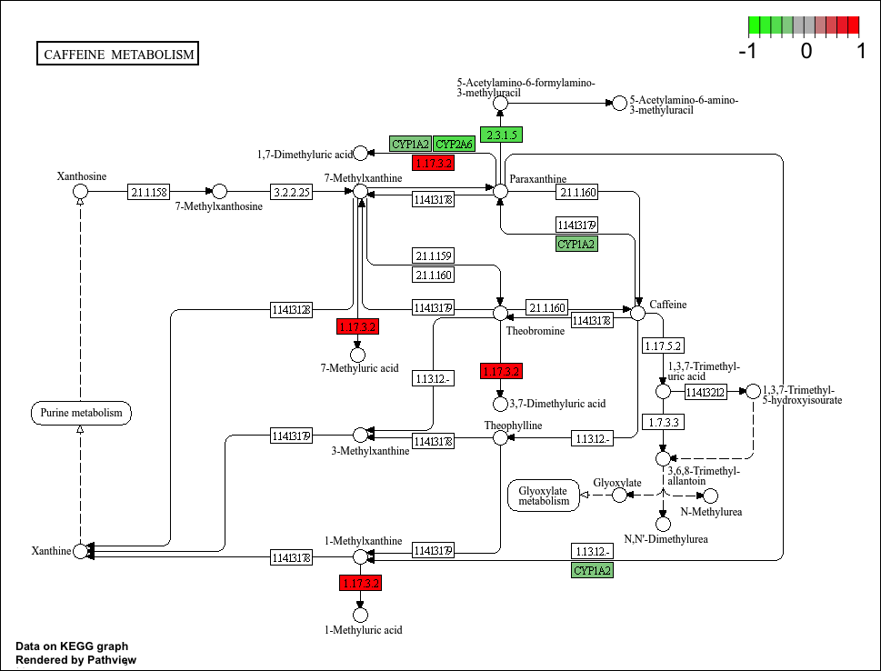

# 1. Background
Today we're going to do an RNA-seq analysis of a data set on the common glucocorticoid steroid dexamethasone (dex), and we'll use DESeq for this analysis. 

# 3. Data Import: Import countData and colData
Let's read the`count` data and `metadata` about this experiment setup from the supplied CSV files: 

```{r}
# Complete the missing code
counts <- read.csv("airway_scaledcounts.csv", row.names=1)
metadata <-  read.csv("airway_metadata.csv")
```

Have a wee peek: 
```{r}
head(counts)
```
and the metadata that tells us what is actually in the columns of our `counts` object: 

```{r}
head(metadata)
```
### Q1. 
> How many genes are in this dataset? 

```{r}
nrow(counts)
```

There are `r nrow(counts)` genes are in this dataset. 

### Q2. 
> How many `control` cell lines do we have? 

```{r}
table(metadata$dex)
```

There are 4 'control' cell lines. 

# 4. Toy differential gene expression

- Find the "control" columns in our `counts` object
- Extract just the "control" column values for all genes
- Calculate the average value per gene in these "control" columns 

```{r}
control.inds <- metadata$dex == "control"
control.counts <- counts[ ,control.inds]
control.mean <- rowMeans(control.counts)

head(control.mean)
```

### Q3. 
> How would you make the above code in either approach more robust? Is there a function that could help here? 

To make the above code more robust, avoid hard-coded column positions or manual calculations by dynamic column lookups and vectorizations. A function that could help is `rowSums` or `rowMeans`.

```{r}
control.mean <- rowMeans(counts[, metadata$dex == "control"])
treated.mean <- rowMeans(counts[, metadata$dex == "treated"])
```

> Now do the same for the "treated" columns. 

```{r}
metadata$dex == "treated" 

```


### Q4. 
> Follow the same procedure for the treated samples (i.e. calculate the mean per gene across drug treated samples and assign to a labeled vector called treated.mean)

```{r}
treated.inds <- metadata$dex == "treated"
treated.counts <- counts[ ,treated.inds]
treated.mean <- rowMeans( treated.counts )
head(treated.mean)

```
or: 
```{r}
treated.mean <- rowMeans( counts[ ,metadata$dex =="treated",] )
head(treated.mean)
```

For book-keeping let's store these together as a new object called `meancounts`
```{r}
meancounts <- data.frame(control.mean, treated.mean)
head(meancounts)
```

### Q5 (a). 
> Create a scatter plot showing the mean of the treated samples against the mean of the control samples. (Make a plot of `control.mean` vs. `treated.mean`) 

```{r}
plot(meancounts[,1],meancounts[,2], xlab="Control", ylab="Treated")
```

### Q5 (b).
> You could also use the ggplot2 package to make this figure producing the plot below. What geom_?() function would you use for this plot? 

I would use the `geom_point()` function for this plot:  

```{r, message = FALSE}
library(ggplot2)
ggplot(meancounts, aes(x = control.mean, y = treated.mean)) +
  geom_point(alpha = 0.5)
```

***Our count data is highly skewed and when we see a pattern like this plot it SCREAMS log transform me!***

### Q6. 
> Try plotting both axes on a log scale. What is the argument to plot() that allows you to do this? 

The argument `log = "xy"` allows us to do this: 

```{r}
plot(meancounts, log = "xy")
```
***We most often used log2 transform this kind of data bioinformatics because it makes my brain hurt less (makes data interpretation easier)***

```{r}
# Treated / Control

log2(20/20)
log2(40/20)
log2(20/40)
log2(80/20)
```
We call this little fraction the **"log2 fold change"** as it tells us how much more or less gene expression we have in units of doubling, etc.

Let's calculate the log2 fold change for our `treated.mean` and `control.mean` counts and call this `log2fc`. 
```{r}
meancounts$log2fc <- log2(meancounts$treated.mean 
                          / meancounts$control.mean)
head(meancounts)
```

*A common "rule of thumb" threshold for calling a gene "up regulated" or "down regulated" is a log2 fold-change value of +2 or -2 (or greater)*

```{r}
zero.vals <- which(meancounts[,1:2]==0, arr.ind=TRUE)

to.rm <- unique(zero.vals[,1])
mycounts <- meancounts[-to.rm,]
head(mycounts)
```

### Q7. 
> What is the purpose of the arr.ind argument in the which() function call above? Why would we then take the first column of the output and need to call the unique() function?

The `arr.ind` argument lets `which()` return both row and column indices for all zero values. We can then identify which gene rows contain zeros by taking the first column and using unique() so that the same row is not counted twice if it has zeros in both samples. 

```{r}
up.ind <- mycounts$log2fc > 2
down.ind <- mycounts$log2fc < (-2)
```

### Q8. 
> Using the up.ind vector above can you determine how many up regulated genes we have at the greater than 2 fc level? 

```{r}
paste("Up:", sum(up.ind))
```


We have 250 up regulated genes


### Q9. 
> Using the down.ind vector above can you determine how many down regulated genes we have at the greater than 2 fc level? 

```{r}
paste("Down:", sum(down.ind))
```

We have 367 down regulated genes 


### Q10. 
> Do you trust these results? Why or why not?

No, I do not trust these results because they are based on raw fold-change cutoffs only, ignoring variation between replicates, statistical significance, and that low-count genes can produce exaggerated fold changes. 


# 5. Setting up for DESeq
Let's do this analyze properly and not forget about the significance of the differences.

For this we will use the **DESeq2** package

```{r, message = FALSE}
library(DESeq2)
```

To run a DESeq analysis we need at least two inputs:

- `countData` i.e. are gene counts across different experiments
- `colData` i.e. our metadata about those count columns 

## Importing data

```{r}
dds <- DESeqDataSetFromMatrix(countData = counts, 
                              colData = metadata, 
                              design =~ dex)
dds
```


# 6. Principal Component Analysis (PCA)

```{r, message = FALSE}
library(DESeq2)

vsd <- vst(dds, blind = FALSE)
pcaData <- plotPCA(vsd, intgroup = "dex", returnData = TRUE)

# Calculate percent variance per PC for the plot axis labelsw
percentVar <- round(100 * attr(pcaData, "percentVar"))

# Build the PCA plot from scratch using the ggplot2 package
library(ggplot2)

ggplot(pcaData, aes(PC1, PC2, color = dex)) +
  geom_point(size = 4) +
  xlab(paste0("PC1: ", percentVar[1], "% variance")) +
  ylab(paste0("PC2: ", percentVar[2], "% variance")) +
  ggtitle("PCA of RNA-seq Samples") +
  theme_minimal()
```

# 7. DESeq analysis

Now we can run the DESeq analysis pipeline using this `dds` object that has all the inputs we need.

```{r}
dds <- DESeq(dds)
res <- results(dds)
head(res)
```

```{r}
res05 <- results(dds, alpha=0.05) #
summary(res05)
```

## Getting results

# 8. Adding annotation data
We need to "map" or "translate" our ENSEMBLE gene identifiers in our results object to date to the identifiers used in different databases we want to use for learning more about these genes.

For this we will use a couple of BioConductor packages that we can install with `BiocManager::install("AnnotationDbi")` and `BiocManager::install("org.Hs.eg.db")` in console. 

```{r, message = FALSE}
library("AnnotationDbi")
library("org.Hs.eg.db")
```

We can see the columns in `org.Hs.eg.db` that list the different databases we can map between: 

```{r}
columns(org.Hs.eg.db)
```
We can now use the `mapIds()` function to map between these different database identifier formats: 

```{r}
res$symbol <- mapIds(org.Hs.eg.db,
              keys=row.names(res), # Our genenames
              keytype="ENSEMBL",        # The format of our genenames
              column="SYMBOL",
              multiVals = "first")
```

```{r}
head(res)
```

### Q11. 
> Run the mapIds() function two more times to add the Entrez ID and UniProt accession and GENENAME as new columns called res$entrez, res$uniprot and res$genename. 

> Q. Can you add "GENENAME" and add as a new "column" to our `res` object? 

```{r}
res$genename <- mapIds(org.Hs.eg.db,
                     keys=row.names(res),
                     column="GENENAME",
                     keytype="ENSEMBL",
                     multiVals="first")
```


> Q. Add "ENTREZID" as `res$entrez`

```{r}
res$entrez <- mapIds(org.Hs.eg.db,
                     keys=row.names(res),
                     column="ENTREZID",
                     keytype="ENSEMBL",
                     multiVals="first")
```

```{r}
head(res)
```


# 9. Data Visualization

## Volcano Plots 

This is a ubiquitous and common visualization for this type of data that puts the log2 foldchange and the adjusted p-value together in one plot that people can get insight for what is going on in the whole data set results 

```{r}
library(ggplot2)

```

```{r}
ggplot(res)+
  aes(log2FoldChange, padj) +
  geom_point(alpha = 0.3)
```

That plot is not very useful because we don't care about genes with high p-values, we want the very low values below our alpha threshold (e.g. 0.01)

Let's log the y-axis so we can see these genes/points more clearly 

```{r}
ggplot(res)+
  aes(log2FoldChange, log(padj)) + 
  geom_point(alpha = 0.3)
```

```{r}
plot_log2 <- plot( res$log2FoldChange,  -log(res$padj), 
      xlab="Log2(FoldChange)",
      ylab="-Log(P-value)")
```

> Q. Add annotation to this volcano plot inlcuding the log2fold-change thresholds of +2 and -2 and the p-value threshold of 0.05. Also color up just the genes that meet both these thresholds. These are the ones we will focus on next day! 

```{r}
mycols <- rep("yellow", nrow(res))
mycols[ abs(res$log2FoldChange) > 2 ]  <- "lightblue" 

inds <- (res$padj < 0.01) & (abs(res$log2FoldChange) > 2 )
mycols[ inds ] <- "salmon"

plot( res$log2FoldChange,  -log(res$padj), 
      col = mycols, 
      ylab="-Log(P-value)", 
      xlab="Log2(FoldChange)")

# Add some cut-off lines
abline(v=c(-2,2), col= "darkblue", lty=2)
abline(h=-log(0.05), col="darkblue", lty=2)
```


```{r}
write.csv(res, file = "myresults.csv")
```

# 10. Pathway analysis

## Pathway analysis with R and Bioconductor

We have our annotated results with their log2 fold-change and p-vales we can figure out which biological pathways and process these genes are involved with. 

We will use the **gage** and **pathview** packages for this step and we can install them with: `BiocManager::install( c("pathview", "gage", "gageData") )` in the console. 

```{r, message = FALSE}
library(gage)
library(gageData)
library(pathview)

data(kegg.sets.hs)

```
We need a vector of importance (e.g. fold-change values) that has gene ids as names. These names need to be in the correct format (using the correct database format for the IDs). 

We will make a wee input vector called `foldchanges` that has "entrez" ids as names. 
```{r}
foldchanges <- res$log2FoldChange
names(foldchanges) <- res$entrez
```

Now we can run `gage()` to do our pathway analysis. 

```{r}
keggres = gage(foldchanges, gsets=kegg.sets.hs)
```

```{r}
attributes(keggres)
```

The top 3 overlapping pathway from KEGG 
```{r}
head(keggres$less, 3)
```

Now we can use the **pathview** package with the found KEGG pathway IDs (e.g. "hsa05310" for the Asthma pathway) to make a pathway figure showing our Differential Expressed Genes (DEGs) 

```{r}
pathview(gene.data=foldchanges, pathway.id="hsa05310")
```


```{r}
write.csv(res, file = "myresults_annotated.csv")
```

### Q12. 
> Can you do the same procedure as above to plot the pathview figures for the top 2 down-reguled pathways?

```{r, message = FALSE}
down_paths <- rownames(keggres$less)[1:2]

down_ids <- substr(down_paths, start = 1, stop = 8)

pathview(gene.data = foldchanges,
         pathway.id = down_ids,
         species = "hsa")

down_paths
down_ids
```

```{r}
pathview(gene.data=foldchanges, pathway.id="hsa00232")
```

 

```{r}
write.csv(res, file = "myresults_down232.csv")
```

```{r}
pathview(gene.data=foldchanges, pathway.id="hsa00983")

```

 

## Save our annotated results

```{r}
write.csv(res, file = "myresults_down983.csv")
```


