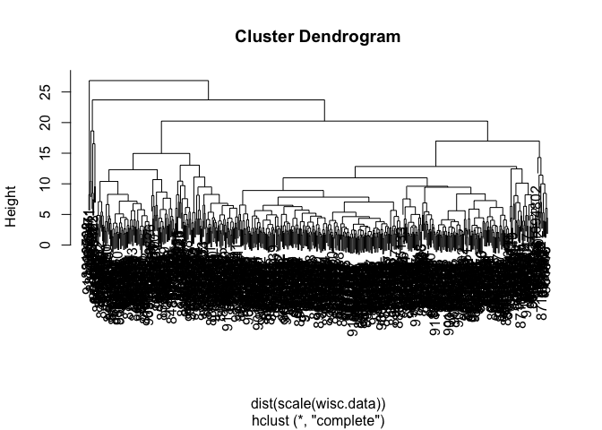
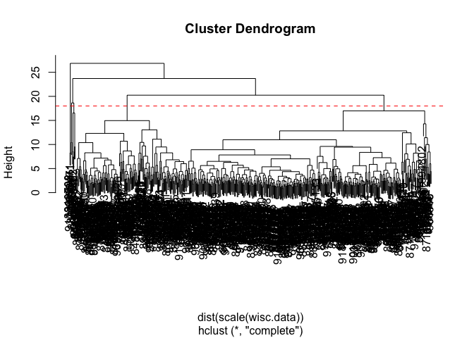
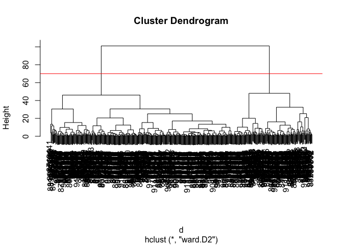
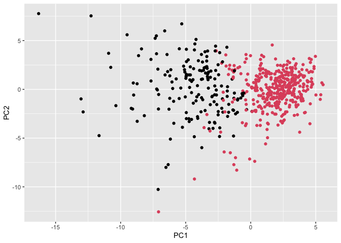

# class08
Sofia Jaravata (A19160915)

- [Background](#background)
- [Data Import](#data-import)
- [2. Exploratory data analysis](#2-exploratory-data-analysis)
  - [\>Q1. How many observations are in this
    dataset?](#q1-how-many-observations-are-in-this-dataset)
  - [\>Q2. How many of the observations have a malignant
    diagnosis?](#q2-how-many-of-the-observations-have-a-malignant-diagnosis)
  - [\>Q3. How many variables/features in the data are suffixed with
    `_mean`?](#q3-how-many-variablesfeatures-in-the-data-are-suffixed-with-_mean)
- [3. Principal Component Analysis
  (PCA)](#3-principal-component-analysis-pca)
  - [Performing PCA](#performing-pca)
    - [\>Q4. From your results, what proportion of the original variance
      is captured by the first principal component
      (PC1)?](#q4-from-your-results-what-proportion-of-the-original-variance-is-captured-by-the-first-principal-component-pc1)
    - [\>Q5. How many principal components (PCs) are required to
      describe at least 70% of the original variance in the
      data?](#q5-how-many-principal-components-pcs-are-required-to-describe-at-least-70-of-the-original-variance-in-the-data)
    - [\>Q6. How many principal components (PCs) are required to
      describe at least 90% of the original variance in the
      data?](#q6-how-many-principal-components-pcs-are-required-to-describe-at-least-90-of-the-original-variance-in-the-data)
  - [Interpreting PCA results](#interpreting-pca-results)
    - [Biplot](#biplot)
    - [\> Q7. What stands out to you about this plot? Is it easy or
      difficult to understand?
      Why?](#-q7-what-stands-out-to-you-about-this-plot-is-it-easy-or-difficult-to-understand-why)
    - [\> Q8. Generate a similar plot for principal components 1 and 3.
      What do you notice about these
      plots?](#-q8-generate-a-similar-plot-for-principal-components-1-and-3-what-do-you-notice-about-these-plots)
  - [Variance Explained](#variance-explained)
  - [Communicating PCA results](#communicating-pca-results)
    - [\> Q9. For the first principal component, what is the component
      of the loading vector (i.e. wisc.pr\$rotation\[,1\]) for the
      feature concave.points_mean? This tells us how much this original
      feature contributes to the first PC. Are there any features with
      larger contributions than this
      one?](#-q9-for-the-first-principal-component-what-is-the-component-of-the-loading-vector-ie-wiscprrotation1-for-the-feature-concavepoints_mean-this-tells-us-how-much-this-original-feature-contributes-to-the-first-pc-are-there-any-features-with-larger-contributions-than-this-one)
- [4. Hierarchical Clustering](#4-hierarchical-clustering)
  - [Selecting number of clusters](#selecting-number-of-clusters)
    - [\> Q12. Which method gives your favorite results for the same
      data.dist dataset? Explain your
      reasoning.](#-q12-which-method-gives-your-favorite-results-for-the-same-datadist-dataset-explain-your-reasoning)
- [5. Combining Methods](#5-combining-methods)
  - [Clustering on PCA results](#clustering-on-pca-results)
    - [\> Q13. How well does the newly created hclust model with two
      clusters separate out the two “M” and “B”
      diagnoses?](#-q13-how-well-does-the-newly-created-hclust-model-with-two-clusters-separate-out-the-two-m-and-b-diagnoses)
    - [\> Q14. How well do the hierarchical clustering models you
      created in the previous sections (i.e. without first doing PCA) do
      in terms of separating the diagnoses? Again, use the table()
      function to compare the output of each model (wisc.hclust.clusters
      and wisc.pr.hclust.clusters) with the vector containing the actual
      diagnoses.](#-q14-how-well-do-the-hierarchical-clustering-models-you-created-in-the-previous-sections-ie-without-first-doing-pca-do-in-terms-of-separating-the-diagnoses-again-use-the-table-function-to-compare-the-output-of-each-model-wischclustclusters-and-wiscprhclustclusters-with-the-vector-containing-the-actual-diagnoses)
- [7. Prediction](#7-prediction)
  - [\> Q16. Which of these new patients should we prioritize for follow
    up based on your
    results?](#-q16-which-of-these-new-patients-should-we-prioritize-for-follow-up-based-on-your-results)

## Background

The goal of this mini-project is for you to explore a complete analysis
using the unsupervised learning techniques covered in class. You’ll
extend what you’ve learned by combining PCA as a preprocessing step to
clustering using data that consist of measurements of cell nuclei of
human breast masses. This expands on our UK food and RNA-Seq analysis
from last day.

Today we will analyze a data-set from fine needle aspiration (FNA) of
breast mass

## Data Import

The data is made available as a CSV file for download. We can read this
in using `read.csv()`:

``` r
# Save your input data file into your Project directory
fna.data <- "WisconsinCancer.csv"

# Complete the following code to input the data and store as wisc.df
wisc.df <- read.csv(fna.data, row.names=1)
#wisc.df
```

``` r
head(wisc.df, 4) #examine input data to ensure column names are set correctly
```

             diagnosis radius_mean texture_mean perimeter_mean area_mean
    842302           M       17.99        10.38         122.80    1001.0
    842517           M       20.57        17.77         132.90    1326.0
    84300903         M       19.69        21.25         130.00    1203.0
    84348301         M       11.42        20.38          77.58     386.1
             smoothness_mean compactness_mean concavity_mean concave.points_mean
    842302           0.11840          0.27760         0.3001             0.14710
    842517           0.08474          0.07864         0.0869             0.07017
    84300903         0.10960          0.15990         0.1974             0.12790
    84348301         0.14250          0.28390         0.2414             0.10520
             symmetry_mean fractal_dimension_mean radius_se texture_se perimeter_se
    842302          0.2419                0.07871    1.0950     0.9053        8.589
    842517          0.1812                0.05667    0.5435     0.7339        3.398
    84300903        0.2069                0.05999    0.7456     0.7869        4.585
    84348301        0.2597                0.09744    0.4956     1.1560        3.445
             area_se smoothness_se compactness_se concavity_se concave.points_se
    842302    153.40      0.006399        0.04904      0.05373           0.01587
    842517     74.08      0.005225        0.01308      0.01860           0.01340
    84300903   94.03      0.006150        0.04006      0.03832           0.02058
    84348301   27.23      0.009110        0.07458      0.05661           0.01867
             symmetry_se fractal_dimension_se radius_worst texture_worst
    842302       0.03003             0.006193        25.38         17.33
    842517       0.01389             0.003532        24.99         23.41
    84300903     0.02250             0.004571        23.57         25.53
    84348301     0.05963             0.009208        14.91         26.50
             perimeter_worst area_worst smoothness_worst compactness_worst
    842302            184.60     2019.0           0.1622            0.6656
    842517            158.80     1956.0           0.1238            0.1866
    84300903          152.50     1709.0           0.1444            0.4245
    84348301           98.87      567.7           0.2098            0.8663
             concavity_worst concave.points_worst symmetry_worst
    842302            0.7119               0.2654         0.4601
    842517            0.2416               0.1860         0.2750
    84300903          0.4504               0.2430         0.3613
    84348301          0.6869               0.2575         0.6638
             fractal_dimension_worst
    842302                   0.11890
    842517                   0.08902
    84300903                 0.08758
    84348301                 0.17300

Make sure we remove or exclude the `diagnosis` column from the data-set
that we use for further analysis - this is the expert diagnosis as
either M or B:

``` r
# We can use -1 here to remove the first column
wisc.data <- wisc.df[,-1]

# Create diagnosis vector for later 
diagnosis <- as.factor(wisc.df$diagnosis)
```

# 2. Exploratory data analysis

### \>Q1. How many observations are in this dataset?

``` r
nrow(wisc.df)
```

    [1] 569

**569** observations in this dataset.

### \>Q2. How many of the observations have a malignant diagnosis?

``` r
table((wisc.df$diagnosis == "M"))
```


    FALSE  TRUE 
      357   212 

**212** observations have a malignant diagnosis.

### \>Q3. How many variables/features in the data are suffixed with `_mean`?

``` r
length( grep("_mean", colnames(wisc.data), value = T))
```

    [1] 10

**10** variables in the data are suffixed with `_mean`.

# 3. Principal Component Analysis (PCA)

We need to scale our data before PCA with the `scale=TRUE` argument to
`prcomp()`

``` r
# Check column means and standard deviations
colMeans(wisc.data)
```

                radius_mean            texture_mean          perimeter_mean 
               1.412729e+01            1.928965e+01            9.196903e+01 
                  area_mean         smoothness_mean        compactness_mean 
               6.548891e+02            9.636028e-02            1.043410e-01 
             concavity_mean     concave.points_mean           symmetry_mean 
               8.879932e-02            4.891915e-02            1.811619e-01 
     fractal_dimension_mean               radius_se              texture_se 
               6.279761e-02            4.051721e-01            1.216853e+00 
               perimeter_se                 area_se           smoothness_se 
               2.866059e+00            4.033708e+01            7.040979e-03 
             compactness_se            concavity_se       concave.points_se 
               2.547814e-02            3.189372e-02            1.179614e-02 
                symmetry_se    fractal_dimension_se            radius_worst 
               2.054230e-02            3.794904e-03            1.626919e+01 
              texture_worst         perimeter_worst              area_worst 
               2.567722e+01            1.072612e+02            8.805831e+02 
           smoothness_worst       compactness_worst         concavity_worst 
               1.323686e-01            2.542650e-01            2.721885e-01 
       concave.points_worst          symmetry_worst fractal_dimension_worst 
               1.146062e-01            2.900756e-01            8.394582e-02 

``` r
apply(wisc.data,2,sd)
```

                radius_mean            texture_mean          perimeter_mean 
               3.524049e+00            4.301036e+00            2.429898e+01 
                  area_mean         smoothness_mean        compactness_mean 
               3.519141e+02            1.406413e-02            5.281276e-02 
             concavity_mean     concave.points_mean           symmetry_mean 
               7.971981e-02            3.880284e-02            2.741428e-02 
     fractal_dimension_mean               radius_se              texture_se 
               7.060363e-03            2.773127e-01            5.516484e-01 
               perimeter_se                 area_se           smoothness_se 
               2.021855e+00            4.549101e+01            3.002518e-03 
             compactness_se            concavity_se       concave.points_se 
               1.790818e-02            3.018606e-02            6.170285e-03 
                symmetry_se    fractal_dimension_se            radius_worst 
               8.266372e-03            2.646071e-03            4.833242e+00 
              texture_worst         perimeter_worst              area_worst 
               6.146258e+00            3.360254e+01            5.693570e+02 
           smoothness_worst       compactness_worst         concavity_worst 
               2.283243e-02            1.573365e-01            2.086243e-01 
       concave.points_worst          symmetry_worst fractal_dimension_worst 
               6.573234e-02            6.186747e-02            1.806127e-02 

``` r
# Perform PCA on wisc.data
wisc.pr <- prcomp( wisc.data, scale = TRUE )

summary(wisc.pr) # summary of results 
```

    Importance of components:
                              PC1    PC2     PC3     PC4     PC5     PC6     PC7
    Standard deviation     3.6444 2.3857 1.67867 1.40735 1.28403 1.09880 0.82172
    Proportion of Variance 0.4427 0.1897 0.09393 0.06602 0.05496 0.04025 0.02251
    Cumulative Proportion  0.4427 0.6324 0.72636 0.79239 0.84734 0.88759 0.91010
                               PC8    PC9    PC10   PC11    PC12    PC13    PC14
    Standard deviation     0.69037 0.6457 0.59219 0.5421 0.51104 0.49128 0.39624
    Proportion of Variance 0.01589 0.0139 0.01169 0.0098 0.00871 0.00805 0.00523
    Cumulative Proportion  0.92598 0.9399 0.95157 0.9614 0.97007 0.97812 0.98335
                              PC15    PC16    PC17    PC18    PC19    PC20   PC21
    Standard deviation     0.30681 0.28260 0.24372 0.22939 0.22244 0.17652 0.1731
    Proportion of Variance 0.00314 0.00266 0.00198 0.00175 0.00165 0.00104 0.0010
    Cumulative Proportion  0.98649 0.98915 0.99113 0.99288 0.99453 0.99557 0.9966
                              PC22    PC23   PC24    PC25    PC26    PC27    PC28
    Standard deviation     0.16565 0.15602 0.1344 0.12442 0.09043 0.08307 0.03987
    Proportion of Variance 0.00091 0.00081 0.0006 0.00052 0.00027 0.00023 0.00005
    Cumulative Proportion  0.99749 0.99830 0.9989 0.99942 0.99969 0.99992 0.99997
                              PC29    PC30
    Standard deviation     0.02736 0.01153
    Proportion of Variance 0.00002 0.00000
    Cumulative Proportion  1.00000 1.00000

## Performing PCA

### \>Q4. From your results, what proportion of the original variance is captured by the first principal component (PC1)?

.4427, 44.27% of the original variance is captured by the PC1.

### \>Q5. How many principal components (PCs) are required to describe at least 70% of the original variance in the data?

3 principal components are required to describe at least 70% of the
original variance in the data.

### \>Q6. How many principal components (PCs) are required to describe at least 90% of the original variance in the data?

7 principal components are required to described at least 90% of the
original variance in the data.

## Interpreting PCA results

### Biplot

``` r
biplot(wisc.pr)
```


### \> Q7. What stands out to you about this plot? Is it easy or difficult to understand? Why?

Nothing really stands out. It is difficult to understand because there
are many values on a small plot, making it hard to see any values and
interpret them.

**Let’s see the “PC score plot”**

``` r
library(ggplot2)
```

    Warning: package 'ggplot2' was built under R version 4.5.2

``` r
ggplot(wisc.pr$x) +
  aes(PC1, PC2, col=diagnosis) +
  geom_point()
```


### \> Q8. Generate a similar plot for principal components 1 and 3. What do you notice about these plots?

``` r
# Repeat for components 1 and 3
ggplot(wisc.pr$x) +
  aes(PC1, PC3, col=diagnosis) +
  geom_point()
```


I notice that PC1 captures the separation between malignant(blue) and
benign(red) samples well, but PC3 allows for overlapping and less
separation on the PC3 axis, making it harder to distinguish. PC2 draws
the sample a little more apart, allowing for more separation and
variance.

## Variance Explained

``` r
# Calculate variance of each component
pr.var <- wisc.pr$sdev^2
head(pr.var)
```

    [1] 13.281608  5.691355  2.817949  1.980640  1.648731  1.207357

Calculate the variance explained by each principal component by dividing
by the total variance explained of all principal components. Assign this
to a variable called pve and create a plot of variance explained for
each principal component.

``` r
# Variance explained by each principal component: pve
pve <- pr.var / sum(pr.var)

# Plot variance explained for each principal component
plot(c(1,pve), xlab = "Principal Component", 
     ylab = "Proportion of Variance Explained", 
     ylim = c(0, 1), type = "o")
```


***Alternative scree plot***

``` r
# Alternative scree plot of the same data, note data driven y-axis
barplot(pve, ylab = "Percent of Variance Explained",
     names.arg=paste0("PC",1:length(pve)), las=2, axes = FALSE)
axis(2, at=pve, labels=round(pve,2)*100 )
```


## Communicating PCA results

### \> Q9. For the first principal component, what is the component of the loading vector (i.e. wisc.pr\$rotation\[,1\]) for the feature concave.points_mean? This tells us how much this original feature contributes to the first PC. Are there any features with larger contributions than this one?

``` r
wisc.pr$rotation["concave.points_mean", 1]
```

    [1] -0.2608538

``` r
sort(abs(wisc.pr$rotation[,1]), decreasing = TRUE)
```

        concave.points_mean          concavity_mean    concave.points_worst 
                 0.26085376              0.25840048              0.25088597 
           compactness_mean         perimeter_worst         concavity_worst 
                 0.23928535              0.23663968              0.22876753 
               radius_worst          perimeter_mean              area_worst 
                 0.22799663              0.22753729              0.22487053 
                  area_mean             radius_mean            perimeter_se 
                 0.22099499              0.21890244              0.21132592 
          compactness_worst               radius_se                 area_se 
                 0.21009588              0.20597878              0.20286964 
          concave.points_se          compactness_se            concavity_se 
                 0.18341740              0.17039345              0.15358979 
            smoothness_mean           symmetry_mean fractal_dimension_worst 
                 0.14258969              0.13816696              0.13178394 
           smoothness_worst          symmetry_worst           texture_worst 
                 0.12795256              0.12290456              0.10446933 
               texture_mean    fractal_dimension_se  fractal_dimension_mean 
                 0.10372458              0.10256832              0.06436335 
                symmetry_se              texture_se           smoothness_se 
                 0.04249842              0.01742803              0.01453145 

The component of the loading vector for the feature concave.points_mean
is -0.2609. No, there are not any features with a larger absolute
contribution than this one for PC1.

# 4. Hierarchical Clustering

``` r
data.scaled <- scale(wisc.data) #scale wisc.data data

data.dist <- dist(data.scaled) #calculate (Euclidean) distances between all pairs of observations in the new scaled dataset 

#create hierarchical clustering model using complete linkage
wisc.hclust <- hclust(dist(scale(wisc.data))) 
plot(wisc.hclust)
```



\##Results of hierarchical clustering \### \> Q10. Using the plot() and
abline() functions, what is the height at which the clustering model has
4 clusters?

``` r
plot(wisc.hclust)
abline(h=18, col="red", lty=2)
```



At height 19, the clustering model has 4 clusters.

**Using Different Methods**

## Selecting number of clusters

``` r
wisc.hclust.clusters <- cutree(wisc.hclust, k=4)
table(wisc.hclust.clusters, diagnosis)
```

                        diagnosis
    wisc.hclust.clusters   B   M
                       1  12 165
                       2   2   5
                       3 343  40
                       4   0   2

### \> Q12. Which method gives your favorite results for the same data.dist dataset? Explain your reasoning.

My favorite method is the “ward.D2” because it is the most organized
looking to me. It makes compact and clean clusters, and looks neater
compared to the other methods, which can be helpful when I may need to
analyze it.

# 5. Combining Methods

**Clustering on PCA results**

``` r
d <- dist(wisc.pr$x[,1:4])
wisc.pr.hclust <- hclust(d, method = "ward.D2") #run hierarchical clustering on d
plot(wisc.pr.hclust)
abline(h=70, col="red")
```



``` r
grps <- cutree(wisc.pr.hclust, h=70)
table(grps)
```

    grps
      1   2 
    171 398 

How does this clustering `grps` correspond to the expert `diagnosis`?

``` r
table(diagnosis)
```

    diagnosis
      B   M 
    357 212 

``` r
table(diagnosis, grps)
```

             grps
    diagnosis   1   2
            B   6 351
            M 165  47

``` r
ggplot(wisc.pr$x) +
  aes(PC1, PC2) +
  geom_point(col=grps)
```



``` r
## Use the distance along the first 7 PCs for clustering i.e. wisc.pr$x[, 1:7]
pc.dist <- dist(wisc.pr$x[, 1:7])
wisc.pr.hclust <- hclust(pc.dist, method = "ward.D2") 

## Cut this hierarchical clustering model into 2 clusters and assign the results to wisc.pr.hclust.clusters.

wisc.pr.hclust.clusters <- cutree(wisc.pr.hclust, k=2)
```

## Clustering on PCA results

### \> Q13. How well does the newly created hclust model with two clusters separate out the two “M” and “B” diagnoses?

``` r
# Compare to actual diagnoses
table(wisc.pr.hclust.clusters, diagnosis)
```

                           diagnosis
    wisc.pr.hclust.clusters   B   M
                          1  28 188
                          2 329  24

The newly created hclust model separates malignant and benign samples
pretty well. Cluster 1 contains mostly malignant cases (188 M vs 28 B),
while Cluster 2 contains mostly benign cases (329 B vs 24 M).

### \> Q14. How well do the hierarchical clustering models you created in the previous sections (i.e. without first doing PCA) do in terms of separating the diagnoses? Again, use the table() function to compare the output of each model (wisc.hclust.clusters and wisc.pr.hclust.clusters) with the vector containing the actual diagnoses.

``` r
table(wisc.hclust.clusters, diagnosis)
```

                        diagnosis
    wisc.hclust.clusters   B   M
                       1  12 165
                       2   2   5
                       3 343  40
                       4   0   2

The hierarchical clustering model without first doing PCA separates the
diagnoses well, where one cluster is mostly malignant (cluster 1) and
another mostly benign (cluster 3), but it also produces many small extra
clusters (cluster 2 and 4). In contrast, the PCA-based clustering gives
two larger, cleaner clusters that better correspond to the two diagnosis
groups, in which “with doing PCA first” improves the understanding and
comprehension of the clustering and separation overall.

# 7. Prediction

``` r
#url <- "new_samples.csv"
url <- "https://tinyurl.com/new-samples-CSV"
new <- read.csv(url)
npc <- predict(wisc.pr, newdata=new)
npc
```

               PC1       PC2        PC3        PC4       PC5        PC6        PC7
    [1,]  2.576616 -3.135913  1.3990492 -0.7631950  2.781648 -0.8150185 -0.3959098
    [2,] -4.754928 -3.009033 -0.1660946 -0.6052952 -1.140698 -1.2189945  0.8193031
                PC8       PC9       PC10      PC11      PC12      PC13     PC14
    [1,] -0.2307350 0.1029569 -0.9272861 0.3411457  0.375921 0.1610764 1.187882
    [2,] -0.3307423 0.5281896 -0.4855301 0.7173233 -1.185917 0.5893856 0.303029
              PC15       PC16        PC17        PC18        PC19       PC20
    [1,] 0.3216974 -0.1743616 -0.07875393 -0.11207028 -0.08802955 -0.2495216
    [2,] 0.1299153  0.1448061 -0.40509706  0.06565549  0.25591230 -0.4289500
               PC21       PC22       PC23       PC24        PC25         PC26
    [1,]  0.1228233 0.09358453 0.08347651  0.1223396  0.02124121  0.078884581
    [2,] -0.1224776 0.01732146 0.06316631 -0.2338618 -0.20755948 -0.009833238
                 PC27        PC28         PC29         PC30
    [1,]  0.220199544 -0.02946023 -0.015620933  0.005269029
    [2,] -0.001134152  0.09638361  0.002795349 -0.019015820

``` r
plot(wisc.pr$x[,1:2], col=grps)
points(npc[,1], npc[,2], col="blue", pch=16, cex=3)
text(npc[,1], npc[,2], c(1,2), col="white")
```


## \> Q16. Which of these new patients should we prioritize for follow up based on your results?

Based on my results, we should be prioritizing Patient 2 because it
falls closer to the group of malignant samples (black group) and Patient
1 falls within the benign cluster samples (red group).
