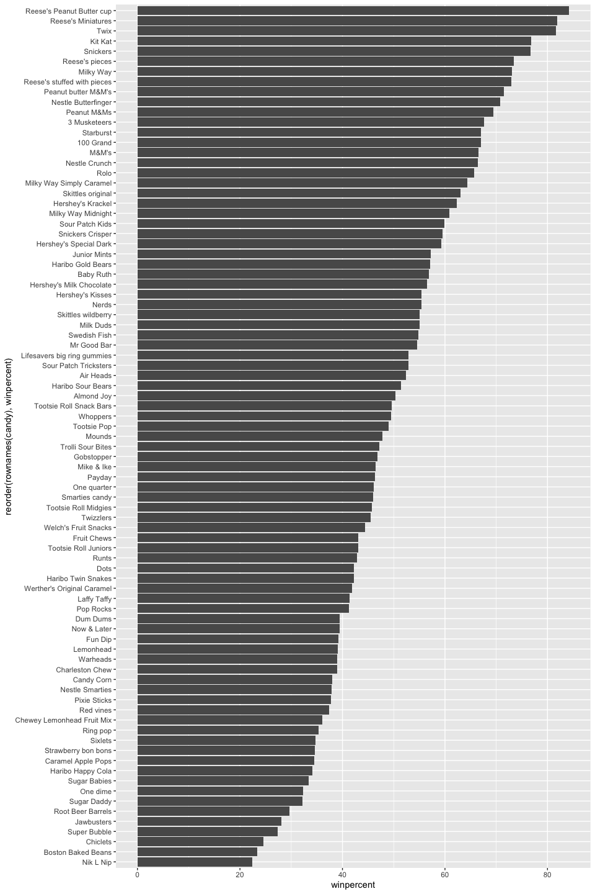
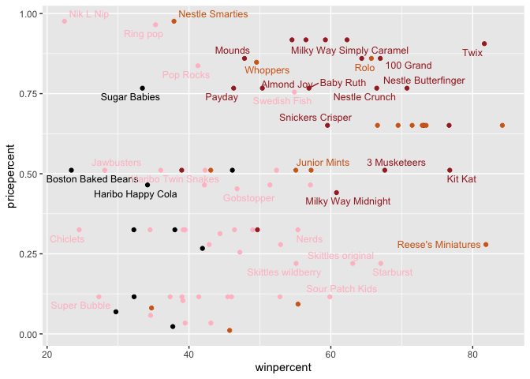
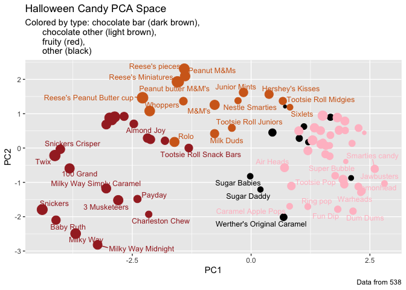
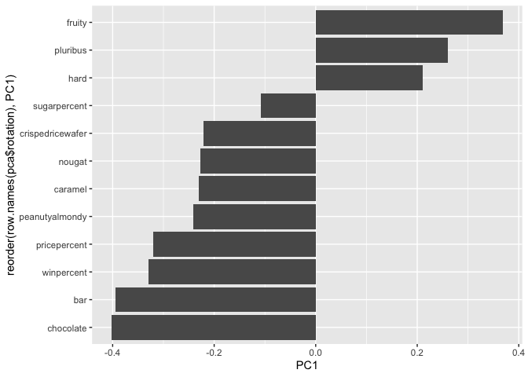

# Class09: Candy Mini Project
Sofia Jaravata (A19160915)

- [Background](#background)
- [Data Import: Importing Candy Data](#data-import-importing-candy-data)
  - [Q1. How many different candy types are in this
    dataset?](#q1-how-many-different-candy-types-are-in-this-dataset)
  - [Q2. How many fruity candy types are in the
    dataset?](#q2-how-many-fruity-candy-types-are-in-the-dataset)
- [2.2 What is your favorite candy?](#22-what-is-your-favorite-candy)
  - [Q3. What is your favorite candy (other than Twix) in the dataset
    and what is it’s winpercent
    value?](#q3-what-is-your-favorite-candy-other-than-twix-in-the-dataset-and-what-is-its-winpercent-value)
  - [Q4. What is the winpercent value for “Kit
    Kat”?](#q4-what-is-the-winpercent-value-for-kit-kat)
  - [Q5. What is the winpercent value for “Tootsie Roll Snack
    Bars”?](#q5-what-is-the-winpercent-value-for-tootsie-roll-snack-bars)
  - [Side-note: the skimr::skim()
    function](#side-note-the-skimrskim-function)
    - [Q6. Is there any variable/column that looks to be on a different
      scale to the majority of the other columns in the
      dataset?](#q6-is-there-any-variablecolumn-that-looks-to-be-on-a-different-scale-to-the-majority-of-the-other-columns-in-the-dataset)
    - [Q7. What do you think a zero and one represent for the
      `candy$chocolate`
      column?](#q7-what-do-you-think-a-zero-and-one-represent-for-the-candychocolate-column)
- [3. Exploratory Analysis](#3-exploratory-analysis)
  - [Q8. Plot a histogram of `winpercent` values using both base R and
    ggplot2.](#q8-plot-a-histogram-of-winpercent-values-using-both-base-r-and-ggplot2)
  - [Q9. Is the distribution of `winpercent` values
    symmetrical?](#q9-is-the-distribution-of-winpercent-values-symmetrical)
  - [Q10. Is the center of the distribution above or below
    50%?](#q10-is-the-center-of-the-distribution-above-or-below-50)
  - [Q11. On average is chocolate candy higher or lower ranked than
    fruit
    candy?](#q11-on-average-is-chocolate-candy-higher-or-lower-ranked-than-fruit-candy)
  - [Q12. Is this difference statistically
    significant?](#q12-is-this-difference-statistically-significant)
- [4. Overall Candy Rankings](#4-overall-candy-rankings)
  - [Q13. What are the five least liked candy types in this
    set?](#q13-what-are-the-five-least-liked-candy-types-in-this-set)
  - [Q14. What are the top 5 all time favorite candy types out of this
    set?](#q14-what-are-the-top-5-all-time-favorite-candy-types-out-of-this-set)
  - [Q15. Make a first barplot of candy ranking based on winpercent
    values.](#q15-make-a-first-barplot-of-candy-ranking-based-on-winpercent-values)
  - [Q16. This is quite ugly, use the reorder() function to get the bars
    sorted by
    winpercent?](#q16-this-is-quite-ugly-use-the-reorder-function-to-get-the-bars-sorted-by-winpercent)
  - [4.0.1 Time to add some useful
    color](#401-time-to-add-some-useful-color)
    - [Q17. What is the worst ranked chocolate
      candy?](#q17-what-is-the-worst-ranked-chocolate-candy)
    - [Q18. What is the best ranked fruity
      candy?](#q18-what-is-the-best-ranked-fruity-candy)
- [5. Taking a look at pricepercent](#5-taking-a-look-at-pricepercent)
  - [Q19. Which candy type is the highest ranked in terms of winpercent
    for the least money - i.e. offers the most bang for your
    buck?](#q19-which-candy-type-is-the-highest-ranked-in-terms-of-winpercent-for-the-least-money---ie-offers-the-most-bang-for-your-buck)
  - [Q20. What are the top 5 most expensive candy types in the dataset
    and of these which is the least
    popular?](#q20-what-are-the-top-5-most-expensive-candy-types-in-the-dataset-and-of-these-which-is-the-least-popular)
- [6. Exploring the correlation
  structure](#6-exploring-the-correlation-structure)
  - [Q22. Examining this plot what two variables are anti-correlated
    (i.e. have minus
    values)?](#q22-examining-this-plot-what-two-variables-are-anti-correlated-ie-have-minus-values)
  - [Q23. Use your corrplot result to make a prediction: which variables
    do you expect will have the largest contributions (i.e. loadings) to
    PC1 (i.e., drive the most separation between candies along the first
    principal
    component)?](#q23-use-your-corrplot-result-to-make-a-prediction-which-variables-do-you-expect-will-have-the-largest-contributions-ie-loadings-to-pc1-ie-drive-the-most-separation-between-candies-along-the-first-principal-component)
- [7. Principal Component Analysis](#7-principal-component-analysis)
  - [Q24. Complete the code to generate the loadings plot above. What
    original variables are picked up strongly by PC1 in the positive
    direction? Do these make sense to you? Where did you see this
    relationship highlighted
    previously?](#q24-complete-the-code-to-generate-the-loadings-plot-above-what-original-variables-are-picked-up-strongly-by-pc1-in-the-positive-direction-do-these-make-sense-to-you-where-did-you-see-this-relationship-highlighted-previously)
- [8. Summary](#8-summary)
  - [Q25. Based on your exploratory analysis, correlation findings, and
    PCA results, what combination of characteristics appears to make a
    “winning” candy? How do these different analyses (visualization,
    correlation, PCA) support or complement each other in reaching this
    conclusion?](#q25-based-on-your-exploratory-analysis-correlation-findings-and-pca-results-what-combination-of-characteristics-appears-to-make-a-winning-candy-how-do-these-different-analyses-visualization-correlation-pca-support-or-complement-each-other-in-reaching-this-conclusion)

## Background

Today we are taking a small detour to anlazye a dataset (that we have
more intrinsic insight into) with the most useful analysis method we
have learned thus far - Principal Component Analysis (PCA)

## Data Import: Importing Candy Data

``` r
candy <- read.csv("candy-data.csv", row.names=1) #reads csv and organizes it 
head(candy) #displays first few elements 
```

                 chocolate fruity caramel peanutyalmondy nougat crispedricewafer
    100 Grand            1      0       1              0      0                1
    3 Musketeers         1      0       0              0      1                0
    One dime             0      0       0              0      0                0
    One quarter          0      0       0              0      0                0
    Air Heads            0      1       0              0      0                0
    Almond Joy           1      0       0              1      0                0
                 hard bar pluribus sugarpercent pricepercent winpercent
    100 Grand       0   1        0        0.732        0.860   66.97173
    3 Musketeers    0   1        0        0.604        0.511   67.60294
    One dime        0   0        0        0.011        0.116   32.26109
    One quarter     0   0        0        0.011        0.511   46.11650
    Air Heads       0   0        0        0.906        0.511   52.34146
    Almond Joy      0   1        0        0.465        0.767   50.34755

### Q1. How many different candy types are in this dataset?

``` r
nrow(candy)
```

    [1] 85

85 different candy types.

### Q2. How many fruity candy types are in the dataset?

``` r
sum(candy$fruity)
```

    [1] 38

38 fruity candy types are in the dataset.

# 2.2 What is your favorite candy?

``` r
library(dplyr)# CONSOLE: install.packages("dplyr")
```

    Warning: package 'dplyr' was built under R version 4.5.2


    Attaching package: 'dplyr'

    The following objects are masked from 'package:stats':

        filter, lag

    The following objects are masked from 'package:base':

        intersect, setdiff, setequal, union

``` r
candy |> 
  filter(row.names(candy)=="Reese's pieces") |> 
  select(winpercent)
```

                   winpercent
    Reese's pieces   73.43499

### Q3. What is your favorite candy (other than Twix) in the dataset and what is it’s winpercent value?

My favorite candy is Reese’s pieces and its winpercent value is
73.43499%

### Q4. What is the winpercent value for “Kit Kat”?

``` r
candy["Kit Kat", ]$winpercent
```

    [1] 76.7686

Kit Kat’s winpercent is 76.7686%.

### Q5. What is the winpercent value for “Tootsie Roll Snack Bars”?

``` r
candy["Tootsie Roll Snack Bar", ]$winpercent
```

    [1] 49.6535

Tootsie Roll Snack Bar’s winpercent is 49.6335%.

## Side-note: the skimr::skim() function

``` r
#library("skimr") #requires loading package in console
#skim(candy)

#no need to load whole package, takes one thing from skimr package efficiently 
skimr::skim(candy) 
```

|                                                  |       |
|:-------------------------------------------------|:------|
| Name                                             | candy |
| Number of rows                                   | 85    |
| Number of columns                                | 12    |
| \_\_\_\_\_\_\_\_\_\_\_\_\_\_\_\_\_\_\_\_\_\_\_   |       |
| Column type frequency:                           |       |
| numeric                                          | 12    |
| \_\_\_\_\_\_\_\_\_\_\_\_\_\_\_\_\_\_\_\_\_\_\_\_ |       |
| Group variables                                  | None  |

Data summary

**Variable type: numeric**

| skim_variable | n_missing | complete_rate | mean | sd | p0 | p25 | p50 | p75 | p100 | hist |
|:---|---:|---:|---:|---:|---:|---:|---:|---:|---:|:---|
| chocolate | 0 | 1 | 0.44 | 0.50 | 0.00 | 0.00 | 0.00 | 1.00 | 1.00 | ▇▁▁▁▆ |
| fruity | 0 | 1 | 0.45 | 0.50 | 0.00 | 0.00 | 0.00 | 1.00 | 1.00 | ▇▁▁▁▆ |
| caramel | 0 | 1 | 0.16 | 0.37 | 0.00 | 0.00 | 0.00 | 0.00 | 1.00 | ▇▁▁▁▂ |
| peanutyalmondy | 0 | 1 | 0.16 | 0.37 | 0.00 | 0.00 | 0.00 | 0.00 | 1.00 | ▇▁▁▁▂ |
| nougat | 0 | 1 | 0.08 | 0.28 | 0.00 | 0.00 | 0.00 | 0.00 | 1.00 | ▇▁▁▁▁ |
| crispedricewafer | 0 | 1 | 0.08 | 0.28 | 0.00 | 0.00 | 0.00 | 0.00 | 1.00 | ▇▁▁▁▁ |
| hard | 0 | 1 | 0.18 | 0.38 | 0.00 | 0.00 | 0.00 | 0.00 | 1.00 | ▇▁▁▁▂ |
| bar | 0 | 1 | 0.25 | 0.43 | 0.00 | 0.00 | 0.00 | 0.00 | 1.00 | ▇▁▁▁▂ |
| pluribus | 0 | 1 | 0.52 | 0.50 | 0.00 | 0.00 | 1.00 | 1.00 | 1.00 | ▇▁▁▁▇ |
| sugarpercent | 0 | 1 | 0.48 | 0.28 | 0.01 | 0.22 | 0.47 | 0.73 | 0.99 | ▇▇▇▇▆ |
| pricepercent | 0 | 1 | 0.47 | 0.29 | 0.01 | 0.26 | 0.47 | 0.65 | 0.98 | ▇▇▇▇▆ |
| winpercent | 0 | 1 | 50.32 | 14.71 | 22.45 | 39.14 | 47.83 | 59.86 | 84.18 | ▃▇▆▅▂ |

> From your use of the skim() function use the output to answer the
> following:

### Q6. Is there any variable/column that looks to be on a different scale to the majority of the other columns in the dataset?

The histogram “hist” column looks to be on a different scale to the
majority of the other columns in the dataset.

### Q7. What do you think a zero and one represent for the `candy$chocolate` column?

For the candy\$chocolate column, the zero and the one is most likely a
binary operator where “0” means the candy does not have chocolate and
“1” means the candy has chocolate.

# 3. Exploratory Analysis

### Q8. Plot a histogram of `winpercent` values using both base R and ggplot2.

``` r
hist(candy$winpercent)
```


``` r
library(ggplot2)
```

    Warning: package 'ggplot2' was built under R version 4.5.2

``` r
ggplot(candy) +
  aes(winpercent)+
  geom_histogram(bins = 20)
```


### Q9. Is the distribution of `winpercent` values symmetrical?

No, they skew right a little bit.

### Q10. Is the center of the distribution above or below 50%?

``` r
summary(candy$winpercent)
```

       Min. 1st Qu.  Median    Mean 3rd Qu.    Max. 
      22.45   39.14   47.83   50.32   59.86   84.18 

The center of the distribution is mostly below 50% as the median is
47.83.

### Q11. On average is chocolate candy higher or lower ranked than fruit candy?

Yes, chocolate candy is higher ranked than fruit candy as the mean of
chocolate candy winpercent is 60.92153, while the mean of fruity candy
winpercent is 44.11974.

``` r
#chocolate candy
choc.ind <- as.logical(candy$chocolate) #true and falses for choc candy 
choc.candy <- candy[choc.ind, ] #access just choc candy 
choc.win <- choc.candy$winpercent # access just winpercent values
mean(choc.win) #print out mean function of the winpercent
```

    [1] 60.92153

``` r
#fruity candy 
fruity.ind <- as.logical(candy$fruity) #true and falses for fruity candy 
fruity.candy <- candy[fruity.ind, ] #access just fruity candy 
fruity.win <- fruity.candy$winpercent # access just winpercent values
mean(fruity.win) #print out mean function of the winpercent  
```

    [1] 44.11974

### Q12. Is this difference statistically significant?

``` r
t.test(choc.win, fruity.win)
```


        Welch Two Sample t-test

    data:  choc.win and fruity.win
    t = 6.2582, df = 68.882, p-value = 2.871e-08
    alternative hypothesis: true difference in means is not equal to 0
    95 percent confidence interval:
     11.44563 22.15795
    sample estimates:
    mean of x mean of y 
     60.92153  44.11974 

This difference is statistically significant, as the p-value, 2.871e-08,
is much less than 0.05 and thus statistically significant.

# 4. Overall Candy Rankings

### Q13. What are the five least liked candy types in this set?

``` r
#sorts the winpercent from lowest percent to highest using base R
head(candy[order(candy$winpercent),], n=5) 
```

                       chocolate fruity caramel peanutyalmondy nougat
    Nik L Nip                  0      1       0              0      0
    Boston Baked Beans         0      0       0              1      0
    Chiclets                   0      1       0              0      0
    Super Bubble               0      1       0              0      0
    Jawbusters                 0      1       0              0      0
                       crispedricewafer hard bar pluribus sugarpercent pricepercent
    Nik L Nip                         0    0   0        1        0.197        0.976
    Boston Baked Beans                0    0   0        1        0.313        0.511
    Chiclets                          0    0   0        1        0.046        0.325
    Super Bubble                      0    0   0        0        0.162        0.116
    Jawbusters                        0    1   0        1        0.093        0.511
                       winpercent
    Nik L Nip            22.44534
    Boston Baked Beans   23.41782
    Chiclets             24.52499
    Super Bubble         27.30386
    Jawbusters           28.12744

The five least liked candy types in this set is Nik L Nip, Boston Baked
Beans, Chiclets, Super Bubble, and Jawbusters.

### Q14. What are the top 5 all time favorite candy types out of this set?

``` r
head(candy[order(candy$winpercent, decreasing = TRUE),], n=5)
```

                              chocolate fruity caramel peanutyalmondy nougat
    Reese's Peanut Butter cup         1      0       0              1      0
    Reese's Miniatures                1      0       0              1      0
    Twix                              1      0       1              0      0
    Kit Kat                           1      0       0              0      0
    Snickers                          1      0       1              1      1
                              crispedricewafer hard bar pluribus sugarpercent
    Reese's Peanut Butter cup                0    0   0        0        0.720
    Reese's Miniatures                       0    0   0        0        0.034
    Twix                                     1    0   1        0        0.546
    Kit Kat                                  1    0   1        0        0.313
    Snickers                                 0    0   1        0        0.546
                              pricepercent winpercent
    Reese's Peanut Butter cup        0.651   84.18029
    Reese's Miniatures               0.279   81.86626
    Twix                             0.906   81.64291
    Kit Kat                          0.511   76.76860
    Snickers                         0.651   76.67378

The top 5 all time favorite candy types are Reese’s Peanut Butter Cup,
Reese’s Miniatures, Twix, Kit Kat, and Snickers.

### Q15. Make a first barplot of candy ranking based on winpercent values.

``` r
library(ggplot2) #CONSOLE: install.packages("ggplot2")

ggplot(candy) + 
  aes(winpercent, rownames(candy)) +
  geom_col()
```


### Q16. This is quite ugly, use the reorder() function to get the bars sorted by winpercent?

``` r
library(ggplot2) 

ggplot(candy) + 
  aes(winpercent, reorder(rownames(candy), winpercent)) +
  geom_col()
```



## 4.0.1 Time to add some useful color

``` r
my_cols=rep("black", nrow(candy))

#chocolate candy in chocolate color 
my_cols[as.logical(candy$chocolate)] = "chocolate"

#candy bars in brown 
my_cols[as.logical(candy$bar)] = "brown"

#fruity candy in pink 
my_cols[as.logical(candy$fruity)] = "pink"

ggplot(candy) + 
  aes(winpercent, reorder(rownames(candy),winpercent)) +
  geom_col(fill=my_cols) + #fills columns as different candy type colors
  ylab("")
```


### Q17. What is the worst ranked chocolate candy?

The worst ranked chocolate candy is Sixlets.

### Q18. What is the best ranked fruity candy?

The best ranked fruity candy is Starburst.

# 5. Taking a look at pricepercent

We can fix the label text overplotitng with an add on package called
**ggrepel** and its `geom_text_repel()`.

> Make a plot of winpercent vs. pricepercent

``` r
library(ggrepel)# CONSOLE: install.packages("ggrepel")
```

    Warning: package 'ggrepel' was built under R version 4.5.2

``` r
# How about a plot of win vs price
ggplot(candy) +
  aes(winpercent, pricepercent, label=rownames(candy)) +
  geom_point(col=my_cols) + 
  geom_text_repel(col=my_cols, size=3.3, max.overlaps = 5)
```



### Q19. Which candy type is the highest ranked in terms of winpercent for the least money - i.e. offers the most bang for your buck?

The candy type the highest ranked in terms of winpercent for the least
money is the Reese’s Miniatures because it is in the lowest right corner
of the plot. It has a high winpercent and low pricepercent.

### Q20. What are the top 5 most expensive candy types in the dataset and of these which is the least popular?

``` r
# order price percent from high to low
ord <- order(candy$pricepercent, decreasing = TRUE)  
head( candy[ord,c(11,12)], n=5 ) 
```

                             pricepercent winpercent
    Nik L Nip                       0.976   22.44534
    Nestle Smarties                 0.976   37.88719
    Ring pop                        0.965   35.29076
    Hershey's Krackel               0.918   62.28448
    Hershey's Milk Chocolate        0.918   56.49050

The top 5 most expensive candy types are Nik L Nip, Nestle Smarties,
Ring pop, Hershey’s Krackel, Hershey’s Milk Chocolate. The least popular
is Nik L Nip (22.44534% winpercent).

# 6. Exploring the correlation structure

We can calculate the pair-wise correlation of all our columns

``` r
library(corrplot) # CONSOLE: install.packages("corrplot")
```

    corrplot 0.95 loaded

``` r
cij <- cor(candy)
corrplot(cij) 
```


### Q22. Examining this plot what two variables are anti-correlated (i.e. have minus values)?

The two variables “Chocolate” and “Candy” are anti-correlated because
they have red values for each other.

### Q23. Use your corrplot result to make a prediction: which variables do you expect will have the largest contributions (i.e. loadings) to PC1 (i.e., drive the most separation between candies along the first principal component)?

The variables “chocolate”, “fruity”, and “bar” will have the largest
contributions to PC1 because they have the largest contributions.

# 7. Principal Component Analysis

In this case we want to be sure to set `scale=TRUE` argument for
`prcomp()` because we have one varaible, `winpercent`, that is on a very
different scale than all others and would otherwise dominate our PCA
results.

``` r
pca <- prcomp(candy, scale = TRUE)
summary(pca)
```

    Importance of components:
                              PC1    PC2    PC3     PC4    PC5     PC6     PC7
    Standard deviation     2.0788 1.1378 1.1092 1.07533 0.9518 0.81923 0.81530
    Proportion of Variance 0.3601 0.1079 0.1025 0.09636 0.0755 0.05593 0.05539
    Cumulative Proportion  0.3601 0.4680 0.5705 0.66688 0.7424 0.79830 0.85369
                               PC8     PC9    PC10    PC11    PC12
    Standard deviation     0.74530 0.67824 0.62349 0.43974 0.39760
    Proportion of Variance 0.04629 0.03833 0.03239 0.01611 0.01317
    Cumulative Proportion  0.89998 0.93832 0.97071 0.98683 1.00000

**First major result figure is the “score plot” of PC1 vs PC2 - how the
different candy are related to each other on our new PC axis:**

``` r
pca <- prcomp(candy, scale = TRUE)
summary(pca)
```

    Importance of components:
                              PC1    PC2    PC3     PC4    PC5     PC6     PC7
    Standard deviation     2.0788 1.1378 1.1092 1.07533 0.9518 0.81923 0.81530
    Proportion of Variance 0.3601 0.1079 0.1025 0.09636 0.0755 0.05593 0.05539
    Cumulative Proportion  0.3601 0.4680 0.5705 0.66688 0.7424 0.79830 0.85369
                               PC8     PC9    PC10    PC11    PC12
    Standard deviation     0.74530 0.67824 0.62349 0.43974 0.39760
    Proportion of Variance 0.04629 0.03833 0.03239 0.01611 0.01317
    Cumulative Proportion  0.89998 0.93832 0.97071 0.98683 1.00000

Now we can plot our main PCA score plot of PC1 vs PC2.

``` r
plot(pca$x[,1:2])
```


> We can change the plotting character and add some color:

``` r
plot(pca$x[,1:2], col=my_cols, pch=16)
```


> We can make a much nicer plot with the ggplot2 package but it is
> important to note that ggplot works best when you supply an input
> data.frame that includes a separate column for each of the aesthetics
> you would like displayed in your final plot. To accomplish this we
> make a new data.frame here that contains our PCA results with all the
> rest of our candy data. We will then use this for making plots below.

``` r
# Make a new data-frame with our PCA results and candy data
my_data <- cbind(candy, pca$x[,1:3])
```

``` r
p <- ggplot(my_data) + 
        aes(x=PC1, y=PC2, 
            size=winpercent/100,  
            text=rownames(my_data),
            label=rownames(my_data)) +
        geom_point(col=my_cols)

p
```


``` r
library(ggrepel)
p +
  geom_text_repel(size=3.3, col=my_cols, max.overlaps = 7) +
  theme(legend.position = "none") +
  labs(title="Halloween Candy PCA Space",
       subtitle="Colored by type: chocolate bar (dark brown), 
       chocolate other (light brown), 
       fruity (red), 
       other (black)",
       caption="Data from 538")
```



> If you want to see more candy labels you can change the max.overlaps
> value to allow more overlapping labels or pass the ggplot object p to
> plotly like so to generate an interactive plot that you can mouse over
> to see labels:

``` r
#library(plotly)
#ggplotly(p)
```

``` r
ggplot(pca$rotation) +
  aes(PC1, reorder(row.names(pca$rotation), PC1)) +
  geom_col()
```



### Q24. Complete the code to generate the loadings plot above. What original variables are picked up strongly by PC1 in the positive direction? Do these make sense to you? Where did you see this relationship highlighted previously?

The variables picked up strongly by PC1 in the positive direction are
“hard”, “pluribus”, and “fruity”. This makes sense because in the
correlation plot earlier, those three variables showed anti-correlation,
with negative values and red dots, opposing the chocolate candies.

# 8. Summary

### Q25. Based on your exploratory analysis, correlation findings, and PCA results, what combination of characteristics appears to make a “winning” candy? How do these different analyses (visualization, correlation, PCA) support or complement each other in reaching this conclusion?

A combination of chocolate, bar , and not fruity characteristics appear
to make a “winning” candy. The visualizations display the ranking
patterns by winpercent and groups by different types of candy, the
correlation matrix shows the relationships between these variables
(candy elements), and the PCA separates chocolate/bar candies from
fruity/pluribus/hard candies in a new axis of variation, which supports
the correlation matrix structure.
