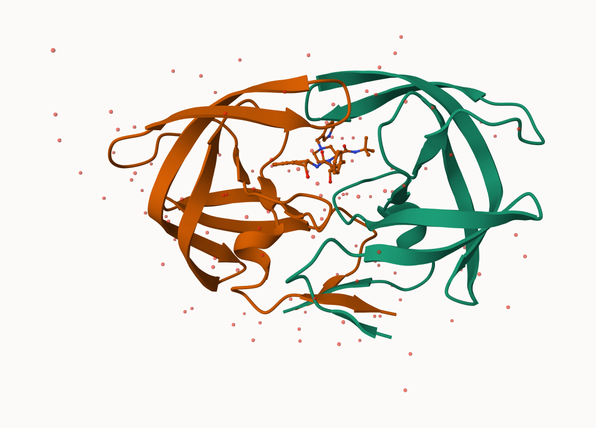
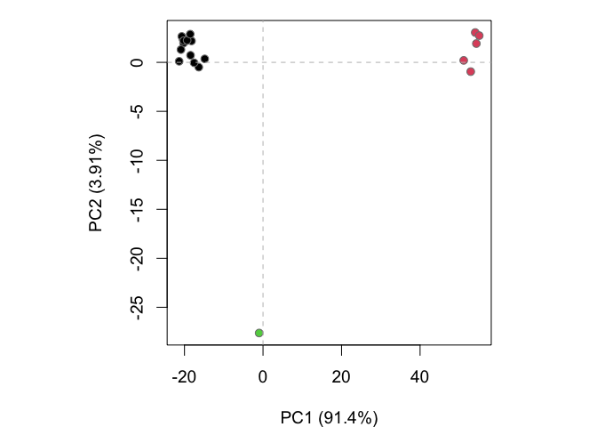
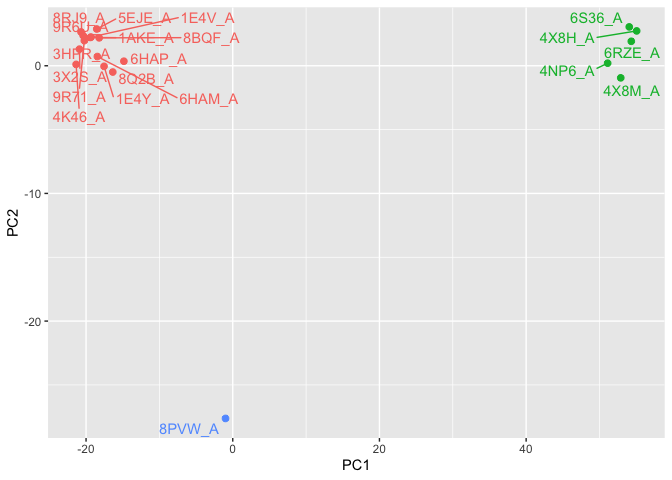
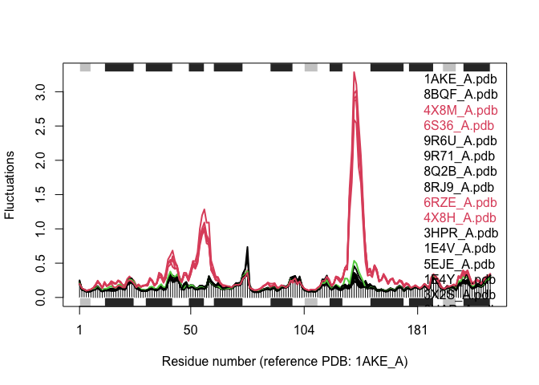

# class10: Structural Bioinformatics (pt1)
Sofia Jaravata (A19160915)

- [Background](#background)
- [2. Introduction to the RCSB Protein Data Bank
  (PDB)](#2-introduction-to-the-rcsb-protein-data-bank-pdb)
  - [PDB statistics](#pdb-statistics)
    - [\> Q1: What percentage of structures in the PDB are solved by
      X-Ray and Electron
      Microscopy?](#-q1-what-percentage-of-structures-in-the-pdb-are-solved-by-x-ray-and-electron-microscopy)
    - [\> Q2: What proportion of structures in the PDB are
      protein?](#-q2-what-proportion-of-structures-in-the-pdb-are-protein)
    - [\> Q3: Type HIV in the PDB website search box on the home page
      and determine how many HIV-1 protease structures are in the
      current
      PDB?](#-q3-type-hiv-in-the-pdb-website-search-box-on-the-home-page-and-determine-how-many-hiv-1-protease-structures-are-in-the-current-pdb)
- [3. Visualizing the HIV-1 protease
  structure](#3-visualizing-the-hiv-1-protease-structure)
  - [Visualizing PDB data with Mol-star (Using
    Mol\*)](#visualizing-pdb-data-with-mol-star-using-mol)
  - [*The important role of water*](#the-important-role-of-water)
    - [\> Q4: Water molecules normally have 3 atoms. Why do we see just
      one atom per water molecule in this
      structure?](#-q4-water-molecules-normally-have-3-atoms-why-do-we-see-just-one-atom-per-water-molecule-in-this-structure)
    - [\> Q5: There is a critical “conserved” water molecule in the
      binding site. Can you identify this water molecule? What residue
      number does this water molecule
      have?](#-q5-there-is-a-critical-conserved-water-molecule-in-the-binding-site-can-you-identify-this-water-molecule-what-residue-number-does-this-water-molecule-have)
    - [\> Q6: Generate and save a figure clearly showing the two
      distinct chains of HIV-protease along with the ligand. You might
      also consider showing the catalytic residues ASP 25 in each chain
      and the critical water (we recommend “Ball & Stick” for these
      side-chains). Add this figure to your Quarto
      document.](#-q6-generate-and-save-a-figure-clearly-showing-the-two-distinct-chains-of-hiv-protease-along-with-the-ligand-you-might-also-consider-showing-the-catalytic-residues-asp-25-in-each-chain-and-the-critical-water-we-recommend-ball--stick-for-these-side-chains-add-this-figure-to-your-quarto-document)
- [4. Introduction to Bio3D in R](#4-introduction-to-bio3d-in-r)
  - [Getting Started with the Bio3D
    package](#getting-started-with-the-bio3d-package)
  - [Reading PDB file data into R](#reading-pdb-file-data-into-r)
    - [\> Q7: How many amino acid residues are there in this pdb
      object?](#-q7-how-many-amino-acid-residues-are-there-in-this-pdb-object)
    - [\> Q8: Name one of the two non-protein
      residues?](#-q8-name-one-of-the-two-non-protein-residues)
    - [\> Q9: How many protein chains are in this
      structure?](#-q9-how-many-protein-chains-are-in-this-structure)
  - [Quick PDB visualization in R](#quick-pdb-visualization-in-r)
  - [Predicting functional motions of a single
    structure](#predicting-functional-motions-of-a-single-structure)
- [5. Comparative structure analysis of Adenylate Kinase (ADK)
  family](#5-comparative-structure-analysis-of-adenylate-kinase-adk-family)
  - [Setup](#setup)
    - [\> Q10. Which of the packages above is found only on BioConductor
      and not
      CRAN?](#-q10-which-of-the-packages-above-is-found-only-on-bioconductor-and-not-cran)
    - [\> Q11. Which of the above packages is not found on BioConductor
      or
      CRAN?:](#-q11-which-of-the-above-packages-is-not-found-on-bioconductor-or-cran)
    - [\> Q12. True or False? Functions from the pak package can be used
      to install packages from GitHub and
      BitBucket?](#-q12-true-or-false-functions-from-the-pak-package-can-be-used-to-install-packages-from-github-and-bitbucket)
  - [Search and retrieve ADK
    structures](#search-and-retrieve-adk-structures)
    - [\> Q13. How many amino acids are in this sequence, i.e. how long
      is this
      sequence?](#-q13-how-many-amino-acids-are-in-this-sequence-ie-how-long-is-this-sequence)
  - [Search for related sequences in the
    database](#search-for-related-sequences-in-the-database)
  - [Align and superpose structures](#align-and-superpose-structures)
  - [Annotate collected PDB
    structures](#annotate-collected-pdb-structures)
  - [Principal component analysis](#principal-component-analysis)
  - [PCA visualization](#pca-visualization)
- [6. Normal mode analysis
  \[optional\]](#6-normal-mode-analysis-optional)
  - [\> Q14. What do you note about this plot? Are the black and colored
    lines similar or different? Where do you think they differ most and
    why?](#-q14-what-do-you-note-about-this-plot-are-the-black-and-colored-lines-similar-or-different-where-do-you-think-they-differ-most-and-why)

## Background

The main repository of high-resolution structural data on biomolecules
is called the **Protein Data Bank** (PDB).

# 2. Introduction to the RCSB Protein Data Bank (PDB)

## PDB statistics

What is in the PDB in terms of molecule type and structure determination
method?

*Read a CSV file of current PDB stats obtained from
https://www.rcsb.org/stats/summary*

``` r
pdb <- read.csv("Data Export Summary.csv") # "CSV" button on website 
pdb
```

               Molecular.Type   X.ray     EM    NMR Integrative Multiple.methods
    1          Protein (only) 180,758 23,111 12,813         348              229
    2 Protein/Oligosaccharide  10,488  3,741     34           8               11
    3              Protein/NA   9,205  6,751    287          26                8
    4     Nucleic acid (only)   3,154    250  1,578           3               15
    5                   Other     178     27     35           4                0
    6  Oligosaccharide (only)      11      0      6           0                1
      Neutron Other   Total
    1      84    32 217,375
    2       1     0  14,283
    3       0     0  16,277
    4       3     1   5,004
    5       0     0     244
    6       0     4      22

### \> Q1: What percentage of structures in the PDB are solved by X-Ray and Electron Microscopy?

``` r
pdb$X.ray 
```

    [1] "180,758" "10,488"  "9,205"   "3,154"   "178"     "11"     

This print out above `pdb$X.ray` is “character”, not “numeric”.
Therefore, I can’t do math with it. We need to fix this…

1.  Two functions that can help here are `sub()` and `as.numeric()`

``` r
#We want to get rid (or sub out) commas: 

x <- pdb$X.ray 
tmp <- sub(",", "", x)
sum( as.numeric(tmp))
```

    [1] 203794

2.  We could make a function to do this:

``` r
rm.comma <- function(x) {
  tmp <- sub(",", "",x) 
sum( as.numeric(tmp))
}
```

``` r
n.tot <- rm.comma(pdb$Total)
n.xray <- rm.comma(pdb$`X-ray`)
n.em <- rm.comma(pdb$EM)

n.xray/n.tot * 100 
```

    [1] 0

``` r
n.em/n.tot * 100 
```

    [1] 13.38046

3.  We could also use a different import function for this CSV that
    speaks American (i.e. deals with commas in numbers in a comma
    separated value file)

``` r
library(readr) #CONSOLE: install.packages("readr")
```

    Warning: package 'readr' was built under R version 4.5.2

``` r
pdb <- read_csv("Data Export Summary.csv")
```

    Rows: 6 Columns: 9
    ── Column specification ────────────────────────────────────────────────────────
    Delimiter: ","
    chr (1): Molecular Type
    dbl (4): Integrative, Multiple methods, Neutron, Other
    num (4): X-ray, EM, NMR, Total

    ℹ Use `spec()` to retrieve the full column specification for this data.
    ℹ Specify the column types or set `show_col_types = FALSE` to quiet this message.

``` r
n.tot <- sum(pdb$Total)
n.xray <- sum(pdb$`X-ray`)
n.em <- sum(pdb$EM)

100 * n.xray / n.tot
```

    [1] 80.48577

``` r
100 * n.em / n.tot
```

    [1] 13.38046

**80.4% are solved by X-Ray and 13.38% are solved by Electron
Microscopy**

> ***Q. How many total protein structures are there in the dataset?***

``` r
pdb$Total[1]
```

    [1] 217375

**217375 total protein structures in the dataset**

### \> Q2: What proportion of structures in the PDB are protein?

The total number of protein sequences in UniProt is 202,556,314

``` r
217375/202556314 * 100
```

    [1] 0.1073158

**0.1073158% structures in the PDB are protein**

> **Key-point**: We have a very, very small structural coverage of known
> proteins (~0.1%). Most structures we know about (~80%) come from one
> method (X-ray crystalography)

### \> Q3: Type HIV in the PDB website search box on the home page and determine how many HIV-1 protease structures are in the current PDB?

**There are currently 1,227 HIV-1 protease structures in the PDB.**

# 3. Visualizing the HIV-1 protease structure

## Visualizing PDB data with Mol-star (Using Mol\*)

Main stand alone web version with all features is at
https://molstar.org/viewer/




## *The important role of water*

### \> Q4: Water molecules normally have 3 atoms. Why do we see just one atom per water molecule in this structure?

1HSG is an X-ray diffraction structure at 2.00 Å resolution. Hydrogen is
a very small molecule and thus not resolved in X-ray data, in which one
atom per water molecule is seen (represented by the oxygen atom).

### \> Q5: There is a critical “conserved” water molecule in the binding site. Can you identify this water molecule? What residue number does this water molecule have?

Yes, the water molecule is identified on Chain B. The water molecule’s
residue number is HOH 308.

### \> Q6: Generate and save a figure clearly showing the two distinct chains of HIV-protease along with the ligand. You might also consider showing the catalytic residues ASP 25 in each chain and the critical water (we recommend “Ball & Stick” for these side-chains). Add this figure to your Quarto document.

 The two multi-colored spacefill models
represent the A and B chain of ASP25, and the red spacefill model above
the ASP25 models is the critical water molecule.

> ***Discussion Topic: Can you think of a way in which indinavir, or
> even larger ligands and substrates, could enter the binding site?***

Indinavir, or even larger ligands and substrates, could enter the
binding site through changes in the HIV protease where the two flap
regions over the binding pocket could open and allow access to the
exposed active site.

# 4. Introduction to Bio3D in R

## Getting Started with the Bio3D package

Bio3D is an R package from CRAN for structural bioinformatics

``` r
library(bio3d) #CONSOLE: install.packages("bio3d)
pdb <- read.pdb("1hsg")
```

      Note: Accessing on-line PDB file

``` r
pdb
```


     Call:  read.pdb(file = "1hsg")

       Total Models#: 1
         Total Atoms#: 1686,  XYZs#: 5058  Chains#: 2  (values: A B)

         Protein Atoms#: 1514  (residues/Calpha atoms#: 198)
         Nucleic acid Atoms#: 0  (residues/phosphate atoms#: 0)

         Non-protein/nucleic Atoms#: 172  (residues: 128)
         Non-protein/nucleic resid values: [ HOH (127), MK1 (1) ]

       Protein sequence:
          PQITLWQRPLVTIKIGGQLKEALLDTGADDTVLEEMSLPGRWKPKMIGGIGGFIKVRQYD
          QILIEICGHKAIGTVLVGPTPVNIIGRNLLTQIGCTLNFPQITLWQRPLVTIKIGGQLKE
          ALLDTGADDTVLEEMSLPGRWKPKMIGGIGGFIKVRQYDQILIEICGHKAIGTVLVGPTP
          VNIIGRNLLTQIGCTLNF

    + attr: atom, xyz, seqres, helix, sheet,
            calpha, remark, call

## Reading PDB file data into R

### \> Q7: How many amino acid residues are there in this pdb object?

198 amino acid residues.

### \> Q8: Name one of the two non-protein residues?

HOH (water), or MK1 (ligand).

### \> Q9: How many protein chains are in this structure?

2 protein chains are in this structure.

``` r
attributes(pdb)
```

    $names
    [1] "atom"   "xyz"    "seqres" "helix"  "sheet"  "calpha" "remark" "call"  

    $class
    [1] "pdb" "sse"

``` r
head(pdb$atom) #access individual attributes
```

      type eleno elety  alt resid chain resno insert      x      y     z o     b
    1 ATOM     1     N <NA>   PRO     A     1   <NA> 29.361 39.686 5.862 1 38.10
    2 ATOM     2    CA <NA>   PRO     A     1   <NA> 30.307 38.663 5.319 1 40.62
    3 ATOM     3     C <NA>   PRO     A     1   <NA> 29.760 38.071 4.022 1 42.64
    4 ATOM     4     O <NA>   PRO     A     1   <NA> 28.600 38.302 3.676 1 43.40
    5 ATOM     5    CB <NA>   PRO     A     1   <NA> 30.508 37.541 6.342 1 37.87
    6 ATOM     6    CG <NA>   PRO     A     1   <NA> 29.296 37.591 7.162 1 38.40
      segid elesy charge
    1  <NA>     N   <NA>
    2  <NA>     C   <NA>
    3  <NA>     C   <NA>
    4  <NA>     O   <NA>
    5  <NA>     C   <NA>
    6  <NA>     C   <NA>

There are lots of functions that can work with these `pdb` objects

``` r
head(pdbseq(pdb))
```

      1   2   3   4   5   6 
    "P" "Q" "I" "T" "L" "W" 

## Quick PDB visualization in R

We can have a quick interactive view of any of these `pdb` objects:

``` r
library(bio3dview)
view.pdb(pdb)
```

Let’s try a custom view

``` r
view.pdb(pdb, 
        colorScheme = "sse", 
         backgroundColor = "black")
```

> ***Q. Create a custom view of HIV-Pr highlighting the active site ASP
> residues (`resno=25`), the two chains (in your choice of colors), and
> the ligand all on a custom color background?***

``` r
library(bio3dview)
library(NGLVieweR)

active.site <- atom.select(pdb, resno=25)
view.pdb(pdb, 
         cols = c("red", "blue"), 
         highlight = active.site, 
         highlight.style = "spacefill", 
         backgroundColor = "lightpink") |>
    setRock()
```

## Predicting functional motions of a single structure

Let’s do a Normal Model Analysis (NMA) to predict the flexibility of a
given `pdb` object:

``` r
adk <- read.pdb("6s36")
```

      Note: Accessing on-line PDB file
       PDB has ALT records, taking A only, rm.alt=TRUE

``` r
#A quick structure summary
adk
```


     Call:  read.pdb(file = "6s36")

       Total Models#: 1
         Total Atoms#: 1898,  XYZs#: 5694  Chains#: 1  (values: A)

         Protein Atoms#: 1654  (residues/Calpha atoms#: 214)
         Nucleic acid Atoms#: 0  (residues/phosphate atoms#: 0)

         Non-protein/nucleic Atoms#: 244  (residues: 244)
         Non-protein/nucleic resid values: [ CL (3), HOH (238), MG (2), NA (1) ]

       Protein sequence:
          MRIILLGAPGAGKGTQAQFIMEKYGIPQISTGDMLRAAVKSGSELGKQAKDIMDAGKLVT
          DELVIALVKERIAQEDCRNGFLLDGFPRTIPQADAMKEAGINVDYVLEFDVPDELIVDKI
          VGRRVHAPSGRVYHVKFNPPKVEGKDDVTGEELTTRKDDQEETVRKRLVEYHQMTAPLIG
          YYSKEAEAGNTKYAKVDGTKPVAEVRADLEKILG

    + attr: atom, xyz, seqres, helix, sheet,
            calpha, remark, call

``` r
# Perform flexiblity prediction
m <- nma(adk)
```

     Building Hessian...        Done in 0.01 seconds.
     Diagonalizing Hessian...   Done in 0.225 seconds.

``` r
plot(m)
```


View the results with an interactive structure view

``` r
view.nma(m)
```

Write out the results for viewing in Mol-star:

``` r
mktrj(m, file="adk_m7.pdb") #view a "movie" of predicted motions 

# for quicker display:

view.nma(m, pdb=adk)
```

# 5. Comparative structure analysis of Adenylate Kinase (ADK) family

## Setup

Install packages in console

### \> Q10. Which of the packages above is found only on BioConductor and not CRAN?

The msa package.

### \> Q11. Which of the above packages is not found on BioConductor or CRAN?:

The package “bio3dview” is not found on BioConductor or CRAN.

### \> Q12. True or False? Functions from the pak package can be used to install packages from GitHub and BitBucket?

TRUE

## Search and retrieve ADK structures

Our first step is to find a sequence for this family. We will use the
database ID “1ake-A” here:

``` r
library(bio3d)
id <- "1ake_A"

aa <- get.seq(id)
```

    Warning in get.seq(id): Removing existing file: seqs.fasta

    Fetching... Please wait. Done.

``` r
aa
```

                 1        .         .         .         .         .         60 
    pdb|1AKE|A   MRIILLGAPGAGKGTQAQFIMEKYGIPQISTGDMLRAAVKSGSELGKQAKDIMDAGKLVT
                 1        .         .         .         .         .         60 

                61        .         .         .         .         .         120 
    pdb|1AKE|A   DELVIALVKERIAQEDCRNGFLLDGFPRTIPQADAMKEAGINVDYVLEFDVPDELIVDRI
                61        .         .         .         .         .         120 

               121        .         .         .         .         .         180 
    pdb|1AKE|A   VGRRVHAPSGRVYHVKFNPPKVEGKDDVTGEELTTRKDDQEETVRKRLVEYHQMTAPLIG
               121        .         .         .         .         .         180 

               181        .         .         .   214 
    pdb|1AKE|A   YYSKEAEAGNTKYAKVDGTKPVAEVRADLEKILG
               181        .         .         .   214 

    Call:
      read.fasta(file = outfile)

    Class:
      fasta

    Alignment dimensions:
      1 sequence rows; 214 position columns (214 non-gap, 0 gap) 

    + attr: id, ali, call

### \> Q13. How many amino acids are in this sequence, i.e. how long is this sequence?

214 amino acids are in this sequence.

## Search for related sequences in the database

``` r
blast <- blast.pdb(aa)
```

     Searching ... please wait (updates every 5 seconds) RID = 1BWJ8X24014 
     .
     Reporting 96 hits

``` r
head(blast$hit.tbl)
```

            queryid subjectids identity alignmentlength mismatches gapopens q.start
    1 Query_2450985     1AKE_A  100.000             214          0        0       1
    2 Query_2450985     8BQF_A   99.533             214          1        0       1
    3 Query_2450985     4X8M_A   99.533             214          1        0       1
    4 Query_2450985     6S36_A   99.533             214          1        0       1
    5 Query_2450985     9R6U_A   99.533             214          1        0       1
    6 Query_2450985     9R71_A   99.533             214          1        0       1
      q.end s.start s.end    evalue bitscore positives mlog.evalue pdb.id    acc
    1   214       1   214 1.82e-156      432    100.00    358.6044 1AKE_A 1AKE_A
    2   214      21   234 2.98e-156      433    100.00    358.1114 8BQF_A 8BQF_A
    3   214       1   214 3.26e-156      432    100.00    358.0215 4X8M_A 4X8M_A
    4   214       1   214 4.78e-156      432    100.00    357.6388 6S36_A 6S36_A
    5   214       1   214 1.07e-155      431     99.53    356.8330 9R6U_A 9R6U_A
    6   214       1   214 1.26e-155      431     99.53    356.6696 9R71_A 9R71_A

``` r
hits <- plot(blast)
```

      * Possible cutoff values:    260 3 
                Yielding Nhits:    20 96 

      * Chosen cutoff value of:    260 
                Yielding Nhits:    20 


``` r
hits$pdb.id
```

     [1] "1AKE_A" "8BQF_A" "4X8M_A" "6S36_A" "9R6U_A" "9R71_A" "8Q2B_A" "8RJ9_A"
     [9] "6RZE_A" "4X8H_A" "3HPR_A" "1E4V_A" "5EJE_A" "1E4Y_A" "3X2S_A" "6HAP_A"
    [17] "6HAM_A" "8PVW_A" "4K46_A" "4NP6_A"

``` r
files <- get.pdb(hits$pdb.id, path="pdbs", split=TRUE, gzip=TRUE)
```

    Warning in get.pdb(hits$pdb.id, path = "pdbs", split = TRUE, gzip = TRUE):
    pdbs/1AKE.pdb.gz exists. Skipping download

    Warning in get.pdb(hits$pdb.id, path = "pdbs", split = TRUE, gzip = TRUE):
    pdbs/8BQF.pdb.gz exists. Skipping download

    Warning in get.pdb(hits$pdb.id, path = "pdbs", split = TRUE, gzip = TRUE):
    pdbs/4X8M.pdb.gz exists. Skipping download

    Warning in get.pdb(hits$pdb.id, path = "pdbs", split = TRUE, gzip = TRUE):
    pdbs/6S36.pdb.gz exists. Skipping download

    Warning in get.pdb(hits$pdb.id, path = "pdbs", split = TRUE, gzip = TRUE):
    pdbs/9R6U.pdb.gz exists. Skipping download

    Warning in get.pdb(hits$pdb.id, path = "pdbs", split = TRUE, gzip = TRUE):
    pdbs/9R71.pdb.gz exists. Skipping download

    Warning in get.pdb(hits$pdb.id, path = "pdbs", split = TRUE, gzip = TRUE):
    pdbs/8Q2B.pdb.gz exists. Skipping download

    Warning in get.pdb(hits$pdb.id, path = "pdbs", split = TRUE, gzip = TRUE):
    pdbs/8RJ9.pdb.gz exists. Skipping download

    Warning in get.pdb(hits$pdb.id, path = "pdbs", split = TRUE, gzip = TRUE):
    pdbs/6RZE.pdb.gz exists. Skipping download

    Warning in get.pdb(hits$pdb.id, path = "pdbs", split = TRUE, gzip = TRUE):
    pdbs/4X8H.pdb.gz exists. Skipping download

    Warning in get.pdb(hits$pdb.id, path = "pdbs", split = TRUE, gzip = TRUE):
    pdbs/3HPR.pdb.gz exists. Skipping download

    Warning in get.pdb(hits$pdb.id, path = "pdbs", split = TRUE, gzip = TRUE):
    pdbs/1E4V.pdb.gz exists. Skipping download

    Warning in get.pdb(hits$pdb.id, path = "pdbs", split = TRUE, gzip = TRUE):
    pdbs/5EJE.pdb.gz exists. Skipping download

    Warning in get.pdb(hits$pdb.id, path = "pdbs", split = TRUE, gzip = TRUE):
    pdbs/1E4Y.pdb.gz exists. Skipping download

    Warning in get.pdb(hits$pdb.id, path = "pdbs", split = TRUE, gzip = TRUE):
    pdbs/3X2S.pdb.gz exists. Skipping download

    Warning in get.pdb(hits$pdb.id, path = "pdbs", split = TRUE, gzip = TRUE):
    pdbs/6HAP.pdb.gz exists. Skipping download

    Warning in get.pdb(hits$pdb.id, path = "pdbs", split = TRUE, gzip = TRUE):
    pdbs/6HAM.pdb.gz exists. Skipping download

    Warning in get.pdb(hits$pdb.id, path = "pdbs", split = TRUE, gzip = TRUE):
    pdbs/8PVW.pdb.gz exists. Skipping download

    Warning in get.pdb(hits$pdb.id, path = "pdbs", split = TRUE, gzip = TRUE):
    pdbs/4K46.pdb.gz exists. Skipping download

    Warning in get.pdb(hits$pdb.id, path = "pdbs", split = TRUE, gzip = TRUE):
    pdbs/4NP6.pdb.gz exists. Skipping download


      |                                                                            
      |                                                                      |   0%
      |                                                                            
      |====                                                                  |   5%
      |                                                                            
      |=======                                                               |  10%
      |                                                                            
      |==========                                                            |  15%
      |                                                                            
      |==============                                                        |  20%
      |                                                                            
      |==================                                                    |  25%
      |                                                                            
      |=====================                                                 |  30%
      |                                                                            
      |========================                                              |  35%
      |                                                                            
      |============================                                          |  40%
      |                                                                            
      |================================                                      |  45%
      |                                                                            
      |===================================                                   |  50%
      |                                                                            
      |======================================                                |  55%
      |                                                                            
      |==========================================                            |  60%
      |                                                                            
      |==============================================                        |  65%
      |                                                                            
      |=================================================                     |  70%
      |                                                                            
      |====================================================                  |  75%
      |                                                                            
      |========================================================              |  80%
      |                                                                            
      |============================================================          |  85%
      |                                                                            
      |===============================================================       |  90%
      |                                                                            
      |==================================================================    |  95%
      |                                                                            
      |======================================================================| 100%

## Align and superpose structures

``` r
pdbs <- pdbaln(files, fit = TRUE, exefile="msa")
```

    Reading PDB files:
    pdbs/split_chain/1AKE_A.pdb
    pdbs/split_chain/8BQF_A.pdb
    pdbs/split_chain/4X8M_A.pdb
    pdbs/split_chain/6S36_A.pdb
    pdbs/split_chain/9R6U_A.pdb
    pdbs/split_chain/9R71_A.pdb
    pdbs/split_chain/8Q2B_A.pdb
    pdbs/split_chain/8RJ9_A.pdb
    pdbs/split_chain/6RZE_A.pdb
    pdbs/split_chain/4X8H_A.pdb
    pdbs/split_chain/3HPR_A.pdb
    pdbs/split_chain/1E4V_A.pdb
    pdbs/split_chain/5EJE_A.pdb
    pdbs/split_chain/1E4Y_A.pdb
    pdbs/split_chain/3X2S_A.pdb
    pdbs/split_chain/6HAP_A.pdb
    pdbs/split_chain/6HAM_A.pdb
    pdbs/split_chain/8PVW_A.pdb
    pdbs/split_chain/4K46_A.pdb
    pdbs/split_chain/4NP6_A.pdb
       PDB has ALT records, taking A only, rm.alt=TRUE
    .   PDB has ALT records, taking A only, rm.alt=TRUE
    ..   PDB has ALT records, taking A only, rm.alt=TRUE
    .   PDB has ALT records, taking A only, rm.alt=TRUE
    .   PDB has ALT records, taking A only, rm.alt=TRUE
    .   PDB has ALT records, taking A only, rm.alt=TRUE
    .   PDB has ALT records, taking A only, rm.alt=TRUE
    .   PDB has ALT records, taking A only, rm.alt=TRUE
    ..   PDB has ALT records, taking A only, rm.alt=TRUE
    ..   PDB has ALT records, taking A only, rm.alt=TRUE
    ....   PDB has ALT records, taking A only, rm.alt=TRUE
    .   PDB has ALT records, taking A only, rm.alt=TRUE
    .   PDB has ALT records, taking A only, rm.alt=TRUE
    ..

    Extracting sequences

    pdb/seq: 1   name: pdbs/split_chain/1AKE_A.pdb 
       PDB has ALT records, taking A only, rm.alt=TRUE
    pdb/seq: 2   name: pdbs/split_chain/8BQF_A.pdb 
       PDB has ALT records, taking A only, rm.alt=TRUE
    pdb/seq: 3   name: pdbs/split_chain/4X8M_A.pdb 
    pdb/seq: 4   name: pdbs/split_chain/6S36_A.pdb 
       PDB has ALT records, taking A only, rm.alt=TRUE
    pdb/seq: 5   name: pdbs/split_chain/9R6U_A.pdb 
       PDB has ALT records, taking A only, rm.alt=TRUE
    pdb/seq: 6   name: pdbs/split_chain/9R71_A.pdb 
       PDB has ALT records, taking A only, rm.alt=TRUE
    pdb/seq: 7   name: pdbs/split_chain/8Q2B_A.pdb 
       PDB has ALT records, taking A only, rm.alt=TRUE
    pdb/seq: 8   name: pdbs/split_chain/8RJ9_A.pdb 
       PDB has ALT records, taking A only, rm.alt=TRUE
    pdb/seq: 9   name: pdbs/split_chain/6RZE_A.pdb 
       PDB has ALT records, taking A only, rm.alt=TRUE
    pdb/seq: 10   name: pdbs/split_chain/4X8H_A.pdb 
    pdb/seq: 11   name: pdbs/split_chain/3HPR_A.pdb 
       PDB has ALT records, taking A only, rm.alt=TRUE
    pdb/seq: 12   name: pdbs/split_chain/1E4V_A.pdb 
    pdb/seq: 13   name: pdbs/split_chain/5EJE_A.pdb 
       PDB has ALT records, taking A only, rm.alt=TRUE
    pdb/seq: 14   name: pdbs/split_chain/1E4Y_A.pdb 
    pdb/seq: 15   name: pdbs/split_chain/3X2S_A.pdb 
    pdb/seq: 16   name: pdbs/split_chain/6HAP_A.pdb 
    pdb/seq: 17   name: pdbs/split_chain/6HAM_A.pdb 
       PDB has ALT records, taking A only, rm.alt=TRUE
    pdb/seq: 18   name: pdbs/split_chain/8PVW_A.pdb 
       PDB has ALT records, taking A only, rm.alt=TRUE
    pdb/seq: 19   name: pdbs/split_chain/4K46_A.pdb 
       PDB has ALT records, taking A only, rm.alt=TRUE
    pdb/seq: 20   name: pdbs/split_chain/4NP6_A.pdb 

``` r
pdbs
```

                                    1        .         .         .         40 
    [Truncated_Name:1]1AKE_A.pdb    --MRIILLGAPGAGKGTQAQFIMEKYGIPQISTGDMLRAA
    [Truncated_Name:2]8BQF_A.pdb    --MRIILLGAPGAGKGTQAQFIMEKYGIPQISTGDMLRAA
    [Truncated_Name:3]4X8M_A.pdb    --MRIILLGAPGAGKGTQAQFIMEKYGIPQISTGDMLRAA
    [Truncated_Name:4]6S36_A.pdb    --MRIILLGAPGAGKGTQAQFIMEKYGIPQISTGDMLRAA
    [Truncated_Name:5]9R6U_A.pdb    --MRIILLGAPGAGKGTQAQFIMEKYGIPQISTGDMLRAA
    [Truncated_Name:6]9R71_A.pdb    --MRIILLGAPGAGKGTQAQFIMEKYGIPQISTGDMLRAA
    [Truncated_Name:7]8Q2B_A.pdb    --MRIILLGAPGAGKGTQAQFIMEKYGIPQISTGDMLRAA
    [Truncated_Name:8]8RJ9_A.pdb    --MRIILLGAPGAGKGTQAQFIMEKYGIPQISTGDMLRAA
    [Truncated_Name:9]6RZE_A.pdb    --MRIILLGAPGAGKGTQAQFIMEKYGIPQISTGDMLRAA
    [Truncated_Name:10]4X8H_A.pdb   --MRIILLGAPGAGKGTQAQFIMEKYGIPQISTGDMLRAA
    [Truncated_Name:11]3HPR_A.pdb   --MRIILLGAPGAGKGTQAQFIMEKYGIPQISTGDMLRAA
    [Truncated_Name:12]1E4V_A.pdb   --MRIILLGAPVAGKGTQAQFIMEKYGIPQISTGDMLRAA
    [Truncated_Name:13]5EJE_A.pdb   --MRIILLGAPGAGKGTQAQFIMEKYGIPQISTGDMLRAA
    [Truncated_Name:14]1E4Y_A.pdb   --MRIILLGALVAGKGTQAQFIMEKYGIPQISTGDMLRAA
    [Truncated_Name:15]3X2S_A.pdb   --MRIILLGAPGAGKGTQAQFIMEKYGIPQISTGDMLRAA
    [Truncated_Name:16]6HAP_A.pdb   --MRIILLGAPGAGKGTQAQFIMEKYGIPQISTGDMLRAA
    [Truncated_Name:17]6HAM_A.pdb   --MRIILLGAPGAGKGTQAQFIMEKYGIPQISTGDMLRAA
    [Truncated_Name:18]8PVW_A.pdb   --MRIILLGAPGAGKGTQAQFIMEKYGIPQISTGDMLRAA
    [Truncated_Name:19]4K46_A.pdb   --MRIILLGAPGAGKGTQAQFIMAKFGIPQISTGDMLRAA
    [Truncated_Name:20]4NP6_A.pdb   NAMRIILLGAPGAGKGTQAQFIMEKFGIPQISTGDMLRAA
                                      ********  *********** *^************** 
                                    1        .         .         .         40 

                                   41        .         .         .         80 
    [Truncated_Name:1]1AKE_A.pdb    VKSGSELGKQAKDIMDAGKLVTDELVIALVKERIAQEDCR
    [Truncated_Name:2]8BQF_A.pdb    VKSGSELGKQAKDIMDAGKLVTDELVIALVKERIAQE---
    [Truncated_Name:3]4X8M_A.pdb    VKSGSELGKQAKDIMDAGKLVTDELVIALVKERIAQEDCR
    [Truncated_Name:4]6S36_A.pdb    VKSGSELGKQAKDIMDAGKLVTDELVIALVKERIAQEDCR
    [Truncated_Name:5]9R6U_A.pdb    VKSGSELGAQAKDIMDAGKLVTDELVIALVKERIAQEDCR
    [Truncated_Name:6]9R71_A.pdb    VKSGSELGKQAKDIMDAGKLVTDELVIALVKERIAQEDCR
    [Truncated_Name:7]8Q2B_A.pdb    VKSGSELGKQAKDIMDAGKLVTDELVIALVKERIAQEDCR
    [Truncated_Name:8]8RJ9_A.pdb    VKSGSELGKQAKDIMDAGKLVTDELVIALVKERIAQEDCR
    [Truncated_Name:9]6RZE_A.pdb    VKSGSELGKQAKDIMDAGKLVTDELVIALVKERIAQEDCR
    [Truncated_Name:10]4X8H_A.pdb   VKSGSELGKQAKDIMDAGKLVTDELVIALVKERIAQEDCR
    [Truncated_Name:11]3HPR_A.pdb   VKSGSELGKQAKDIMDAGKLVTDELVIALVKERIAQEDCR
    [Truncated_Name:12]1E4V_A.pdb   VKSGSELGKQAKDIMDAGKLVTDELVIALVKERIAQEDCR
    [Truncated_Name:13]5EJE_A.pdb   VKSGSELGKQAKDIMDACKLVTDELVIALVKERIAQEDCR
    [Truncated_Name:14]1E4Y_A.pdb   VKSGSELGKQAKDIMDAGKLVTDELVIALVKERIAQEDCR
    [Truncated_Name:15]3X2S_A.pdb   VKSGSELGKQAKDIMDCGKLVTDELVIALVKERIAQEDSR
    [Truncated_Name:16]6HAP_A.pdb   VKSGSELGKQAKDIMDAGKLVTDELVIALVRERICQEDSR
    [Truncated_Name:17]6HAM_A.pdb   IKSGSELGKQAKDIMDAGKLVTDEIIIALVKERICQEDSR
    [Truncated_Name:18]8PVW_A.pdb   VKSGSELGKQAKDIMDAGKLVTDELVIALVKERIAQEDCR
    [Truncated_Name:19]4K46_A.pdb   IKAGTELGKQAKSVIDAGQLVSDDIILGLVKERIAQDDCA
    [Truncated_Name:20]4NP6_A.pdb   IKAGTELGKQAKAVIDAGQLVSDDIILGLIKERIAQADCE
                                    ^* *^*** *** ^^*   **^*^^^^^*^^*** *     
                                   41        .         .         .         80 

                                   81        .         .         .         120 
    [Truncated_Name:1]1AKE_A.pdb    NGFLLDGFPRTIPQADAMKEAGINVDYVLEFDVPDELIVD
    [Truncated_Name:2]8BQF_A.pdb    -GFLLDGFPRTIPQADAMKEAGINVDYVIEFDVPDELIVD
    [Truncated_Name:3]4X8M_A.pdb    NGFLLDGFPRTIPQADAMKEAGINVDYVLEFDVPDELIVD
    [Truncated_Name:4]6S36_A.pdb    NGFLLDGFPRTIPQADAMKEAGINVDYVLEFDVPDELIVD
    [Truncated_Name:5]9R6U_A.pdb    NGFLLDGFPRTIPQADAMKEAGINVDYVLEFDVPDELIVD
    [Truncated_Name:6]9R71_A.pdb    NGFLLDGFPRTIPQADAMKEAGINVDYVLEFDVPDALIVD
    [Truncated_Name:7]8Q2B_A.pdb    NGFLLDGFPRTIPQADAMKEAGINVDYVLEFDVPDELIVD
    [Truncated_Name:8]8RJ9_A.pdb    NGFLLAGFPRTIPQADAMKEAGINVDYVLEFDVPDELIVD
    [Truncated_Name:9]6RZE_A.pdb    NGFLLDGFPRTIPQADAMKEAGINVDYVLEFDVPDELIVD
    [Truncated_Name:10]4X8H_A.pdb   NGFLLDGFPRTIPQADAMKEAGINVDYVLEFDVPDELIVD
    [Truncated_Name:11]3HPR_A.pdb   NGFLLDGFPRTIPQADAMKEAGINVDYVLEFDVPDELIVD
    [Truncated_Name:12]1E4V_A.pdb   NGFLLDGFPRTIPQADAMKEAGINVDYVLEFDVPDELIVD
    [Truncated_Name:13]5EJE_A.pdb   NGFLLDGFPRTIPQADAMKEAGINVDYVLEFDVPDELIVD
    [Truncated_Name:14]1E4Y_A.pdb   NGFLLDGFPRTIPQADAMKEAGINVDYVLEFDVPDELIVD
    [Truncated_Name:15]3X2S_A.pdb   NGFLLDGFPRTIPQADAMKEAGINVDYVLEFDVPDELIVD
    [Truncated_Name:16]6HAP_A.pdb   NGFLLDGFPRTIPQADAMKEAGINVDYVLEFDVPDELIVD
    [Truncated_Name:17]6HAM_A.pdb   NGFLLDGFPRTIPQADAMKEAGINVDYVLEFDVPDELIVD
    [Truncated_Name:18]8PVW_A.pdb   NGFLLDGFPRTIPQADAMKEAGINVDYVLEFDVPDELIVD
    [Truncated_Name:19]4K46_A.pdb   KGFLLDGFPRTIPQADGLKEVGVVVDYVIEFDVADSVIVE
    [Truncated_Name:20]4NP6_A.pdb   KGFLLDGFPRTIPQADGLKEMGINVDYVIEFDVADDVIVE
                                     **** **********^^** *^ ****^**** * ^**^ 
                                   81        .         .         .         120 

                                  121        .         .         .         160 
    [Truncated_Name:1]1AKE_A.pdb    RIVGRRVHAPSGRVYHVKFNPPKVEGKDDVTGEELTTRKD
    [Truncated_Name:2]8BQF_A.pdb    RIVGRRVHAPSGRVYHVKFNPPKVEGKDDVTGEELTTRKD
    [Truncated_Name:3]4X8M_A.pdb    RIVGRRVHAPSGRVYHVKFNPPKVEGKDDVTGEELTTRKD
    [Truncated_Name:4]6S36_A.pdb    KIVGRRVHAPSGRVYHVKFNPPKVEGKDDVTGEELTTRKD
    [Truncated_Name:5]9R6U_A.pdb    RIVGRRVHAPSGRVYHVKFNPPKVEGKDDVTGEELTTRKD
    [Truncated_Name:6]9R71_A.pdb    RIVGRRVHAPSGRVYHVKFNPPKVEGKDDVTGEELTTRKD
    [Truncated_Name:7]8Q2B_A.pdb    RIVGRRVHAPSGRVYHVKFNPPKVEGKDDVTGEELTTRKA
    [Truncated_Name:8]8RJ9_A.pdb    RIVGRRVHAPSGRVYHVKFNPPKVEGKDDVTGEELTTRKD
    [Truncated_Name:9]6RZE_A.pdb    AIVGRRVHAPSGRVYHVKFNPPKVEGKDDVTGEELTTRKD
    [Truncated_Name:10]4X8H_A.pdb   RIVGRRVHAPSGRVYHVKFNPPKVEGKDDVTGEELTTRKD
    [Truncated_Name:11]3HPR_A.pdb   RIVGRRVHAPSGRVYHVKFNPPKVEGKDDGTGEELTTRKD
    [Truncated_Name:12]1E4V_A.pdb   RIVGRRVHAPSGRVYHVKFNPPKVEGKDDVTGEELTTRKD
    [Truncated_Name:13]5EJE_A.pdb   RIVGRRVHAPSGRVYHVKFNPPKVEGKDDVTGEELTTRKD
    [Truncated_Name:14]1E4Y_A.pdb   RIVGRRVHAPSGRVYHVKFNPPKVEGKDDVTGEELTTRKD
    [Truncated_Name:15]3X2S_A.pdb   RIVGRRVHAPSGRVYHVKFNPPKVEGKDDVTGEELTTRKD
    [Truncated_Name:16]6HAP_A.pdb   RIVGRRVHAPSGRVYHVKFNPPKVEGKDDVTGEELTTRKD
    [Truncated_Name:17]6HAM_A.pdb   RIVGRRVHAPSGRVYHVKFNPPKVEGKDDVTGEELTTRKD
    [Truncated_Name:18]8PVW_A.pdb   RILKR--GETSGRV-------------------------D
    [Truncated_Name:19]4K46_A.pdb   RMAGRRAHLASGRTYHNVYNPPKVEGKDDVTGEDLVIRED
    [Truncated_Name:20]4NP6_A.pdb   RMAGRRAHLPSGRTYHVVYNPPKVEGKDDVTGEDLVIRED
                                     ^  *     ***                            
                                  121        .         .         .         160 

                                  161        .         .         .         200 
    [Truncated_Name:1]1AKE_A.pdb    DQEETVRKRLVEYHQMTAPLIGYYSKEAEAGNTKYAKVDG
    [Truncated_Name:2]8BQF_A.pdb    DQEETVRKRLVEYHQMTAPLIGYYSKEAEAGNTKYAKVDG
    [Truncated_Name:3]4X8M_A.pdb    DQEETVRKRLVEWHQMTAPLIGYYSKEAEAGNTKYAKVDG
    [Truncated_Name:4]6S36_A.pdb    DQEETVRKRLVEYHQMTAPLIGYYSKEAEAGNTKYAKVDG
    [Truncated_Name:5]9R6U_A.pdb    DQEETVRKRLVEYHQMTAPLIGYYSKEAEAGNTKYAKVDG
    [Truncated_Name:6]9R71_A.pdb    DQEETVRKRLVEYHQMTAPLIGYYSKEAEAGNTKYAKVDG
    [Truncated_Name:7]8Q2B_A.pdb    DQEETVRKRLVEYHQMTAPLIGYYSKEAEAGNTKYAKVDG
    [Truncated_Name:8]8RJ9_A.pdb    DQEETVRKRLVEYHQMTAPLIGYYSKEAEAGNTKYAKVDG
    [Truncated_Name:9]6RZE_A.pdb    DQEETVRKRLVEYHQMTAPLIGYYSKEAEAGNTKYAKVDG
    [Truncated_Name:10]4X8H_A.pdb   DQEETVRKRLVEYHQMTAALIGYYSKEAEAGNTKYAKVDG
    [Truncated_Name:11]3HPR_A.pdb   DQEETVRKRLVEYHQMTAPLIGYYSKEAEAGNTKYAKVDG
    [Truncated_Name:12]1E4V_A.pdb   DQEETVRKRLVEYHQMTAPLIGYYSKEAEAGNTKYAKVDG
    [Truncated_Name:13]5EJE_A.pdb   DQEECVRKRLVEYHQMTAPLIGYYSKEAEAGNTKYAKVDG
    [Truncated_Name:14]1E4Y_A.pdb   DQEETVRKRLVEYHQMTAPLIGYYSKEAEAGNTKYAKVDG
    [Truncated_Name:15]3X2S_A.pdb   DQEETVRKRLCEYHQMTAPLIGYYSKEAEAGNTKYAKVDG
    [Truncated_Name:16]6HAP_A.pdb   DQEETVRKRLVEYHQMTAPLIGYYSKEAEAGNTKYAKVDG
    [Truncated_Name:17]6HAM_A.pdb   DQEETVRKRLVEYHQMTAPLIGYYSKEAEAGNTKYAKVDG
    [Truncated_Name:18]8PVW_A.pdb   DNEETVRKRLVEYHQMTAPLIGYYSKEAEAGNTKYAKVDG
    [Truncated_Name:19]4K46_A.pdb   DKEETVLARLGVYHNQTAPLIAYYGKEAEAGNTQYLKFDG
    [Truncated_Name:20]4NP6_A.pdb   DKEETVRARLNVYHTQTAPLIEYYGKEAAAGKTQYLKFDG
                                    * ** *  **  ^*  ** ** ** *** ** * * * ** 
                                  161        .         .         .         200 

                                  201        .     216 
    [Truncated_Name:1]1AKE_A.pdb    TKPVAEVRADLEKILG
    [Truncated_Name:2]8BQF_A.pdb    TKPVAEVRADLEKIL-
    [Truncated_Name:3]4X8M_A.pdb    TKPVAEVRADLEKILG
    [Truncated_Name:4]6S36_A.pdb    TKPVAEVRADLEKILG
    [Truncated_Name:5]9R6U_A.pdb    TKPVAEVRADLEKILG
    [Truncated_Name:6]9R71_A.pdb    TKPVAEVRADLEKILG
    [Truncated_Name:7]8Q2B_A.pdb    TKPVAEVRADLEKILG
    [Truncated_Name:8]8RJ9_A.pdb    TKPVAEVRADLEKILG
    [Truncated_Name:9]6RZE_A.pdb    TKPVAEVRADLEKILG
    [Truncated_Name:10]4X8H_A.pdb   TKPVAEVRADLEKILG
    [Truncated_Name:11]3HPR_A.pdb   TKPVAEVRADLEKILG
    [Truncated_Name:12]1E4V_A.pdb   TKPVAEVRADLEKILG
    [Truncated_Name:13]5EJE_A.pdb   TKPVAEVRADLEKILG
    [Truncated_Name:14]1E4Y_A.pdb   TKPVAEVRADLEKILG
    [Truncated_Name:15]3X2S_A.pdb   TKPVAEVRADLEKILG
    [Truncated_Name:16]6HAP_A.pdb   TKPVCEVRADLEKILG
    [Truncated_Name:17]6HAM_A.pdb   TKPVCEVRADLEKILG
    [Truncated_Name:18]8PVW_A.pdb   TKPVAEVRADLEKILG
    [Truncated_Name:19]4K46_A.pdb   TKAVAEVSAELEKALA
    [Truncated_Name:20]4NP6_A.pdb   TKQVSEVSADIAKALA
                                    ** * ** *^^ * *  
                                  201        .     216 

    Call:
      pdbaln(files = files, fit = TRUE, exefile = "msa")

    Class:
      pdbs, fasta

    Alignment dimensions:
      20 sequence rows; 216 position columns (182 non-gap, 34 gap) 

    + attr: xyz, resno, b, chain, id, ali, resid, sse, call

Quick interactive structural view

``` r
library(bio3dview)
view.pdbs(pdbs, colorScheme = "residueIndex")
```

## Annotate collected PDB structures

``` r
# Vector containing PDB database codes
ids <- basename.pdb(pdbs$id)

anno <- pdb.annotate(ids)
unique(anno$source)
```

    [1] "Escherichia coli"                            
    [2] "Escherichia coli K-12"                       
    [3] "Escherichia coli O139:H28 str. E24377A"      
    [4] "Escherichia coli str. K-12 substr. MDS42"    
    [5] "Photobacterium profundum"                    
    [6] "Vibrio cholerae O1 biovar El Tor str. N16961"

``` r
anno
```

           structureId chainId macromoleculeType chainLength experimentalTechnique
    1AKE_A        1AKE       A           Protein         214                 X-ray
    8BQF_A        8BQF       A           Protein         234                 X-ray
    4X8M_A        4X8M       A           Protein         214                 X-ray
    6S36_A        6S36       A           Protein         214                 X-ray
    9R6U_A        9R6U       A           Protein         214                 X-ray
    9R71_A        9R71       A           Protein         214                 X-ray
    8Q2B_A        8Q2B       A           Protein         214                 X-ray
    8RJ9_A        8RJ9       A           Protein         214                 X-ray
    6RZE_A        6RZE       A           Protein         214                 X-ray
    4X8H_A        4X8H       A           Protein         214                 X-ray
    3HPR_A        3HPR       A           Protein         214                 X-ray
    1E4V_A        1E4V       A           Protein         214                 X-ray
    5EJE_A        5EJE       A           Protein         214                 X-ray
    1E4Y_A        1E4Y       A           Protein         214                 X-ray
    3X2S_A        3X2S       A           Protein         214                 X-ray
    6HAP_A        6HAP       A           Protein         214                 X-ray
    6HAM_A        6HAM       A           Protein         214                 X-ray
    8PVW_A        8PVW       A           Protein         187                 X-ray
    4K46_A        4K46       A           Protein         214                 X-ray
    4NP6_A        4NP6       A           Protein         217                 X-ray
           resolution       scopDomain                                        pfam
    1AKE_A      2.000 Adenylate kinase                      Adenylate kinase (ADK)
    8BQF_A      2.050             <NA> Adenylate kinase, active site lid (ADK_lid)
    4X8M_A      2.600             <NA>                      Adenylate kinase (ADK)
    6S36_A      1.600             <NA>                      Adenylate kinase (ADK)
    9R6U_A      1.770             <NA> Adenylate kinase, active site lid (ADK_lid)
    9R71_A      1.610             <NA>                      Adenylate kinase (ADK)
    8Q2B_A      1.760             <NA> Adenylate kinase, active site lid (ADK_lid)
    8RJ9_A      1.590             <NA>                      Adenylate kinase (ADK)
    6RZE_A      1.690             <NA> Adenylate kinase, active site lid (ADK_lid)
    4X8H_A      2.500             <NA>                      Adenylate kinase (ADK)
    3HPR_A      2.000             <NA>                      Adenylate kinase (ADK)
    1E4V_A      1.850 Adenylate kinase                      Adenylate kinase (ADK)
    5EJE_A      1.900             <NA>                      Adenylate kinase (ADK)
    1E4Y_A      1.850 Adenylate kinase                      Adenylate kinase (ADK)
    3X2S_A      2.800             <NA>                                        <NA>
    6HAP_A      2.700             <NA>                      Adenylate kinase (ADK)
    6HAM_A      2.550             <NA>                      Adenylate kinase (ADK)
    8PVW_A      2.000             <NA>                      Adenylate kinase (ADK)
    4K46_A      2.010             <NA>                      Adenylate kinase (ADK)
    4NP6_A      2.004             <NA>                      Adenylate kinase (ADK)
                   ligandId
    1AKE_A              AP5
    8BQF_A              AP5
    4X8M_A             <NA>
    6S36_A CL (3),NA,MG (2)
    9R6U_A       NA,GOL,AP5
    9R71_A              AP5
    8Q2B_A      AP5,MPO,SO4
    8RJ9_A          ADP (2)
    6RZE_A    NA (3),CL (2)
    4X8H_A             <NA>
    3HPR_A              AP5
    1E4V_A              AP5
    5EJE_A           AP5,CO
    1E4Y_A              AP5
    3X2S_A   JPY (2),AP5,MG
    6HAP_A              AP5
    6HAM_A              AP5
    8PVW_A              AP5
    4K46_A      ADP,AMP,PO4
    4NP6_A             <NA>
                                                                                  ligandName
    1AKE_A                                                  BIS(ADENOSINE)-5'-PENTAPHOSPHATE
    8BQF_A                                                  BIS(ADENOSINE)-5'-PENTAPHOSPHATE
    4X8M_A                                                                              <NA>
    6S36_A                                     CHLORIDE ION (3),SODIUM ION,MAGNESIUM ION (2)
    9R6U_A                              SODIUM ION,GLYCEROL,BIS(ADENOSINE)-5'-PENTAPHOSPHATE
    9R71_A                                                  BIS(ADENOSINE)-5'-PENTAPHOSPHATE
    8Q2B_A BIS(ADENOSINE)-5'-PENTAPHOSPHATE,3[N-MORPHOLINO]PROPANE SULFONIC ACID,SULFATE ION
    8RJ9_A                                                      ADENOSINE-5'-DIPHOSPHATE (2)
    6RZE_A                                                   SODIUM ION (3),CHLORIDE ION (2)
    4X8H_A                                                                              <NA>
    3HPR_A                                                  BIS(ADENOSINE)-5'-PENTAPHOSPHATE
    1E4V_A                                                  BIS(ADENOSINE)-5'-PENTAPHOSPHATE
    5EJE_A                                  BIS(ADENOSINE)-5'-PENTAPHOSPHATE,COBALT (II) ION
    1E4Y_A                                                  BIS(ADENOSINE)-5'-PENTAPHOSPHATE
    3X2S_A  N-(pyren-1-ylmethyl)acetamide (2),BIS(ADENOSINE)-5'-PENTAPHOSPHATE,MAGNESIUM ION
    6HAP_A                                                  BIS(ADENOSINE)-5'-PENTAPHOSPHATE
    6HAM_A                                                  BIS(ADENOSINE)-5'-PENTAPHOSPHATE
    8PVW_A                                                  BIS(ADENOSINE)-5'-PENTAPHOSPHATE
    4K46_A                    ADENOSINE-5'-DIPHOSPHATE,ADENOSINE MONOPHOSPHATE,PHOSPHATE ION
    4NP6_A                                                                              <NA>
                                                 source
    1AKE_A                             Escherichia coli
    8BQF_A                             Escherichia coli
    4X8M_A                             Escherichia coli
    6S36_A                             Escherichia coli
    9R6U_A                             Escherichia coli
    9R71_A                             Escherichia coli
    8Q2B_A                             Escherichia coli
    8RJ9_A                             Escherichia coli
    6RZE_A                             Escherichia coli
    4X8H_A                             Escherichia coli
    3HPR_A                        Escherichia coli K-12
    1E4V_A                             Escherichia coli
    5EJE_A       Escherichia coli O139:H28 str. E24377A
    1E4Y_A                             Escherichia coli
    3X2S_A     Escherichia coli str. K-12 substr. MDS42
    6HAP_A       Escherichia coli O139:H28 str. E24377A
    6HAM_A                        Escherichia coli K-12
    8PVW_A                        Escherichia coli K-12
    4K46_A                     Photobacterium profundum
    4NP6_A Vibrio cholerae O1 biovar El Tor str. N16961
                                                                                                                                                                         structureTitle
    1AKE_A STRUCTURE OF THE COMPLEX BETWEEN ADENYLATE KINASE FROM ESCHERICHIA COLI AND THE INHIBITOR AP5A REFINED AT 1.9 ANGSTROMS RESOLUTION: A MODEL FOR A CATALYTIC TRANSITION STATE
    8BQF_A                                                                                                                                                Adenylate Kinase L107I MUTANT
    4X8M_A                                                                                                                   Crystal structure of E. coli Adenylate kinase Y171W mutant
    6S36_A                                                                                                                   Crystal structure of E. coli Adenylate kinase R119K mutant
    9R6U_A                                                                                     Crystal structure of E. coli Adenylate kinase K47A mutant in complex with inhibitor Ap5A
    9R71_A                                                                                   Crystal structure of E. coli Adenylate kinase E114A mutant in complex with inhibitor Ap5a.
    8Q2B_A                                              E. coli Adenylate Kinase variant D158A (AK D158A) showing significant changes to the stacking of catalytic arginine side chains
    8RJ9_A                                                        E. coli adenylate kinase Asp84Ala variant in complex with two ADP molecules as a result of enzymatic AP4A hydrolysis.
    6RZE_A                                                                                                                   Crystal structure of E. coli Adenylate kinase R119A mutant
    4X8H_A                                                                                                                   Crystal structure of E. coli Adenylate kinase P177A mutant
    3HPR_A                                                                                               Crystal structure of V148G adenylate kinase from E. coli, in complex with Ap5A
    1E4V_A                                                                                                       Mutant G10V of adenylate kinase from E. coli, modified in the Gly-loop
    5EJE_A                                                                                  Crystal structure of E. coli Adenylate kinase G56C/T163C double mutant in complex with Ap5a
    1E4Y_A                                                                                                        Mutant P9L of adenylate kinase from E. coli, modified in the Gly-loop
    3X2S_A                                                                                                                      Crystal structure of pyrene-conjugated adenylate kinase
    6HAP_A                                                                                                                                                             Adenylate kinase
    6HAM_A                                                                                                                                                             Adenylate kinase
    8PVW_A                                                                                                           Structure of a short E. coli adenylate kinase in complex with Ap5A
    4K46_A                                                                                                          Crystal Structure of Adenylate Kinase from Photobacterium profundum
    4NP6_A                                                                                                   Crystal Structure of Adenylate Kinase from Vibrio cholerae O1 biovar eltor
                                                        citation rObserved   rFree
    1AKE_A             Muller, C.W., et al. J Mol Biology (1992)   0.19600      NA
    8BQF_A  Scheerer, D., et al. Proc Natl Acad Sci U S A (2023)   0.22073 0.25789
    4X8M_A               Kovermann, M., et al. Nat Commun (2015)   0.24910 0.30890
    6S36_A                 Rogne, P., et al. Biochemistry (2019)   0.16320 0.23560
    9R6U_A              Mattsson, J., et al. Biochemistry (2025)        NA 0.22790
    9R71_A              Mattsson, J., et al. Biochemistry (2025)   0.19600 0.24400
    8Q2B_A               Nam, K., et al. J Chem Inf Model (2024)   0.18320 0.22440
    8RJ9_A                        Nam, K., et al. Sci Adv (2024)   0.15190 0.20290
    6RZE_A                 Rogne, P., et al. Biochemistry (2019)   0.18650 0.23500
    4X8H_A               Kovermann, M., et al. Nat Commun (2015)   0.19610 0.28950
    3HPR_A Schrank, T.P., et al. Proc Natl Acad Sci U S A (2009)   0.21000 0.24320
    1E4V_A                  Muller, C.W., et al. Proteins (1993)   0.19600      NA
    5EJE_A Kovermann, M., et al. Proc Natl Acad Sci U S A (2017)   0.18890 0.23580
    1E4Y_A                  Muller, C.W., et al. Proteins (1993)   0.17800      NA
    3X2S_A               Fujii, A., et al. Bioconjug Chem (2015)   0.20700 0.25600
    6HAP_A              Kantaev, R., et al. J Phys Chem B (2018)   0.22630 0.27760
    6HAM_A              Kantaev, R., et al. J Phys Chem B (2018)   0.20511 0.24325
    8PVW_A              Rodriguez, J.A., et al. To be published    0.18590 0.23440
    4K46_A                   Cho, Y.-J., et al. To be published    0.17000 0.22290
    4NP6_A                      Kim, Y., et al. To be published    0.18800 0.22200
             rWork spaceGroup
    1AKE_A 0.19600  P 21 2 21
    8BQF_A 0.21882  P 2 21 21
    4X8M_A 0.24630    C 1 2 1
    6S36_A 0.15940    C 1 2 1
    9R6U_A 0.19190  P 21 2 21
    9R71_A 0.19300  P 21 21 2
    8Q2B_A 0.18100   P 1 21 1
    8RJ9_A 0.15010  P 21 21 2
    6RZE_A 0.18190    C 1 2 1
    4X8H_A 0.19140    C 1 2 1
    3HPR_A 0.20620  P 21 21 2
    1E4V_A 0.19600  P 21 2 21
    5EJE_A 0.18630  P 21 2 21
    1E4Y_A 0.17800   P 1 21 1
    3X2S_A 0.20700 P 21 21 21
    6HAP_A 0.22370    I 2 2 2
    6HAM_A 0.20311       P 43
    8PVW_A 0.18340  P 2 21 21
    4K46_A 0.16730 P 21 21 21
    4NP6_A 0.18600       P 43

## Principal component analysis

PCA of all this structural data (x,y and z atom coordinates)

``` r
pc <- pca(pdbs)
plot(pc)
```


``` r
plot(pc, 1:2)
```


> **Function `rmsd()` faciliates clustering analysis based on pairwise
> structural deviation**

``` r
# Calculate RMSD
rd <- rmsd(pdbs)
```

    Warning in rmsd(pdbs): No indices provided, using the 182 non NA positions

``` r
# Structure-based clustering
hc.rd <- hclust(dist(rd))
grps.rd <- cutree(hc.rd, k=3)

plot(pc, 1:2, col="grey50", bg=grps.rd, pch=21, cex=1)
```



## PCA visualization

``` r
# Visualize first principal component
pc1 <- mktrj(pc, pc=1, file="pc_1.pdb")
pc1
```


       Total Frames#: 34
       Total XYZs#:   546,  (Atoms#:  182)

        [1]  26.417  52.833  39.777  <...>  16.853  51.184  40.052  [18564] 

    + attr: Matrix DIM = 34 x 546

Interactive view of the PC1 captured structural differences:

``` r
view.pca(pc)
```

``` r
mktrj(pc, file = "pca.pdb")
```

We can also plot our main PCA results with ggplot:

``` r
#Plotting results with ggplot2
library(ggplot2)
```

    Warning: package 'ggplot2' was built under R version 4.5.2

``` r
library(ggrepel)
```

    Warning: package 'ggrepel' was built under R version 4.5.2

``` r
df <- data.frame(PC1=pc$z[,1], 
                 PC2=pc$z[,2], 
                 col=as.factor(grps.rd),
                 ids=ids)

p <- ggplot(df) + 
  aes(PC1, PC2, col=col, label=ids) +
  geom_point(size=2) +
  geom_text_repel(max.overlaps = 20) +
  theme(legend.position = "none")
p
```



# 6. Normal mode analysis \[optional\]

``` r
modes <- nma(pdbs)
```

    Warning in nma.pdbs(pdbs): 8BQF_A.pdb might have missing residue(s) in structure:
       Fluctuations at neighboring positions may be affected.


    Details of Scheduled Calculation:
      ... 20 input structures 
      ... storing 540 eigenvectors for each structure 
      ... dimension of x$U.subspace: ( 546x540x20 )
      ... coordinate superposition prior to NM calculation 
      ... aligned eigenvectors (gap containing positions removed)  
      ... estimated memory usage of final 'eNMA' object: 45.1 Mb 


      |                                                                            
      |                                                                      |   0%
      |                                                                            
      |====                                                                  |   5%
      |                                                                            
      |=======                                                               |  10%
      |                                                                            
      |==========                                                            |  15%
      |                                                                            
      |==============                                                        |  20%
      |                                                                            
      |==================                                                    |  25%
      |                                                                            
      |=====================                                                 |  30%
      |                                                                            
      |========================                                              |  35%
      |                                                                            
      |============================                                          |  40%
      |                                                                            
      |================================                                      |  45%
      |                                                                            
      |===================================                                   |  50%
      |                                                                            
      |======================================                                |  55%
      |                                                                            
      |==========================================                            |  60%
      |                                                                            
      |==============================================                        |  65%
      |                                                                            
      |=================================================                     |  70%
      |                                                                            
      |====================================================                  |  75%
      |                                                                            
      |========================================================              |  80%
      |                                                                            
      |============================================================          |  85%
      |                                                                            
      |===============================================================       |  90%
      |                                                                            
      |==================================================================    |  95%
      |                                                                            
      |======================================================================| 100%

``` r
plot(modes, pdbs, col=grps.rd)
```

    Extracting SSE from pdbs$sse attribute



### \> Q14. What do you note about this plot? Are the black and colored lines similar or different? Where do you think they differ most and why?

The black lines are lower, meaning that they have smaller fluctuations
and likely represent a more stable, closed, or core-like conformation of
the protein. The colored lines are showing greater fluctuations,
especially around residues ~50 and ~150, suggesting that these regions
are more flexible and likely correspond to mobile loop, hinge or domain
motions.
