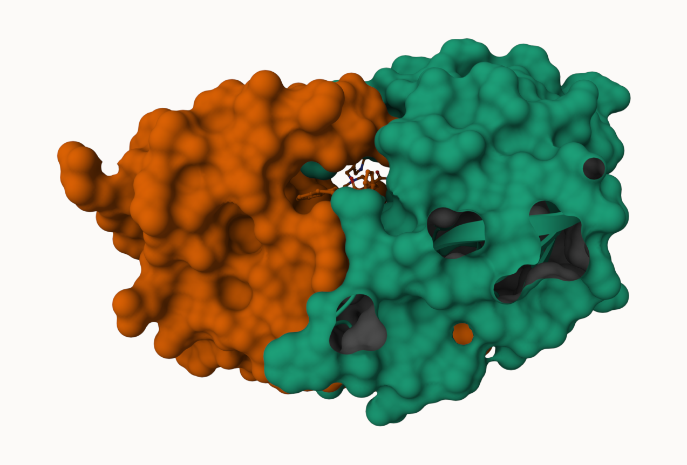

## Background

The main repository of high-resolution structural data on biomolecules is called the **Protein Data Bank** (PDB). 

# 2. Introduction to the RCSB Protein Data Bank (PDB)

## PDB statistics

What is in the PDB in terms of molecule type and structure determination method?

*Read a CSV file of current PDB stats obtained from https://www.rcsb.org/stats/summary*

```{r}
pdb <- read.csv("Data Export Summary.csv") # "CSV" button on website 
pdb
```

### Q1. 
> What percentage of structures in the PDB are solved by X-Ray and Electron Microscopy? 

```{r}
pdb$X.ray 
```
This print out above `pdb$X.ray` is "character", not "numeric". Therefore, I can't do math with it. We need to fix this... 

1. Two functions that can help here are `sub()` and `as.numeric()`
```{r}
#We want to get rid (or sub out) commas: 

x <- pdb$X.ray 
tmp <- sub(",", "", x)
sum( as.numeric(tmp))
```

2. We could make a function to do this:

```{r}
rm.comma <- function(x) {
  tmp <- sub(",", "",x) 
sum( as.numeric(tmp))
}
```

```{r}
n.tot <- rm.comma(pdb$Total)
n.xray <- rm.comma(pdb$`X-ray`)
n.em <- rm.comma(pdb$EM)

n.xray/n.tot * 100 
n.em/n.tot * 100 
```

3. We could also use a different import function for this CSV that speaks American (i.e. deals with commas in numbers in a comma separated value file)

```{r}
library(readr) #CONSOLE: install.packages("readr")
pdb <- read_csv("Data Export Summary.csv")
```

```{r}
n.tot <- sum(pdb$Total)
n.xray <- sum(pdb$`X-ray`)
n.em <- sum(pdb$EM)

100 * n.xray / n.tot
100 * n.em / n.tot
```

**80.4% are solved by X-Ray and 13.38% are solved by Electron Microscopy**

> ***Q. How many total protein structures are there in the dataset?*** 

```{r}
pdb$Total[1]
```
**217375 total protein structures in the dataset** 


### Q2.
> What proportion of structures in the PDB are protein?

The total number of protein sequences in UniProt is 202,556,314

```{r}
217375/202556314 * 100
```
**0.1073158% structures in the PDB are protein**

> **Key-point**: We have a very, very small structural coverage of known proteins (~0.1%). Most structures we know about (~80%) come from one method (X-ray crystalography)

### Q3.
> Type HIV in the PDB website search box on the home page and determine how many HIV-1 protease structures are in the current PDB?

**There are currently 1,227 HIV-1 protease structures in the PDB.**

# 3. Visualizing the HIV-1 protease structure

## Visualizing PDB data with Mol-star (Using Mol*)
Main stand alone web version with all features is at https://molstar.org/viewer/





## *The important role of water*
### Q4.
> Water molecules normally have 3 atoms. Why do we see just one atom per water molecule in this structure?

1HSG is an X-ray diffraction structure at 2.00 Å resolution. Hydrogen is a very small molecule and thus not resolved in X-ray data, in which one atom per water molecule is seen (represented by the oxygen atom).

### Q5.
> There is a critical “conserved” water molecule in the binding site. Can you identify this water molecule? What residue number does this water molecule have? 

Yes, the water molecule is identified on Chain B. The water molecule's residue number is HOH 308. 

### Q6.
> Generate and save a figure clearly showing the two distinct chains of HIV-protease along with the ligand. You might also consider showing the catalytic residues ASP 25 in each chain and the critical water (we recommend “Ball & Stick” for these side-chains). Add this figure to your Quarto document.

 
The two multi-colored spacefill models represent the A and B chain of ASP25, and the red spacefill model above the ASP25 models is the critical water molecule. 

> ***Discussion Topic: Can you think of a way in which indinavir, or even larger ligands and substrates, could enter the binding site?***

Indinavir, or even larger ligands and substrates, could enter the binding site through changes in the HIV protease where the two flap regions over the binding pocket could open and allow access to the exposed active site.

# 4. Introduction to Bio3D in R

## Getting Started with the Bio3D package

Bio3D is an R package from CRAN for structural bioinformatics 
```{r}
library(bio3d) #CONSOLE: install.packages("bio3d)
pdb <- read.pdb("1hsg")
pdb
```


## Reading PDB file data into R

### Q7. 
> How many amino acid residues are there in this pdb object? 

198 amino acid residues. 

### Q8. 
> Name one of the two non-protein residues? 

HOH (water), or MK1 (ligand). 

### Q9. 
> How many protein chains are in this structure? 

2 protein chains are in this structure. 


```{r}
attributes(pdb)
```
```{r}
head(pdb$atom) #access individual attributes
```

There are lots of functions that can work with these `pdb` objects
```{r}
head(pdbseq(pdb))
```


## Quick PDB visualization in R
We can have a quick interactive view of any of these `pdb` objects: 

```{r}
#| eval: !expr knitr::is_html_output()

library(bio3dview)
view.pdb(pdb)
```

Let's try a custom view
```{r}
#| eval: !expr knitr::is_html_output()

view.pdb(pdb, 
        colorScheme = "sse", 
         backgroundColor = "black")
```
> ***Q. Create a custom view of HIV-Pr highlighting the active site ASP residues (`resno=25`), the two chains (in your choice of colors), and the ligand all on a custom color background?***  

```{r}
#| eval: !expr knitr::is_html_output()

library(bio3dview)
library(NGLVieweR)

active.site <- atom.select(pdb, resno=25)
view.pdb(pdb, 
         cols = c("red", "blue"), 
         highlight = active.site, 
         highlight.style = "spacefill", 
         backgroundColor = "lightpink") |>
    setRock()

```

## Predicting functional motions of a single structure
Let's do a Normal Model Analysis (NMA) to predict the flexibility of a given `pdb` object: 

```{r}
adk <- read.pdb("6s36")

#A quick structure summary
adk
```
```{r}
# Perform flexiblity prediction
m <- nma(adk)

plot(m)
```

View the results with an interactive structure view 
```{r}
#| eval: !expr knitr::is_html_output()

view.nma(m)
```

Write out the results for viewing in Mol-star: 

```{r}
#| eval: !expr knitr::is_html_output()

mktrj(m, file="adk_m7.pdb") #view a "movie" of predicted motions 

# for quicker display:

view.nma(m, pdb=adk)
```


# 5. Comparative structure analysis of Adenylate Kinase (ADK) family

## Setup
Install packages in console 

### Q10. 
> Which of the packages above is found only on BioConductor and not CRAN? 

The msa package. 

### Q11. 
> Which of the above packages is not found on BioConductor or CRAN?: 

The package "bio3dview" is not found on BioConductor or CRAN. 

### Q12. 
> True or False? Functions from the pak package can be used to install packages from GitHub and BitBucket? 

TRUE

## Search and retrieve ADK structures

Our first step is to find a sequence for this family. We will use the database ID "1ake-A" here: 
```{r}
library(bio3d)
id <- "1ake_A"

aa <- get.seq(id)
aa
```
### Q13. 
> How many amino acids are in this sequence, i.e. how long is this sequence? 

214 amino acids are in this sequence. 

## Search for related sequences in the database

```{r}
blast <- blast.pdb(aa)
```

```{r}
head(blast$hit.tbl)
```

```{r}
hits <- plot(blast)
```

```{r}
hits$pdb.id
```

```{r}
files <- get.pdb(hits$pdb.id, path="pdbs", split=TRUE, gzip=TRUE)
  
```


## Align and superpose structures
```{r}
pdbs <- pdbaln(files, fit = TRUE, exefile="msa")
pdbs
```

Quick interactive structural view 
```{r}
#| eval: !expr knitr::is_html_output()

library(bio3dview)
view.pdbs(pdbs, colorScheme = "residueIndex")
```

## Annotate collected PDB structures

```{r}
# Vector containing PDB database codes
ids <- basename.pdb(pdbs$id)

anno <- pdb.annotate(ids)
unique(anno$source)
anno

```

## Principal component analysis

PCA of all this structural data (x,y and z atom coordinates)
```{r}
pc <- pca(pdbs)
plot(pc)
plot(pc, 1:2)

```
> **Function `rmsd()` faciliates clustering analysis based on pairwise structural deviation** 

```{r}
# Calculate RMSD
rd <- rmsd(pdbs)

# Structure-based clustering
hc.rd <- hclust(dist(rd))
grps.rd <- cutree(hc.rd, k=3)

plot(pc, 1:2, col="grey50", bg=grps.rd, pch=21, cex=1)
```


## PCA visualization

```{r}
# Visualize first principal component
pc1 <- mktrj(pc, pc=1, file="pc_1.pdb")
pc1
```

Interactive view of the PC1 captured structural differences:

```{r}
#| eval: !expr knitr::is_html_output()

view.pca(pc)
```

```{r}
mktrj(pc, file = "pca.pdb")
```

We can also plot our main PCA results with ggplot:
```{r}
#Plotting results with ggplot2
library(ggplot2)
library(ggrepel)

df <- data.frame(PC1=pc$z[,1], 
                 PC2=pc$z[,2], 
                 col=as.factor(grps.rd),
                 ids=ids)

p <- ggplot(df) + 
  aes(PC1, PC2, col=col, label=ids) +
  geom_point(size=2) +
  geom_text_repel(max.overlaps = 20) +
  theme(legend.position = "none")
p
```

# 6. Normal mode analysis [optional]

```{r}
modes <- nma(pdbs)
plot(modes, pdbs, col=grps.rd)

```

### Q14. 
> What do you note about this plot? Are the black and colored lines similar or different? Where do you think they differ most and why?

The black lines are lower, meaning that they have smaller fluctuations and likely represent a more stable, closed, or core-like conformation of the protein. The colored lines are showing greater fluctuations, especially around residues ~50 and ~150, suggesting that these regions are more flexible and likely correspond to mobile loop, hinge or domain motions. 
