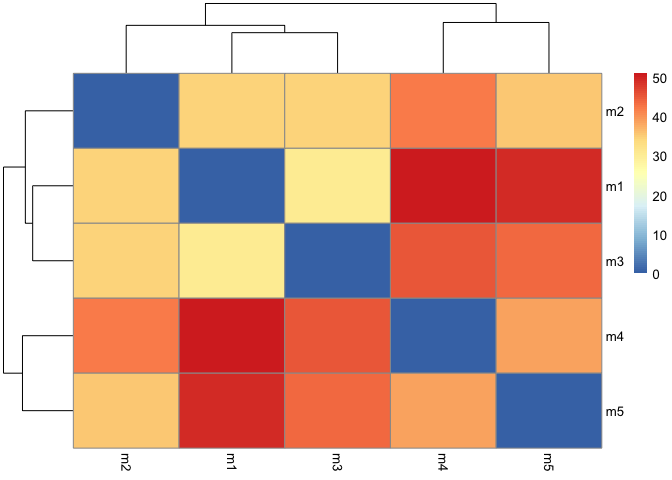
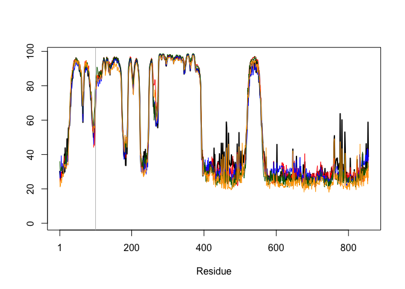
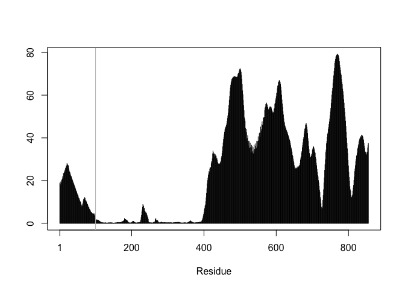
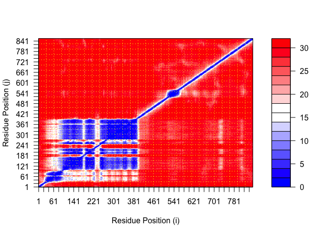
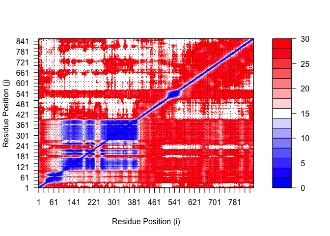
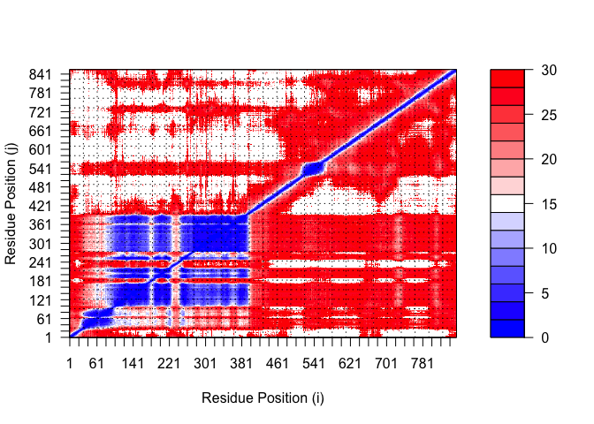
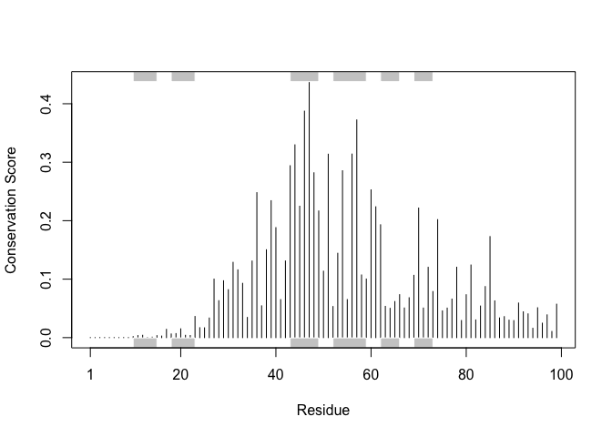

# Class 11: AlphaFold
Sofia Jaravata (A19160915)

- [Custom Analysis of Resulting
  Models](#custom-analysis-of-resulting-models)
  - [Predicted Alignment Error for
    domains](#predicted-alignment-error-for-domains)
  - [Residue conservation from alignment
    file](#residue-conservation-from-alignment-file)

# Custom Analysis of Resulting Models

``` r
library(bio3d)
pdb_dir <- read.pdb("hivpr_dimer_0b62a/hivpr_dimer_0b62a_unrelaxed_rank_003_alphafold2_ptm_model_1_seed_000.pdb")

#1. include file directory "hivpr_dimer_23119" FOLDER
#2.  include pdb "model 1" for "file name" 
pdb_dir 
```


     Call:  read.pdb(file = "hivpr_dimer_0b62a/hivpr_dimer_0b62a_unrelaxed_rank_003_alphafold2_ptm_model_1_seed_000.pdb")

       Total Models#: 1
         Total Atoms#: 6769,  XYZs#: 20307  Chains#: 1  (values: A)

         Protein Atoms#: 6769  (residues/Calpha atoms#: 855)
         Nucleic acid Atoms#: 0  (residues/phosphate atoms#: 0)

         Non-protein/nucleic Atoms#: 0  (residues: 0)
         Non-protein/nucleic resid values: [ none ]

       Protein sequence:
          MVFTVSCSKMSSIVDRDDSSIFDGLVEEDDKDKAKRVSRNKSEKKRRDQFNVLIKELGSM
          LPGNARKMDKSTVLQKSIDFLRKHKETTAQSDASEIRQDWKPTFLSNEEFTQLMLEALDG
          FFLAIMTDGSIIYVSESVTSLLEHLPSDLVDQSIFNFIPEGEHSEVYKILSTHLLESDSL
          TPEYLKSKNQLEFCCHMLRGTIDPKEPSTYEYVRFIGNFKSLTSV...<cut>...VQPQ

    + attr: atom, xyz, calpha, call

Make a vector of input PDB file names that we can read into R

``` r
pdb_files <- list.files(path = "hivpr_dimer_0b62a/", 
           pattern = "*.pdb", 
           full.names = TRUE)

basename(pdb_files)
```

    [1] "hivpr_dimer_0b62a_unrelaxed_rank_001_alphafold2_ptm_model_2_seed_000.pdb"
    [2] "hivpr_dimer_0b62a_unrelaxed_rank_002_alphafold2_ptm_model_3_seed_000.pdb"
    [3] "hivpr_dimer_0b62a_unrelaxed_rank_003_alphafold2_ptm_model_1_seed_000.pdb"
    [4] "hivpr_dimer_0b62a_unrelaxed_rank_004_alphafold2_ptm_model_5_seed_000.pdb"
    [5] "hivpr_dimer_0b62a_unrelaxed_rank_005_alphafold2_ptm_model_4_seed_000.pdb"

``` r
library(bio3d)
# Read all data from Models 
#  and superpose/fit coords

pdbs <- pdbaln(files = pdb_files, fit=TRUE, exefile="msa") 
```

    Reading PDB files:
    hivpr_dimer_0b62a//hivpr_dimer_0b62a_unrelaxed_rank_001_alphafold2_ptm_model_2_seed_000.pdb
    hivpr_dimer_0b62a//hivpr_dimer_0b62a_unrelaxed_rank_002_alphafold2_ptm_model_3_seed_000.pdb
    hivpr_dimer_0b62a//hivpr_dimer_0b62a_unrelaxed_rank_003_alphafold2_ptm_model_1_seed_000.pdb
    hivpr_dimer_0b62a//hivpr_dimer_0b62a_unrelaxed_rank_004_alphafold2_ptm_model_5_seed_000.pdb
    hivpr_dimer_0b62a//hivpr_dimer_0b62a_unrelaxed_rank_005_alphafold2_ptm_model_4_seed_000.pdb
    .....

    Extracting sequences

    pdb/seq: 1   name: hivpr_dimer_0b62a//hivpr_dimer_0b62a_unrelaxed_rank_001_alphafold2_ptm_model_2_seed_000.pdb 
    pdb/seq: 2   name: hivpr_dimer_0b62a//hivpr_dimer_0b62a_unrelaxed_rank_002_alphafold2_ptm_model_3_seed_000.pdb 
    pdb/seq: 3   name: hivpr_dimer_0b62a//hivpr_dimer_0b62a_unrelaxed_rank_003_alphafold2_ptm_model_1_seed_000.pdb 
    pdb/seq: 4   name: hivpr_dimer_0b62a//hivpr_dimer_0b62a_unrelaxed_rank_004_alphafold2_ptm_model_5_seed_000.pdb 
    pdb/seq: 5   name: hivpr_dimer_0b62a//hivpr_dimer_0b62a_unrelaxed_rank_005_alphafold2_ptm_model_4_seed_000.pdb 

``` r
#if error, CONSOLE: install.packages("BiocManager"), BiocManager::install("msa")
```

``` r
#Quick view of model sequences 
pdbs
```

                                   1        .         .         .         .         50 
    [Truncated_Name:1]hivpr_dime   MVFTVSCSKMSSIVDRDDSSIFDGLVEEDDKDKAKRVSRNKSEKKRRDQF
    [Truncated_Name:2]hivpr_dime   MVFTVSCSKMSSIVDRDDSSIFDGLVEEDDKDKAKRVSRNKSEKKRRDQF
    [Truncated_Name:3]hivpr_dime   MVFTVSCSKMSSIVDRDDSSIFDGLVEEDDKDKAKRVSRNKSEKKRRDQF
    [Truncated_Name:4]hivpr_dime   MVFTVSCSKMSSIVDRDDSSIFDGLVEEDDKDKAKRVSRNKSEKKRRDQF
    [Truncated_Name:5]hivpr_dime   MVFTVSCSKMSSIVDRDDSSIFDGLVEEDDKDKAKRVSRNKSEKKRRDQF
                                   ************************************************** 
                                   1        .         .         .         .         50 

                                  51        .         .         .         .         100 
    [Truncated_Name:1]hivpr_dime   NVLIKELGSMLPGNARKMDKSTVLQKSIDFLRKHKETTAQSDASEIRQDW
    [Truncated_Name:2]hivpr_dime   NVLIKELGSMLPGNARKMDKSTVLQKSIDFLRKHKETTAQSDASEIRQDW
    [Truncated_Name:3]hivpr_dime   NVLIKELGSMLPGNARKMDKSTVLQKSIDFLRKHKETTAQSDASEIRQDW
    [Truncated_Name:4]hivpr_dime   NVLIKELGSMLPGNARKMDKSTVLQKSIDFLRKHKETTAQSDASEIRQDW
    [Truncated_Name:5]hivpr_dime   NVLIKELGSMLPGNARKMDKSTVLQKSIDFLRKHKETTAQSDASEIRQDW
                                   ************************************************** 
                                  51        .         .         .         .         100 

                                 101        .         .         .         .         150 
    [Truncated_Name:1]hivpr_dime   KPTFLSNEEFTQLMLEALDGFFLAIMTDGSIIYVSESVTSLLEHLPSDLV
    [Truncated_Name:2]hivpr_dime   KPTFLSNEEFTQLMLEALDGFFLAIMTDGSIIYVSESVTSLLEHLPSDLV
    [Truncated_Name:3]hivpr_dime   KPTFLSNEEFTQLMLEALDGFFLAIMTDGSIIYVSESVTSLLEHLPSDLV
    [Truncated_Name:4]hivpr_dime   KPTFLSNEEFTQLMLEALDGFFLAIMTDGSIIYVSESVTSLLEHLPSDLV
    [Truncated_Name:5]hivpr_dime   KPTFLSNEEFTQLMLEALDGFFLAIMTDGSIIYVSESVTSLLEHLPSDLV
                                   ************************************************** 
                                 101        .         .         .         .         150 

                                 151        .         .         .         .         200 
    [Truncated_Name:1]hivpr_dime   DQSIFNFIPEGEHSEVYKILSTHLLESDSLTPEYLKSKNQLEFCCHMLRG
    [Truncated_Name:2]hivpr_dime   DQSIFNFIPEGEHSEVYKILSTHLLESDSLTPEYLKSKNQLEFCCHMLRG
    [Truncated_Name:3]hivpr_dime   DQSIFNFIPEGEHSEVYKILSTHLLESDSLTPEYLKSKNQLEFCCHMLRG
    [Truncated_Name:4]hivpr_dime   DQSIFNFIPEGEHSEVYKILSTHLLESDSLTPEYLKSKNQLEFCCHMLRG
    [Truncated_Name:5]hivpr_dime   DQSIFNFIPEGEHSEVYKILSTHLLESDSLTPEYLKSKNQLEFCCHMLRG
                                   ************************************************** 
                                 151        .         .         .         .         200 

                                 201        .         .         .         .         250 
    [Truncated_Name:1]hivpr_dime   TIDPKEPSTYEYVRFIGNFKSLTSVSTSTHNGFEGTIQRTHRPSYEDRVC
    [Truncated_Name:2]hivpr_dime   TIDPKEPSTYEYVRFIGNFKSLTSVSTSTHNGFEGTIQRTHRPSYEDRVC
    [Truncated_Name:3]hivpr_dime   TIDPKEPSTYEYVRFIGNFKSLTSVSTSTHNGFEGTIQRTHRPSYEDRVC
    [Truncated_Name:4]hivpr_dime   TIDPKEPSTYEYVRFIGNFKSLTSVSTSTHNGFEGTIQRTHRPSYEDRVC
    [Truncated_Name:5]hivpr_dime   TIDPKEPSTYEYVRFIGNFKSLTSVSTSTHNGFEGTIQRTHRPSYEDRVC
                                   ************************************************** 
                                 201        .         .         .         .         250 

                                 251        .         .         .         .         300 
    [Truncated_Name:1]hivpr_dime   FVATVRLATPQFIKEMCTVEEPNEEFTSRHSLEWKFLFLDHRAPPIIGYL
    [Truncated_Name:2]hivpr_dime   FVATVRLATPQFIKEMCTVEEPNEEFTSRHSLEWKFLFLDHRAPPIIGYL
    [Truncated_Name:3]hivpr_dime   FVATVRLATPQFIKEMCTVEEPNEEFTSRHSLEWKFLFLDHRAPPIIGYL
    [Truncated_Name:4]hivpr_dime   FVATVRLATPQFIKEMCTVEEPNEEFTSRHSLEWKFLFLDHRAPPIIGYL
    [Truncated_Name:5]hivpr_dime   FVATVRLATPQFIKEMCTVEEPNEEFTSRHSLEWKFLFLDHRAPPIIGYL
                                   ************************************************** 
                                 251        .         .         .         .         300 

                                 301        .         .         .         .         350 
    [Truncated_Name:1]hivpr_dime   PFEVLGTSGYDYYHVDDLENLAKCHEHLMQYGKGKSCYYRFLTKGQQWIW
    [Truncated_Name:2]hivpr_dime   PFEVLGTSGYDYYHVDDLENLAKCHEHLMQYGKGKSCYYRFLTKGQQWIW
    [Truncated_Name:3]hivpr_dime   PFEVLGTSGYDYYHVDDLENLAKCHEHLMQYGKGKSCYYRFLTKGQQWIW
    [Truncated_Name:4]hivpr_dime   PFEVLGTSGYDYYHVDDLENLAKCHEHLMQYGKGKSCYYRFLTKGQQWIW
    [Truncated_Name:5]hivpr_dime   PFEVLGTSGYDYYHVDDLENLAKCHEHLMQYGKGKSCYYRFLTKGQQWIW
                                   ************************************************** 
                                 301        .         .         .         .         350 

                                 351        .         .         .         .         400 
    [Truncated_Name:1]hivpr_dime   LQTHYYITYHQWNSRPEFIVCTHTVVSYAEVRAERRRELGIEESLPETAA
    [Truncated_Name:2]hivpr_dime   LQTHYYITYHQWNSRPEFIVCTHTVVSYAEVRAERRRELGIEESLPETAA
    [Truncated_Name:3]hivpr_dime   LQTHYYITYHQWNSRPEFIVCTHTVVSYAEVRAERRRELGIEESLPETAA
    [Truncated_Name:4]hivpr_dime   LQTHYYITYHQWNSRPEFIVCTHTVVSYAEVRAERRRELGIEESLPETAA
    [Truncated_Name:5]hivpr_dime   LQTHYYITYHQWNSRPEFIVCTHTVVSYAEVRAERRRELGIEESLPETAA
                                   ************************************************** 
                                 351        .         .         .         .         400 

                                 401        .         .         .         .         450 
    [Truncated_Name:1]hivpr_dime   DKSQDSGSDNRINTVSLKEALERFDHSPTPSASSRSSRKSSHTAVSDPSS
    [Truncated_Name:2]hivpr_dime   DKSQDSGSDNRINTVSLKEALERFDHSPTPSASSRSSRKSSHTAVSDPSS
    [Truncated_Name:3]hivpr_dime   DKSQDSGSDNRINTVSLKEALERFDHSPTPSASSRSSRKSSHTAVSDPSS
    [Truncated_Name:4]hivpr_dime   DKSQDSGSDNRINTVSLKEALERFDHSPTPSASSRSSRKSSHTAVSDPSS
    [Truncated_Name:5]hivpr_dime   DKSQDSGSDNRINTVSLKEALERFDHSPTPSASSRSSRKSSHTAVSDPSS
                                   ************************************************** 
                                 401        .         .         .         .         450 

                                 451        .         .         .         .         500 
    [Truncated_Name:1]hivpr_dime   TPTKIPTDTSTPPRQHLPAHEKMTQRRSSFSSQSINSQSVGPSLTQPAMS
    [Truncated_Name:2]hivpr_dime   TPTKIPTDTSTPPRQHLPAHEKMTQRRSSFSSQSINSQSVGPSLTQPAMS
    [Truncated_Name:3]hivpr_dime   TPTKIPTDTSTPPRQHLPAHEKMTQRRSSFSSQSINSQSVGPSLTQPAMS
    [Truncated_Name:4]hivpr_dime   TPTKIPTDTSTPPRQHLPAHEKMTQRRSSFSSQSINSQSVGPSLTQPAMS
    [Truncated_Name:5]hivpr_dime   TPTKIPTDTSTPPRQHLPAHEKMTQRRSSFSSQSINSQSVGPSLTQPAMS
                                   ************************************************** 
                                 451        .         .         .         .         500 

                                 501        .         .         .         .         550 
    [Truncated_Name:1]hivpr_dime   QAANLPIPQGMSQFQFSAQLGAMQHLKDQLEQRTRMIEANIHRQQEELRK
    [Truncated_Name:2]hivpr_dime   QAANLPIPQGMSQFQFSAQLGAMQHLKDQLEQRTRMIEANIHRQQEELRK
    [Truncated_Name:3]hivpr_dime   QAANLPIPQGMSQFQFSAQLGAMQHLKDQLEQRTRMIEANIHRQQEELRK
    [Truncated_Name:4]hivpr_dime   QAANLPIPQGMSQFQFSAQLGAMQHLKDQLEQRTRMIEANIHRQQEELRK
    [Truncated_Name:5]hivpr_dime   QAANLPIPQGMSQFQFSAQLGAMQHLKDQLEQRTRMIEANIHRQQEELRK
                                   ************************************************** 
                                 501        .         .         .         .         550 

                                 551        .         .         .         .         600 
    [Truncated_Name:1]hivpr_dime   IQEQLQMVHGQGLQMFLQQSNPGLNFGSVQLSSGNSNIQQLTPVNMQGQV
    [Truncated_Name:2]hivpr_dime   IQEQLQMVHGQGLQMFLQQSNPGLNFGSVQLSSGNSNIQQLTPVNMQGQV
    [Truncated_Name:3]hivpr_dime   IQEQLQMVHGQGLQMFLQQSNPGLNFGSVQLSSGNSNIQQLTPVNMQGQV
    [Truncated_Name:4]hivpr_dime   IQEQLQMVHGQGLQMFLQQSNPGLNFGSVQLSSGNSNIQQLTPVNMQGQV
    [Truncated_Name:5]hivpr_dime   IQEQLQMVHGQGLQMFLQQSNPGLNFGSVQLSSGNSNIQQLTPVNMQGQV
                                   ************************************************** 
                                 551        .         .         .         .         600 

                                 601        .         .         .         .         650 
    [Truncated_Name:1]hivpr_dime   VPANQVQSGHISTGQHMIQQQTLQSTSTQQSQQSVMSGHSQQTSLPSQTP
    [Truncated_Name:2]hivpr_dime   VPANQVQSGHISTGQHMIQQQTLQSTSTQQSQQSVMSGHSQQTSLPSQTP
    [Truncated_Name:3]hivpr_dime   VPANQVQSGHISTGQHMIQQQTLQSTSTQQSQQSVMSGHSQQTSLPSQTP
    [Truncated_Name:4]hivpr_dime   VPANQVQSGHISTGQHMIQQQTLQSTSTQQSQQSVMSGHSQQTSLPSQTP
    [Truncated_Name:5]hivpr_dime   VPANQVQSGHISTGQHMIQQQTLQSTSTQQSQQSVMSGHSQQTSLPSQTP
                                   ************************************************** 
                                 601        .         .         .         .         650 

                                 651        .         .         .         .         700 
    [Truncated_Name:1]hivpr_dime   STLTAPLYNTMVISQPAAGSMVQIPSSMPQNSTQSATVTTFTQDRQIRFS
    [Truncated_Name:2]hivpr_dime   STLTAPLYNTMVISQPAAGSMVQIPSSMPQNSTQSATVTTFTQDRQIRFS
    [Truncated_Name:3]hivpr_dime   STLTAPLYNTMVISQPAAGSMVQIPSSMPQNSTQSATVTTFTQDRQIRFS
    [Truncated_Name:4]hivpr_dime   STLTAPLYNTMVISQPAAGSMVQIPSSMPQNSTQSATVTTFTQDRQIRFS
    [Truncated_Name:5]hivpr_dime   STLTAPLYNTMVISQPAAGSMVQIPSSMPQNSTQSATVTTFTQDRQIRFS
                                   ************************************************** 
                                 651        .         .         .         .         700 

                                 701        .         .         .         .         750 
    [Truncated_Name:1]hivpr_dime   QGQQLVTKLVTAPVACGAVMVPSTMLMGQVVTAYPTFATQQQQAQTLSVT
    [Truncated_Name:2]hivpr_dime   QGQQLVTKLVTAPVACGAVMVPSTMLMGQVVTAYPTFATQQQQAQTLSVT
    [Truncated_Name:3]hivpr_dime   QGQQLVTKLVTAPVACGAVMVPSTMLMGQVVTAYPTFATQQQQAQTLSVT
    [Truncated_Name:4]hivpr_dime   QGQQLVTKLVTAPVACGAVMVPSTMLMGQVVTAYPTFATQQQQAQTLSVT
    [Truncated_Name:5]hivpr_dime   QGQQLVTKLVTAPVACGAVMVPSTMLMGQVVTAYPTFATQQQQAQTLSVT
                                   ************************************************** 
                                 701        .         .         .         .         750 

                                 751        .         .         .         .         800 
    [Truncated_Name:1]hivpr_dime   QQQQQQQQQPPQQQQQQQQSSQEQQLPSVQQPAQAQLGQPPQQFLQTSRL
    [Truncated_Name:2]hivpr_dime   QQQQQQQQQPPQQQQQQQQSSQEQQLPSVQQPAQAQLGQPPQQFLQTSRL
    [Truncated_Name:3]hivpr_dime   QQQQQQQQQPPQQQQQQQQSSQEQQLPSVQQPAQAQLGQPPQQFLQTSRL
    [Truncated_Name:4]hivpr_dime   QQQQQQQQQPPQQQQQQQQSSQEQQLPSVQQPAQAQLGQPPQQFLQTSRL
    [Truncated_Name:5]hivpr_dime   QQQQQQQQQPPQQQQQQQQSSQEQQLPSVQQPAQAQLGQPPQQFLQTSRL
                                   ************************************************** 
                                 751        .         .         .         .         800 

                                 801        .         .         .         .         850 
    [Truncated_Name:1]hivpr_dime   LHGNPSTQLILSAAFPLQQSTFPPSHHQQHQPQQQQQLPRHRTDSLTDPS
    [Truncated_Name:2]hivpr_dime   LHGNPSTQLILSAAFPLQQSTFPPSHHQQHQPQQQQQLPRHRTDSLTDPS
    [Truncated_Name:3]hivpr_dime   LHGNPSTQLILSAAFPLQQSTFPPSHHQQHQPQQQQQLPRHRTDSLTDPS
    [Truncated_Name:4]hivpr_dime   LHGNPSTQLILSAAFPLQQSTFPPSHHQQHQPQQQQQLPRHRTDSLTDPS
    [Truncated_Name:5]hivpr_dime   LHGNPSTQLILSAAFPLQQSTFPPSHHQQHQPQQQQQLPRHRTDSLTDPS
                                   ************************************************** 
                                 801        .         .         .         .         850 

                                 851   855 
    [Truncated_Name:1]hivpr_dime   KVQPQ
    [Truncated_Name:2]hivpr_dime   KVQPQ
    [Truncated_Name:3]hivpr_dime   KVQPQ
    [Truncated_Name:4]hivpr_dime   KVQPQ
    [Truncated_Name:5]hivpr_dime   KVQPQ
                                   ***** 
                                 851   855 

    Call:
      pdbaln(files = pdb_files, fit = TRUE, exefile = "msa")

    Class:
      pdbs, fasta

    Alignment dimensions:
      5 sequence rows; 855 position columns (855 non-gap, 0 gap) 

    + attr: xyz, resno, b, chain, id, ali, resid, sse, call

> ***RMSD is a standard measure of structural distance between
> coordinate sets. We can use the `rmsd()` function to calculate the
> RMSD between all pairs models.***

``` r
rd <- rmsd(pdbs, fit=T)
```

    Warning in rmsd(pdbs, fit = T): No indices provided, using the 855 non NA positions

``` r
range(rd)
```

    [1]  0.000 51.224

> ***Draw a heatmap of these RMSD matrix values***

``` r
library(pheatmap)
colnames(rd) <- paste0("m",1:5)
rownames(rd) <- paste0("m",1:5)
pheatmap(rd)
```



Here we can see that models 1 and 3 are more similar to each other than
they are to any other model. Models 1 and 2 are quite similar to each
other and in turn more similar to model 3 than to models 4 and 5. We
will see this trend again in the pLDDT and PAE plots further below.

``` r
pdb <- read.pdb("1hsg")
```

      Note: Accessing on-line PDB file

``` r
plotb3(pdbs$b[1,], typ="l", lwd=2, sse=pdb)
```

    Warning in plotb3(pdbs$b[1, ], typ = "l", lwd = 2, sse = pdb): Length of input
    'sse' does not equal the length of input 'x'; Ignoring 'sse'

``` r
points(pdbs$b[2,], typ="l", col="red")
points(pdbs$b[3,], typ="l", col="blue")
points(pdbs$b[4,], typ="l", col="darkgreen")
points(pdbs$b[5,], typ="l", col="orange")
abline(v=100, col="gray")
```



> \*\*\* `core.find()` function\*\*\*

``` r
core <- core.find(pdbs)
```

     core size 854 of 855  vol = 9280322 
     core size 853 of 855  vol = 9151789 
     core size 852 of 855  vol = 9033580 
     core size 851 of 855  vol = 8918959 
     core size 850 of 855  vol = 8807146 
     core size 849 of 855  vol = 8691040 
     core size 848 of 855  vol = 8575226 
     core size 847 of 855  vol = 8457685 
     core size 846 of 855  vol = 8343343 
     core size 845 of 855  vol = 8227693 
     core size 844 of 855  vol = 8111039 
     core size 843 of 855  vol = 7990632 
     core size 842 of 855  vol = 7871803 
     core size 841 of 855  vol = 7750553 
     core size 840 of 855  vol = 7629541 
     core size 839 of 855  vol = 7504170 
     core size 838 of 855  vol = 7384716 
     core size 837 of 855  vol = 7266142 
     core size 836 of 855  vol = 7153139 
     core size 835 of 855  vol = 7042025 
     core size 834 of 855  vol = 6939181 
     core size 833 of 855  vol = 6835301 
     core size 832 of 855  vol = 6746560 
     core size 831 of 855  vol = 6655204 
     core size 830 of 855  vol = 6580748 
     core size 829 of 855  vol = 6506814 
     core size 828 of 855  vol = 6430805 
     core size 827 of 855  vol = 6351337 
     core size 826 of 855  vol = 6271924 
     core size 825 of 855  vol = 6193879 
     core size 824 of 855  vol = 6119094 
     core size 823 of 855  vol = 6044822 
     core size 822 of 855  vol = 5972683 
     core size 821 of 855  vol = 5907567 
     core size 820 of 855  vol = 5839789 
     core size 819 of 855  vol = 5779153 
     core size 818 of 855  vol = 5715268 
     core size 817 of 855  vol = 5652418 
     core size 816 of 855  vol = 5593617 
     core size 815 of 855  vol = 5555476 
     core size 814 of 855  vol = 5506911 
     core size 813 of 855  vol = 5471182 
     core size 812 of 855  vol = 5436215 
     core size 811 of 855  vol = 5400796 
     core size 810 of 855  vol = 5354304 
     core size 809 of 855  vol = 5320677 
     core size 808 of 855  vol = 5267125 
     core size 807 of 855  vol = 5233797 
     core size 806 of 855  vol = 5202289 
     core size 805 of 855  vol = 5164090 
     core size 804 of 855  vol = 5124105 
     core size 803 of 855  vol = 5082268 
     core size 802 of 855  vol = 5043971 
     core size 801 of 855  vol = 5002122 
     core size 800 of 855  vol = 4962782 
     core size 799 of 855  vol = 4923810 
     core size 798 of 855  vol = 4884359 
     core size 797 of 855  vol = 4840333 
     core size 796 of 855  vol = 4794981 
     core size 795 of 855  vol = 4757952 
     core size 794 of 855  vol = 4721591 
     core size 793 of 855  vol = 4689157 
     core size 792 of 855  vol = 4645499 
     core size 791 of 855  vol = 4610284 
     core size 790 of 855  vol = 4575514 
     core size 789 of 855  vol = 4542434 
     core size 788 of 855  vol = 4509328 
     core size 787 of 855  vol = 4474737 
     core size 786 of 855  vol = 4438487 
     core size 785 of 855  vol = 4392640 
     core size 784 of 855  vol = 4357787 
     core size 783 of 855  vol = 4317406 
     core size 782 of 855  vol = 4276346 
     core size 781 of 855  vol = 4232838 
     core size 780 of 855  vol = 4188931 
     core size 779 of 855  vol = 4144574 
     core size 778 of 855  vol = 4100682 
     core size 777 of 855  vol = 4060213 
     core size 776 of 855  vol = 4020517 
     core size 775 of 855  vol = 3977612 
     core size 774 of 855  vol = 3934510 
     core size 773 of 855  vol = 3905423 
     core size 772 of 855  vol = 3863610 
     core size 771 of 855  vol = 3825228 
     core size 770 of 855  vol = 3786247 
     core size 769 of 855  vol = 3743532 
     core size 768 of 855  vol = 3706055 
     core size 767 of 855  vol = 3662454 
     core size 766 of 855  vol = 3624879 
     core size 765 of 855  vol = 3589305 
     core size 764 of 855  vol = 3549918 
     core size 763 of 855  vol = 3511588 
     core size 762 of 855  vol = 3473770 
     core size 761 of 855  vol = 3439417 
     core size 760 of 855  vol = 3415863 
     core size 759 of 855  vol = 3373986 
     core size 758 of 855  vol = 3338578 
     core size 757 of 855  vol = 3304180 
     core size 756 of 855  vol = 3268827 
     core size 755 of 855  vol = 3238337 
     core size 754 of 855  vol = 3207855 
     core size 753 of 855  vol = 3177183 
     core size 752 of 855  vol = 3144980 
     core size 751 of 855  vol = 3113604 
     core size 750 of 855  vol = 3095699 
     core size 749 of 855  vol = 3067568 
     core size 748 of 855  vol = 3040274 
     core size 747 of 855  vol = 3009100 
     core size 746 of 855  vol = 2983655 
     core size 745 of 855  vol = 2968254 
     core size 744 of 855  vol = 2934195 
     core size 743 of 855  vol = 2900928 
     core size 742 of 855  vol = 2873060 
     core size 741 of 855  vol = 2847279 
     core size 740 of 855  vol = 2823586 
     core size 739 of 855  vol = 2797956 
     core size 738 of 855  vol = 2776189 
     core size 737 of 855  vol = 2746323 
     core size 736 of 855  vol = 2734282 
     core size 735 of 855  vol = 2715206 
     core size 734 of 855  vol = 2693640 
     core size 733 of 855  vol = 2676553 
     core size 732 of 855  vol = 2658117 
     core size 731 of 855  vol = 2641475 
     core size 730 of 855  vol = 2625737 
     core size 729 of 855  vol = 2613132 
     core size 728 of 855  vol = 2599089 
     core size 727 of 855  vol = 2584137 
     core size 726 of 855  vol = 2559846 
     core size 725 of 855  vol = 2540192 
     core size 724 of 855  vol = 2526840 
     core size 723 of 855  vol = 2515695 
     core size 722 of 855  vol = 2494566 
     core size 721 of 855  vol = 2477463 
     core size 720 of 855  vol = 2460928 
     core size 719 of 855  vol = 2443902 
     core size 718 of 855  vol = 2425027 
     core size 717 of 855  vol = 2406871 
     core size 716 of 855  vol = 2389566 
     core size 715 of 855  vol = 2371877 
     core size 714 of 855  vol = 2352552 
     core size 713 of 855  vol = 2336221 
     core size 712 of 855  vol = 2320499 
     core size 711 of 855  vol = 2303455 
     core size 710 of 855  vol = 2284648 
     core size 709 of 855  vol = 2269663 
     core size 708 of 855  vol = 2253118 
     core size 707 of 855  vol = 2236313 
     core size 706 of 855  vol = 2219694 
     core size 705 of 855  vol = 2204156 
     core size 704 of 855  vol = 2189109 
     core size 703 of 855  vol = 2174183 
     core size 702 of 855  vol = 2157277 
     core size 701 of 855  vol = 2141547 
     core size 700 of 855  vol = 2126011 
     core size 699 of 855  vol = 2102927 
     core size 698 of 855  vol = 2088383 
     core size 697 of 855  vol = 2074187 
     core size 696 of 855  vol = 2061445 
     core size 695 of 855  vol = 2038681 
     core size 694 of 855  vol = 2023282 
     core size 693 of 855  vol = 2012792 
     core size 692 of 855  vol = 2002149 
     core size 691 of 855  vol = 1992204 
     core size 690 of 855  vol = 1980833 
     core size 689 of 855  vol = 1967438 
     core size 688 of 855  vol = 1953008 
     core size 687 of 855  vol = 1937874 
     core size 686 of 855  vol = 1923626 
     core size 685 of 855  vol = 1911084 
     core size 684 of 855  vol = 1898555 
     core size 683 of 855  vol = 1887819 
     core size 682 of 855  vol = 1872707 
     core size 681 of 855  vol = 1857383 
     core size 680 of 855  vol = 1847101 
     core size 679 of 855  vol = 1834749 
     core size 678 of 855  vol = 1821976 
     core size 677 of 855  vol = 1806881 
     core size 676 of 855  vol = 1790113 
     core size 675 of 855  vol = 1774461 
     core size 674 of 855  vol = 1757840 
     core size 673 of 855  vol = 1745731 
     core size 672 of 855  vol = 1731617 
     core size 671 of 855  vol = 1715727 
     core size 670 of 855  vol = 1703458 
     core size 669 of 855  vol = 1687623 
     core size 668 of 855  vol = 1670791 
     core size 667 of 855  vol = 1653361 
     core size 666 of 855  vol = 1636527 
     core size 665 of 855  vol = 1622289 
     core size 664 of 855  vol = 1605862 
     core size 663 of 855  vol = 1588580 
     core size 662 of 855  vol = 1572728 
     core size 661 of 855  vol = 1554667 
     core size 660 of 855  vol = 1537994 
     core size 659 of 855  vol = 1518668 
     core size 658 of 855  vol = 1501833 
     core size 657 of 855  vol = 1489381 
     core size 656 of 855  vol = 1478251 
     core size 655 of 855  vol = 1463164 
     core size 654 of 855  vol = 1453444 
     core size 653 of 855  vol = 1436247 
     core size 652 of 855  vol = 1420820 
     core size 651 of 855  vol = 1408888 
     core size 650 of 855  vol = 1395912 
     core size 649 of 855  vol = 1384270 
     core size 648 of 855  vol = 1375381 
     core size 647 of 855  vol = 1358190 
     core size 646 of 855  vol = 1340953 
     core size 645 of 855  vol = 1326924 
     core size 644 of 855  vol = 1318112 
     core size 643 of 855  vol = 1306577 
     core size 642 of 855  vol = 1295391 
     core size 641 of 855  vol = 1286870 
     core size 640 of 855  vol = 1276248 
     core size 639 of 855  vol = 1269317 
     core size 638 of 855  vol = 1261183 
     core size 637 of 855  vol = 1254177 
     core size 636 of 855  vol = 1246446 
     core size 635 of 855  vol = 1236386 
     core size 634 of 855  vol = 1228467 
     core size 633 of 855  vol = 1212776 
     core size 632 of 855  vol = 1203090 
     core size 631 of 855  vol = 1193994 
     core size 630 of 855  vol = 1183356 
     core size 629 of 855  vol = 1175529 
     core size 628 of 855  vol = 1163600 
     core size 627 of 855  vol = 1154706 
     core size 626 of 855  vol = 1145995 
     core size 625 of 855  vol = 1138613 
     core size 624 of 855  vol = 1123634 
     core size 623 of 855  vol = 1117081 
     core size 622 of 855  vol = 1110831 
     core size 621 of 855  vol = 1103405 
     core size 620 of 855  vol = 1095444 
     core size 619 of 855  vol = 1087611 
     core size 618 of 855  vol = 1076937 
     core size 617 of 855  vol = 1071781 
     core size 616 of 855  vol = 1066703 
     core size 615 of 855  vol = 1051618 
     core size 614 of 855  vol = 1043588 
     core size 613 of 855  vol = 1035767 
     core size 612 of 855  vol = 1028573 
     core size 611 of 855  vol = 1020922 
     core size 610 of 855  vol = 1013157 
     core size 609 of 855  vol = 1002411 
     core size 608 of 855  vol = 994785.8 
     core size 607 of 855  vol = 987386 
     core size 606 of 855  vol = 979941.8 
     core size 605 of 855  vol = 971407 
     core size 604 of 855  vol = 964167 
     core size 603 of 855  vol = 957410.9 
     core size 602 of 855  vol = 951687.5 
     core size 601 of 855  vol = 946494.8 
     core size 600 of 855  vol = 940705.5 
     core size 599 of 855  vol = 935083.4 
     core size 598 of 855  vol = 929755.7 
     core size 597 of 855  vol = 922573.2 
     core size 596 of 855  vol = 916902.4 
     core size 595 of 855  vol = 905189.4 
     core size 594 of 855  vol = 898145.8 
     core size 593 of 855  vol = 891444.2 
     core size 592 of 855  vol = 882103.7 
     core size 591 of 855  vol = 874969 
     core size 590 of 855  vol = 871603.7 
     core size 589 of 855  vol = 866973.7 
     core size 588 of 855  vol = 861617.4 
     core size 587 of 855  vol = 857006.9 
     core size 586 of 855  vol = 847096.3 
     core size 585 of 855  vol = 840294.4 
     core size 584 of 855  vol = 833859.4 
     core size 583 of 855  vol = 824949.6 
     core size 582 of 855  vol = 813754.7 
     core size 581 of 855  vol = 804119.3 
     core size 580 of 855  vol = 795226.1 
     core size 579 of 855  vol = 786409.7 
     core size 578 of 855  vol = 777290.4 
     core size 577 of 855  vol = 766218.8 
     core size 576 of 855  vol = 756725.9 
     core size 575 of 855  vol = 747240.4 
     core size 574 of 855  vol = 736483.2 
     core size 573 of 855  vol = 725388.7 
     core size 572 of 855  vol = 714213.5 
     core size 571 of 855  vol = 705232.3 
     core size 570 of 855  vol = 700898.4 
     core size 569 of 855  vol = 694358 
     core size 568 of 855  vol = 686871.9 
     core size 567 of 855  vol = 674720.1 
     core size 566 of 855  vol = 664314.4 
     core size 565 of 855  vol = 657513.2 
     core size 564 of 855  vol = 650919.1 
     core size 563 of 855  vol = 640190.7 
     core size 562 of 855  vol = 631721.3 
     core size 561 of 855  vol = 626630.4 
     core size 560 of 855  vol = 624053.8 
     core size 559 of 855  vol = 617648.3 
     core size 558 of 855  vol = 612626.1 
     core size 557 of 855  vol = 605623.6 
     core size 556 of 855  vol = 599747.2 
     core size 555 of 855  vol = 595297.7 
     core size 554 of 855  vol = 589029.6 
     core size 553 of 855  vol = 585481.7 
     core size 552 of 855  vol = 577865.4 
     core size 551 of 855  vol = 568068.3 
     core size 550 of 855  vol = 561276 
     core size 549 of 855  vol = 554907.9 
     core size 548 of 855  vol = 549052.8 
     core size 547 of 855  vol = 543507.9 
     core size 546 of 855  vol = 535077.2 
     core size 545 of 855  vol = 529224.9 
     core size 544 of 855  vol = 523466.1 
     core size 543 of 855  vol = 517878.2 
     core size 542 of 855  vol = 513247.7 
     core size 541 of 855  vol = 503090.6 
     core size 540 of 855  vol = 496225.2 
     core size 539 of 855  vol = 489914.7 
     core size 538 of 855  vol = 483867.9 
     core size 537 of 855  vol = 478787.4 
     core size 536 of 855  vol = 474778.8 
     core size 535 of 855  vol = 469086.5 
     core size 534 of 855  vol = 463240.1 
     core size 533 of 855  vol = 457496.6 
     core size 532 of 855  vol = 451465.6 
     core size 531 of 855  vol = 445427.1 
     core size 530 of 855  vol = 439521.3 
     core size 529 of 855  vol = 433324.4 
     core size 528 of 855  vol = 425434.1 
     core size 527 of 855  vol = 419370.3 
     core size 526 of 855  vol = 412857.2 
     core size 525 of 855  vol = 406636.7 
     core size 524 of 855  vol = 400360.1 
     core size 523 of 855  vol = 393977.9 
     core size 522 of 855  vol = 387758.5 
     core size 521 of 855  vol = 381457.7 
     core size 520 of 855  vol = 375026.8 
     core size 519 of 855  vol = 368429 
     core size 518 of 855  vol = 361721.1 
     core size 517 of 855  vol = 354987.1 
     core size 516 of 855  vol = 348283.9 
     core size 515 of 855  vol = 342020.3 
     core size 514 of 855  vol = 337951 
     core size 513 of 855  vol = 331549.6 
     core size 512 of 855  vol = 325064.7 
     core size 511 of 855  vol = 318379.6 
     core size 510 of 855  vol = 311481.5 
     core size 509 of 855  vol = 304570.9 
     core size 508 of 855  vol = 297666.8 
     core size 507 of 855  vol = 290948.4 
     core size 506 of 855  vol = 284210.6 
     core size 505 of 855  vol = 277422.4 
     core size 504 of 855  vol = 270521.6 
     core size 503 of 855  vol = 263545.1 
     core size 502 of 855  vol = 256641.7 
     core size 501 of 855  vol = 249584.4 
     core size 500 of 855  vol = 243263.4 
     core size 499 of 855  vol = 235707.3 
     core size 498 of 855  vol = 231892.8 
     core size 497 of 855  vol = 226768.4 
     core size 496 of 855  vol = 221817.8 
     core size 495 of 855  vol = 214112.2 
     core size 494 of 855  vol = 209476.5 
     core size 493 of 855  vol = 205335.9 
     core size 492 of 855  vol = 200948.4 
     core size 491 of 855  vol = 196660.9 
     core size 490 of 855  vol = 192767.4 
     core size 489 of 855  vol = 186818.8 
     core size 488 of 855  vol = 180089.7 
     core size 487 of 855  vol = 177700.3 
     core size 486 of 855  vol = 174510 
     core size 485 of 855  vol = 170529.3 
     core size 484 of 855  vol = 164808 
     core size 483 of 855  vol = 160349.6 
     core size 482 of 855  vol = 158780.1 
     core size 481 of 855  vol = 157797.8 
     core size 480 of 855  vol = 155195.9 
     core size 479 of 855  vol = 149362.3 
     core size 478 of 855  vol = 148794.2 
     core size 477 of 855  vol = 143529 
     core size 476 of 855  vol = 142797.1 
     core size 475 of 855  vol = 142640.1 
     core size 474 of 855  vol = 139383.5 
     core size 473 of 855  vol = 139095 
     core size 472 of 855  vol = 136870.6 
     core size 471 of 855  vol = 134164.5 
     core size 470 of 855  vol = 129775 
     core size 469 of 855  vol = 124419.3 
     core size 468 of 855  vol = 119079.7 
     core size 467 of 855  vol = 114472.3 
     core size 466 of 855  vol = 111296.4 
     core size 465 of 855  vol = 106456.8 
     core size 464 of 855  vol = 102531.6 
     core size 463 of 855  vol = 100600.4 
     core size 462 of 855  vol = 97927.03 
     core size 461 of 855  vol = 95285.83 
     core size 460 of 855  vol = 92532.21 
     core size 459 of 855  vol = 90023.05 
     core size 458 of 855  vol = 87405.33 
     core size 457 of 855  vol = 83875.49 
     core size 456 of 855  vol = 81064.27 
     core size 455 of 855  vol = 76649.45 
     core size 454 of 855  vol = 73676.83 
     core size 453 of 855  vol = 71475.67 
     core size 452 of 855  vol = 68781 
     core size 451 of 855  vol = 67098.27 
     core size 450 of 855  vol = 65596.06 
     core size 449 of 855  vol = 64302.51 
     core size 448 of 855  vol = 62961.54 
     core size 447 of 855  vol = 61581.68 
     core size 446 of 855  vol = 60278.08 
     core size 445 of 855  vol = 58386.9 
     core size 444 of 855  vol = 56667.83 
     core size 443 of 855  vol = 54807.29 
     core size 442 of 855  vol = 52935.7 
     core size 441 of 855  vol = 51586.5 
     core size 440 of 855  vol = 50191.23 
     core size 439 of 855  vol = 48924.87 
     core size 438 of 855  vol = 47603.96 
     core size 437 of 855  vol = 46204.5 
     core size 436 of 855  vol = 44899.65 
     core size 435 of 855  vol = 43550.78 
     core size 434 of 855  vol = 42170.54 
     core size 433 of 855  vol = 40854.93 
     core size 432 of 855  vol = 39644.21 
     core size 431 of 855  vol = 38437.25 
     core size 430 of 855  vol = 37191.24 
     core size 429 of 855  vol = 35593.1 
     core size 428 of 855  vol = 34510.03 
     core size 427 of 855  vol = 33317.44 
     core size 426 of 855  vol = 32436.19 
     core size 425 of 855  vol = 31473.35 
     core size 424 of 855  vol = 30520.57 
     core size 423 of 855  vol = 29548.45 
     core size 422 of 855  vol = 28826.12 
     core size 421 of 855  vol = 27934.97 
     core size 420 of 855  vol = 27058.24 
     core size 419 of 855  vol = 26184.26 
     core size 418 of 855  vol = 25242.93 
     core size 417 of 855  vol = 24146.48 
     core size 416 of 855  vol = 23338.31 
     core size 415 of 855  vol = 22683.97 
     core size 414 of 855  vol = 21822.99 
     core size 413 of 855  vol = 21106.74 
     core size 412 of 855  vol = 20398.17 
     core size 411 of 855  vol = 19758.58 
     core size 410 of 855  vol = 19109.04 
     core size 409 of 855  vol = 18474.32 
     core size 408 of 855  vol = 17893.27 
     core size 407 of 855  vol = 17340 
     core size 406 of 855  vol = 16704.72 
     core size 405 of 855  vol = 15961.55 
     core size 404 of 855  vol = 15374.93 
     core size 403 of 855  vol = 14842.32 
     core size 402 of 855  vol = 14282.59 
     core size 401 of 855  vol = 13732.57 
     core size 400 of 855  vol = 13190.3 
     core size 399 of 855  vol = 12584.48 
     core size 398 of 855  vol = 12055.66 
     core size 397 of 855  vol = 11714.18 
     core size 396 of 855  vol = 11338.38 
     core size 395 of 855  vol = 10902.68 
     core size 394 of 855  vol = 10402.25 
     core size 393 of 855  vol = 10132.15 
     core size 392 of 855  vol = 9704.205 
     core size 391 of 855  vol = 9549.904 
     core size 390 of 855  vol = 9380.016 
     core size 389 of 855  vol = 9183.446 
     core size 388 of 855  vol = 8924.969 
     core size 387 of 855  vol = 8778.035 
     core size 386 of 855  vol = 8426.88 
     core size 385 of 855  vol = 8332.418 
     core size 384 of 855  vol = 8229.938 
     core size 383 of 855  vol = 8127.822 
     core size 382 of 855  vol = 8042.586 
     core size 381 of 855  vol = 7943.839 
     core size 380 of 855  vol = 7841.984 
     core size 379 of 855  vol = 7727.468 
     core size 378 of 855  vol = 7623.008 
     core size 377 of 855  vol = 7517.717 
     core size 376 of 855  vol = 7408.4 
     core size 375 of 855  vol = 7290.651 
     core size 374 of 855  vol = 7165.527 
     core size 373 of 855  vol = 7045.972 
     core size 372 of 855  vol = 6934.283 
     core size 371 of 855  vol = 6815.122 
     core size 370 of 855  vol = 6688.148 
     core size 369 of 855  vol = 6558.276 
     core size 368 of 855  vol = 6432.07 
     core size 367 of 855  vol = 6306.508 
     core size 366 of 855  vol = 6193.293 
     core size 365 of 855  vol = 6068.551 
     core size 364 of 855  vol = 5940.959 
     core size 363 of 855  vol = 5809.356 
     core size 362 of 855  vol = 5691.378 
     core size 361 of 855  vol = 5570.317 
     core size 360 of 855  vol = 5488.221 
     core size 359 of 855  vol = 5362.012 
     core size 358 of 855  vol = 5230.412 
     core size 357 of 855  vol = 5088.803 
     core size 356 of 855  vol = 4958.26 
     core size 355 of 855  vol = 4830.957 
     core size 354 of 855  vol = 4627.876 
     core size 353 of 855  vol = 4417.122 
     core size 352 of 855  vol = 4293.098 
     core size 351 of 855  vol = 4160.954 
     core size 350 of 855  vol = 4042.958 
     core size 349 of 855  vol = 3917.735 
     core size 348 of 855  vol = 3794.585 
     core size 347 of 855  vol = 3665.881 
     core size 346 of 855  vol = 3531.735 
     core size 345 of 855  vol = 3385.501 
     core size 344 of 855  vol = 3247.432 
     core size 343 of 855  vol = 3129.297 
     core size 342 of 855  vol = 3010.111 
     core size 341 of 855  vol = 2888.674 
     core size 340 of 855  vol = 2776.337 
     core size 339 of 855  vol = 2659.891 
     core size 338 of 855  vol = 2541.248 
     core size 337 of 855  vol = 2387.677 
     core size 336 of 855  vol = 2273.233 
     core size 335 of 855  vol = 2156.992 
     core size 334 of 855  vol = 2017.117 
     core size 333 of 855  vol = 1913.421 
     core size 332 of 855  vol = 1812.017 
     core size 331 of 855  vol = 1710.544 
     core size 330 of 855  vol = 1624.1 
     core size 329 of 855  vol = 1544.407 
     core size 328 of 855  vol = 1463.979 
     core size 327 of 855  vol = 1383.057 
     core size 326 of 855  vol = 1306.716 
     core size 325 of 855  vol = 1225.815 
     core size 324 of 855  vol = 1132.749 
     core size 323 of 855  vol = 1058.098 
     core size 322 of 855  vol = 992.254 
     core size 321 of 855  vol = 934.74 
     core size 320 of 855  vol = 870.503 
     core size 319 of 855  vol = 817.871 
     core size 318 of 855  vol = 764.21 
     core size 317 of 855  vol = 710.07 
     core size 316 of 855  vol = 662.663 
     core size 315 of 855  vol = 619.466 
     core size 314 of 855  vol = 578.372 
     core size 313 of 855  vol = 536.102 
     core size 312 of 855  vol = 499.476 
     core size 311 of 855  vol = 464.745 
     core size 310 of 855  vol = 429.372 
     core size 309 of 855  vol = 399.67 
     core size 308 of 855  vol = 370.267 
     core size 307 of 855  vol = 337.07 
     core size 306 of 855  vol = 304.311 
     core size 305 of 855  vol = 275.123 
     core size 304 of 855  vol = 250.351 
     core size 303 of 855  vol = 228.036 
     core size 302 of 855  vol = 206.102 
     core size 301 of 855  vol = 187.395 
     core size 300 of 855  vol = 172.79 
     core size 299 of 855  vol = 156.637 
     core size 298 of 855  vol = 141.102 
     core size 297 of 855  vol = 126.995 
     core size 296 of 855  vol = 113.282 
     core size 295 of 855  vol = 100.79 
     core size 294 of 855  vol = 90.543 
     core size 293 of 855  vol = 81.395 
     core size 292 of 855  vol = 71.908 
     core size 291 of 855  vol = 62.765 
     core size 290 of 855  vol = 54.199 
     core size 289 of 855  vol = 48.589 
     core size 288 of 855  vol = 44.776 
     core size 287 of 855  vol = 40.857 
     core size 286 of 855  vol = 37.396 
     core size 285 of 855  vol = 33.881 
     core size 284 of 855  vol = 31.16 
     core size 283 of 855  vol = 28.438 
     core size 282 of 855  vol = 26.068 
     core size 281 of 855  vol = 23.896 
     core size 280 of 855  vol = 22.152 
     core size 279 of 855  vol = 20.921 
     core size 278 of 855  vol = 19.586 
     core size 277 of 855  vol = 18.341 
     core size 276 of 855  vol = 17.321 
     core size 275 of 855  vol = 16.361 
     core size 274 of 855  vol = 15.58 
     core size 273 of 855  vol = 14.969 
     core size 272 of 855  vol = 14.18 
     core size 271 of 855  vol = 13.379 
     core size 270 of 855  vol = 12.689 
     core size 269 of 855  vol = 11.895 
     core size 268 of 855  vol = 11.268 
     core size 267 of 855  vol = 10.659 
     core size 266 of 855  vol = 10.043 
     core size 265 of 855  vol = 9.448 
     core size 264 of 855  vol = 8.812 
     core size 263 of 855  vol = 8.317 
     core size 262 of 855  vol = 7.758 
     core size 261 of 855  vol = 7.311 
     core size 260 of 855  vol = 6.877 
     core size 259 of 855  vol = 6.553 
     core size 258 of 855  vol = 6.199 
     core size 257 of 855  vol = 5.966 
     core size 256 of 855  vol = 5.757 
     core size 255 of 855  vol = 5.549 
     core size 254 of 855  vol = 5.348 
     core size 253 of 855  vol = 5.128 
     core size 252 of 855  vol = 4.913 
     core size 251 of 855  vol = 4.727 
     core size 250 of 855  vol = 4.551 
     core size 249 of 855  vol = 4.377 
     core size 248 of 855  vol = 4.196 
     core size 247 of 855  vol = 4.044 
     core size 246 of 855  vol = 3.923 
     core size 245 of 855  vol = 3.79 
     core size 244 of 855  vol = 3.653 
     core size 243 of 855  vol = 3.493 
     core size 242 of 855  vol = 3.324 
     core size 241 of 855  vol = 3.207 
     core size 240 of 855  vol = 3.093 
     core size 239 of 855  vol = 2.988 
     core size 238 of 855  vol = 2.904 
     core size 237 of 855  vol = 2.808 
     core size 236 of 855  vol = 2.718 
     core size 235 of 855  vol = 2.629 
     core size 234 of 855  vol = 2.553 
     core size 233 of 855  vol = 2.468 
     core size 232 of 855  vol = 2.401 
     core size 231 of 855  vol = 2.317 
     core size 230 of 855  vol = 2.258 
     core size 229 of 855  vol = 2.195 
     core size 228 of 855  vol = 2.132 
     core size 227 of 855  vol = 2.065 
     core size 226 of 855  vol = 2.001 
     core size 225 of 855  vol = 1.943 
     core size 224 of 855  vol = 1.889 
     core size 223 of 855  vol = 1.825 
     core size 222 of 855  vol = 1.769 
     core size 221 of 855  vol = 1.705 
     core size 220 of 855  vol = 1.659 
     core size 219 of 855  vol = 1.615 
     core size 218 of 855  vol = 1.566 
     core size 217 of 855  vol = 1.52 
     core size 216 of 855  vol = 1.478 
     core size 215 of 855  vol = 1.424 
     core size 214 of 855  vol = 1.384 
     core size 213 of 855  vol = 1.349 
     core size 212 of 855  vol = 1.314 
     core size 211 of 855  vol = 1.276 
     core size 210 of 855  vol = 1.233 
     core size 209 of 855  vol = 1.191 
     core size 208 of 855  vol = 1.15 
     core size 207 of 855  vol = 1.121 
     core size 206 of 855  vol = 1.084 
     core size 205 of 855  vol = 1.063 
     core size 204 of 855  vol = 1.038 
     core size 203 of 855  vol = 1.016 
     core size 202 of 855  vol = 0.995 
     core size 201 of 855  vol = 0.969 
     core size 200 of 855  vol = 0.947 
     core size 199 of 855  vol = 0.931 
     core size 198 of 855  vol = 0.915 
     core size 197 of 855  vol = 0.896 
     core size 196 of 855  vol = 0.879 
     core size 195 of 855  vol = 0.863 
     core size 194 of 855  vol = 0.848 
     core size 193 of 855  vol = 0.832 
     core size 192 of 855  vol = 0.814 
     core size 191 of 855  vol = 0.799 
     core size 190 of 855  vol = 0.785 
     core size 189 of 855  vol = 0.772 
     core size 188 of 855  vol = 0.759 
     core size 187 of 855  vol = 0.742 
     core size 186 of 855  vol = 0.73 
     core size 185 of 855  vol = 0.718 
     core size 184 of 855  vol = 0.704 
     core size 183 of 855  vol = 0.691 
     core size 182 of 855  vol = 0.679 
     core size 181 of 855  vol = 0.666 
     core size 180 of 855  vol = 0.656 
     core size 179 of 855  vol = 0.644 
     core size 178 of 855  vol = 0.635 
     core size 177 of 855  vol = 0.625 
     core size 176 of 855  vol = 0.614 
     core size 175 of 855  vol = 0.604 
     core size 174 of 855  vol = 0.595 
     core size 173 of 855  vol = 0.585 
     core size 172 of 855  vol = 0.575 
     core size 171 of 855  vol = 0.563 
     core size 170 of 855  vol = 0.554 
     core size 169 of 855  vol = 0.545 
     core size 168 of 855  vol = 0.535 
     core size 167 of 855  vol = 0.527 
     core size 166 of 855  vol = 0.518 
     core size 165 of 855  vol = 0.508 
     core size 164 of 855  vol = 0.5 
     FINISHED: Min vol ( 0.5 ) reached

``` r
core.inds <- print(core, vol=0.5)
```

    # 165 positions (cumulative volume <= 0.5 Angstrom^3) 
       start end length
    1    115 115      1
    2    117 167     51
    3    192 200      9
    4    208 221     14
    5    250 263     14
    6    275 278      4
    7    285 290      6
    8    292 322     31
    9    328 330      3
    10   334 346     13
    11   348 354      7
    12   371 381     11
    13   383 383      1

``` r
xyz <- pdbfit(pdbs, core.inds, outpath="corefit_structures")
```

``` r
#examine the RMSF between positions of the structure

rf <- rmsf(xyz)

plotb3(rf, sse=pdb)
```

    Warning in plotb3(rf, sse = pdb): Length of input 'sse' does not equal the
    length of input 'x'; Ignoring 'sse'

``` r
abline(v=100, col="gray", ylab="RMSF")
```



## Predicted Alignment Error for domains

``` r
library(jsonlite)
results_dir <- "hivpr_dimer_0b62a/"
# Listing of all PAE JSON files
pae_files <- list.files(path=results_dir,
                        pattern=".*model.*\\.json",
                        full.names = TRUE)
pae_files
```

    [1] "hivpr_dimer_0b62a//hivpr_dimer_0b62a_scores_rank_001_alphafold2_ptm_model_2_seed_000.json"
    [2] "hivpr_dimer_0b62a//hivpr_dimer_0b62a_scores_rank_002_alphafold2_ptm_model_3_seed_000.json"
    [3] "hivpr_dimer_0b62a//hivpr_dimer_0b62a_scores_rank_003_alphafold2_ptm_model_1_seed_000.json"
    [4] "hivpr_dimer_0b62a//hivpr_dimer_0b62a_scores_rank_004_alphafold2_ptm_model_5_seed_000.json"
    [5] "hivpr_dimer_0b62a//hivpr_dimer_0b62a_scores_rank_005_alphafold2_ptm_model_4_seed_000.json"

``` r
#read the 1st and 5th files

pae1 <- read_json(pae_files[1],simplifyVector = TRUE)
pae5 <- read_json(pae_files[5],simplifyVector = TRUE)

attributes(pae1)
```

    $names
    [1] "plddt"   "max_pae" "pae"     "ptm"    

``` r
# Per-residue pLDDT scores 
#  same as B-factor of PDB..
head(pae1$plddt) 
```

    [1] 30.22 27.16 25.36 26.83 29.55 26.61

> ***NOTE: The lower the PAE score the better (more reliable model)***

``` r
pae1$max_pae
```

    [1] 31.4375

``` r
pae5$max_pae
```

    [1] 31.45312

From this, we can conclude that model 1 is a more reliable model than
model 5 as its PAE score is slightly lower.

``` r
plot.dmat(pae1$pae, 
          xlab="Residue Position (i)",
          ylab="Residue Position (j)")
```



``` r
library(bio3d)
plot.dmat(pae5$pae, 
          xlab="Residue Position (i)",
          ylab="Residue Position (j)",
          grid.col = "black",
          zlim=c(0,30))
```



***Here is the model 1 plot again but this time using the same data
range as the plot for model 5:***

``` r
plot.dmat(pae1$pae, 
          xlab="Residue Position (i)",
          ylab="Residue Position (j)",
          grid.col = "black",
          zlim=c(0,30))
```



The PAE plots display predicted alignment error between residue pairs.
In these plots above, both models appear confident for individual
domains but less confident in the relative arrangement between domains,
but Model 1 is slightly better due to its lower maximum PAE.

## Residue conservation from alignment file

``` r
aln_file <- list.files(path=results_dir,
                       pattern=".a3m$",
                        full.names = TRUE)
aln_file
```

    [1] "hivpr_dimer_0b62a//hivpr_dimer_0b62a.a3m"

``` r
aln <- read.fasta(aln_file[1], to.upper = TRUE)
```

    [1] " ** Duplicated sequence id's: 101 **"

How many sequences are in this alignment:

``` r
dim(aln$ali)
```

    [1] 3651 1123

We can score residue conservation in the alignment with the conserv()
function.

``` r
sim <- conserv(aln)
plotb3(sim[1:99], sse=trim.pdb(pdb, chain="A"),
       ylab="Conservation Score")
```



The conserved Active Site residues will stand out if we generate a
consensus sequence with a high cutoff value:

``` r
con <- consensus(aln, cutoff = 0.9)
con$seq
```

       [1] "-" "-" "-" "-" "-" "-" "-" "-" "-" "-" "-" "-" "-" "-" "-" "-" "-" "-"
      [19] "-" "-" "-" "-" "-" "-" "-" "-" "-" "-" "-" "-" "-" "-" "-" "-" "-" "-"
      [37] "-" "-" "-" "-" "-" "-" "-" "-" "-" "-" "-" "-" "-" "-" "-" "-" "-" "-"
      [55] "-" "-" "-" "-" "-" "-" "-" "-" "-" "-" "-" "-" "-" "-" "-" "-" "-" "-"
      [73] "-" "-" "-" "-" "-" "-" "-" "-" "-" "-" "-" "-" "-" "-" "-" "-" "-" "-"
      [91] "-" "-" "-" "-" "-" "-" "-" "-" "-" "-" "-" "-" "-" "-" "-" "-" "-" "-"
     [109] "-" "-" "-" "-" "-" "-" "-" "-" "-" "-" "-" "-" "-" "-" "-" "-" "-" "-"
     [127] "-" "-" "-" "-" "-" "-" "-" "-" "-" "-" "-" "-" "-" "-" "-" "-" "-" "-"
     [145] "-" "-" "-" "-" "-" "-" "-" "-" "-" "-" "-" "-" "-" "-" "-" "-" "-" "-"
     [163] "-" "-" "-" "-" "-" "-" "-" "-" "-" "-" "-" "-" "-" "-" "-" "-" "-" "-"
     [181] "-" "-" "-" "-" "-" "-" "-" "-" "-" "-" "-" "-" "-" "-" "-" "-" "-" "-"
     [199] "-" "-" "-" "-" "-" "-" "-" "-" "-" "-" "-" "-" "-" "-" "-" "-" "-" "-"
     [217] "-" "-" "-" "-" "-" "-" "-" "-" "-" "-" "-" "-" "-" "-" "-" "-" "-" "-"
     [235] "-" "-" "-" "-" "-" "-" "-" "-" "-" "-" "-" "-" "-" "-" "-" "-" "-" "-"
     [253] "-" "-" "-" "-" "-" "-" "-" "-" "-" "-" "-" "-" "-" "-" "-" "-" "-" "-"
     [271] "-" "-" "-" "-" "-" "-" "-" "-" "-" "-" "-" "-" "-" "-" "-" "-" "-" "-"
     [289] "-" "-" "-" "-" "-" "-" "-" "-" "-" "-" "-" "-" "-" "-" "-" "-" "-" "-"
     [307] "-" "-" "-" "-" "-" "-" "-" "-" "-" "-" "-" "-" "-" "-" "-" "-" "-" "-"
     [325] "-" "-" "-" "-" "-" "-" "-" "-" "-" "-" "-" "-" "-" "-" "-" "-" "-" "-"
     [343] "-" "-" "-" "-" "-" "-" "-" "-" "-" "-" "-" "-" "-" "-" "-" "-" "-" "-"
     [361] "-" "-" "-" "-" "-" "-" "-" "-" "-" "-" "-" "-" "-" "-" "-" "-" "-" "-"
     [379] "-" "-" "-" "-" "-" "-" "-" "-" "-" "-" "-" "-" "-" "-" "-" "-" "-" "-"
     [397] "-" "-" "-" "-" "-" "-" "-" "-" "-" "-" "-" "-" "-" "-" "-" "-" "-" "-"
     [415] "-" "-" "-" "-" "-" "-" "-" "-" "-" "-" "-" "-" "-" "-" "-" "-" "-" "-"
     [433] "-" "-" "-" "-" "-" "-" "-" "-" "-" "-" "-" "-" "-" "-" "-" "-" "-" "-"
     [451] "-" "-" "-" "-" "-" "-" "-" "-" "-" "-" "-" "-" "-" "-" "-" "-" "-" "-"
     [469] "-" "-" "-" "-" "-" "-" "-" "-" "-" "-" "-" "-" "-" "-" "-" "-" "-" "-"
     [487] "-" "-" "-" "-" "-" "-" "-" "-" "-" "-" "-" "-" "-" "-" "-" "-" "-" "-"
     [505] "-" "-" "-" "-" "-" "-" "-" "-" "-" "-" "-" "-" "-" "-" "-" "-" "-" "-"
     [523] "-" "-" "-" "-" "-" "-" "-" "-" "-" "-" "-" "-" "-" "-" "-" "-" "-" "-"
     [541] "-" "-" "-" "-" "-" "-" "-" "-" "-" "-" "-" "-" "-" "-" "-" "-" "-" "-"
     [559] "-" "-" "-" "-" "-" "-" "-" "-" "-" "-" "-" "-" "-" "-" "-" "-" "-" "-"
     [577] "-" "-" "-" "-" "-" "-" "-" "-" "-" "-" "-" "-" "-" "-" "-" "-" "-" "-"
     [595] "-" "-" "-" "-" "-" "-" "-" "-" "-" "-" "-" "-" "-" "-" "-" "-" "-" "-"
     [613] "-" "-" "-" "-" "-" "-" "-" "-" "-" "-" "-" "-" "-" "-" "-" "-" "-" "-"
     [631] "-" "-" "-" "-" "-" "-" "-" "-" "-" "-" "-" "-" "-" "-" "-" "-" "-" "-"
     [649] "-" "-" "-" "-" "-" "-" "-" "-" "-" "-" "-" "-" "-" "-" "-" "-" "-" "-"
     [667] "-" "-" "-" "-" "-" "-" "-" "-" "-" "-" "-" "-" "-" "-" "-" "-" "-" "-"
     [685] "-" "-" "-" "-" "-" "-" "-" "-" "-" "-" "-" "-" "-" "-" "-" "-" "-" "-"
     [703] "-" "-" "-" "-" "-" "-" "-" "-" "-" "-" "-" "-" "-" "-" "-" "-" "-" "-"
     [721] "-" "-" "-" "-" "-" "-" "-" "-" "-" "-" "-" "-" "-" "-" "-" "-" "-" "-"
     [739] "-" "-" "-" "-" "-" "-" "-" "-" "-" "-" "-" "-" "-" "-" "-" "-" "-" "-"
     [757] "-" "-" "-" "-" "-" "-" "-" "-" "-" "-" "-" "-" "-" "-" "-" "-" "-" "-"
     [775] "-" "-" "-" "-" "-" "-" "-" "-" "-" "-" "-" "-" "-" "-" "-" "-" "-" "-"
     [793] "-" "-" "-" "-" "-" "-" "-" "-" "-" "-" "-" "-" "-" "-" "-" "-" "-" "-"
     [811] "-" "-" "-" "-" "-" "-" "-" "-" "-" "-" "-" "-" "-" "-" "-" "-" "-" "-"
     [829] "-" "-" "-" "-" "-" "-" "-" "-" "-" "-" "-" "-" "-" "-" "-" "-" "-" "-"
     [847] "-" "-" "-" "-" "-" "-" "-" "-" "-" "-" "-" "-" "-" "-" "-" "-" "-" "-"
     [865] "-" "-" "-" "-" "-" "-" "-" "-" "-" "-" "-" "-" "-" "-" "-" "-" "-" "-"
     [883] "-" "-" "-" "-" "-" "-" "-" "-" "-" "-" "-" "-" "-" "-" "-" "-" "-" "-"
     [901] "-" "-" "-" "-" "-" "-" "-" "-" "-" "-" "-" "-" "-" "-" "-" "-" "-" "-"
     [919] "-" "-" "-" "-" "-" "-" "-" "-" "-" "-" "-" "-" "-" "-" "-" "-" "-" "-"
     [937] "-" "-" "-" "-" "-" "-" "-" "-" "-" "-" "-" "-" "-" "-" "-" "-" "-" "-"
     [955] "-" "-" "-" "-" "-" "-" "-" "-" "-" "-" "-" "-" "-" "-" "-" "-" "-" "-"
     [973] "-" "-" "-" "-" "-" "-" "-" "-" "-" "-" "-" "-" "-" "-" "-" "-" "-" "-"
     [991] "-" "-" "-" "-" "-" "-" "-" "-" "-" "-" "-" "-" "-" "-" "-" "-" "-" "-"
    [1009] "-" "-" "-" "-" "-" "-" "-" "-" "-" "-" "-" "-" "-" "-" "-" "-" "-" "-"
    [1027] "-" "-" "-" "-" "-" "-" "-" "-" "-" "-" "-" "-" "-" "-" "-" "-" "-" "-"
    [1045] "-" "-" "-" "-" "-" "-" "-" "-" "-" "-" "-" "-" "-" "-" "-" "-" "-" "-"
    [1063] "-" "-" "-" "-" "-" "-" "-" "-" "-" "-" "-" "-" "-" "-" "-" "-" "-" "-"
    [1081] "-" "-" "-" "-" "-" "-" "-" "-" "-" "-" "-" "-" "-" "-" "-" "-" "-" "-"
    [1099] "-" "-" "-" "-" "-" "-" "-" "-" "-" "-" "-" "-" "-" "-" "-" "-" "-" "-"
    [1117] "-" "-" "-" "-" "-" "-" "-"

For a final visualization of these functionally important sites we can
map this conservation score to the Occupancy column of a PDB file for
viewing in molecular viewer programs such as Mol\*, PyMol, VMD, chimera
etc.

``` r
m1.pdb <- read.pdb(pdb_files[1])

#scaled to fit any number of unique residues  
nres <- length(unique(m1.pdb$atom$resno))

occ <- vec2resno(sim[1:nres], m1.pdb$atom$resno)

write.pdb(m1.pdb, o = occ, file = "m1_conserv.pdb")
```
