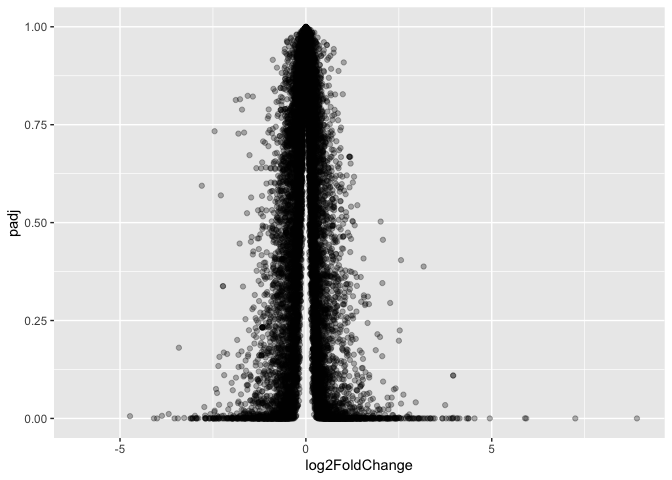
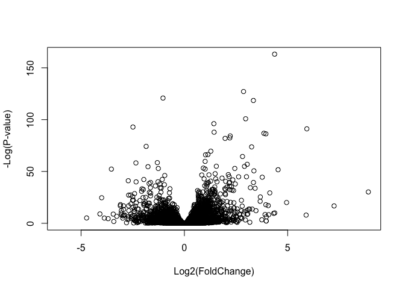
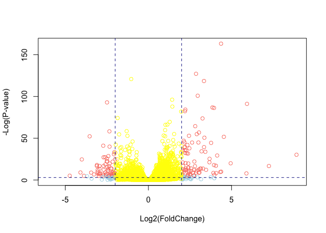
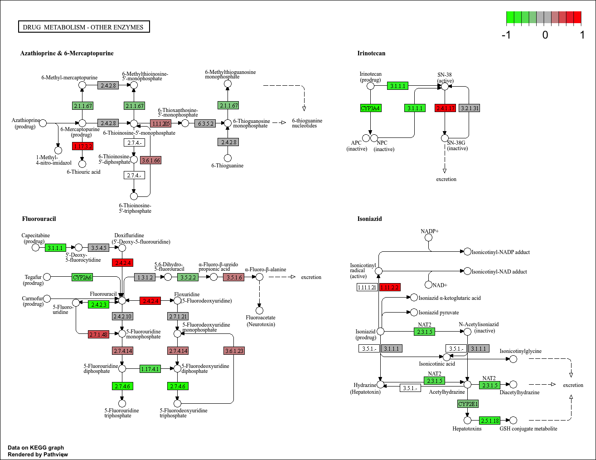

# class 13: RNASeq analysis with DESeq
Sofia Jaravata (A19160915)

- [1. Background](#1-background)
- [3. Data Import: Import countData and
  colData](#3-data-import-import-countdata-and-coldata)
  - [Q1.](#q1)
  - [Q2.](#q2)
- [4. Toy differential gene
  expression](#4-toy-differential-gene-expression)
  - [Q3.](#q3)
  - [Q4.](#q4)
  - [Q5 (a).](#q5-a)
  - [Q5 (b).](#q5-b)
  - [Q6.](#q6)
  - [Q7.](#q7)
  - [Q8.](#q8)
  - [Q9.](#q9)
  - [Q10.](#q10)
- [5. Setting up for DESeq](#5-setting-up-for-deseq)
  - [Importing data](#importing-data)
- [6. Principal Component Analysis
  (PCA)](#6-principal-component-analysis-pca)
- [7. DESeq analysis](#7-deseq-analysis)
  - [Getting results](#getting-results)
- [8. Adding annotation data](#8-adding-annotation-data)
  - [Q11.](#q11)
- [9. Data Visualization](#9-data-visualization)
  - [Volcano Plots](#volcano-plots)
- [10. Pathway analysis](#10-pathway-analysis)
  - [Pathway analysis with R and
    Bioconductor](#pathway-analysis-with-r-and-bioconductor)
    - [Q12.](#q12)
  - [Save our annotated results](#save-our-annotated-results)

# 1. Background

Today we’re going to do an RNA-seq analysis of a data set on the common
glucocorticoid steroid dexamethasone (dex), and we’ll use DESeq for this
analysis.

# 3. Data Import: Import countData and colData

Let’s read the`count` data and `metadata` about this experiment setup
from the supplied CSV files:

``` r
# Complete the missing code
counts <- read.csv("airway_scaledcounts.csv", row.names=1)
metadata <-  read.csv("airway_metadata.csv")
```

Have a wee peek:

``` r
head(counts)
```

                    SRR1039508 SRR1039509 SRR1039512 SRR1039513 SRR1039516
    ENSG00000000003        723        486        904        445       1170
    ENSG00000000005          0          0          0          0          0
    ENSG00000000419        467        523        616        371        582
    ENSG00000000457        347        258        364        237        318
    ENSG00000000460         96         81         73         66        118
    ENSG00000000938          0          0          1          0          2
                    SRR1039517 SRR1039520 SRR1039521
    ENSG00000000003       1097        806        604
    ENSG00000000005          0          0          0
    ENSG00000000419        781        417        509
    ENSG00000000457        447        330        324
    ENSG00000000460         94        102         74
    ENSG00000000938          0          0          0

and the metadata that tells us what is actually in the columns of our
`counts` object:

``` r
head(metadata)
```

              id     dex celltype     geo_id
    1 SRR1039508 control   N61311 GSM1275862
    2 SRR1039509 treated   N61311 GSM1275863
    3 SRR1039512 control  N052611 GSM1275866
    4 SRR1039513 treated  N052611 GSM1275867
    5 SRR1039516 control  N080611 GSM1275870
    6 SRR1039517 treated  N080611 GSM1275871

### Q1.

> How many genes are in this dataset?

``` r
nrow(counts)
```

    [1] 38694

There are 38694 genes are in this dataset.

### Q2.

> How many `control` cell lines do we have?

``` r
table(metadata$dex)
```


    control treated 
          4       4 

There are 4 ‘control’ cell lines.

# 4. Toy differential gene expression

- Find the “control” columns in our `counts` object
- Extract just the “control” column values for all genes
- Calculate the average value per gene in these “control” columns

``` r
control.inds <- metadata$dex == "control"
control.counts <- counts[ ,control.inds]
control.mean <- rowMeans(control.counts)

head(control.mean)
```

    ENSG00000000003 ENSG00000000005 ENSG00000000419 ENSG00000000457 ENSG00000000460 
             900.75            0.00          520.50          339.75           97.25 
    ENSG00000000938 
               0.75 

### Q3.

> How would you make the above code in either approach more robust? Is
> there a function that could help here?

To make the above code more robust, avoid hard-coded column positions or
manual calculations by dynamic column lookups and vectorizations. A
function that could help is `rowSums` or `rowMeans`.

``` r
control.mean <- rowMeans(counts[, metadata$dex == "control"])
treated.mean <- rowMeans(counts[, metadata$dex == "treated"])
```

> Now do the same for the “treated” columns.

``` r
metadata$dex == "treated" 
```

    [1] FALSE  TRUE FALSE  TRUE FALSE  TRUE FALSE  TRUE

### Q4.

> Follow the same procedure for the treated samples (i.e. calculate the
> mean per gene across drug treated samples and assign to a labeled
> vector called treated.mean)

``` r
treated.inds <- metadata$dex == "treated"
treated.counts <- counts[ ,treated.inds]
treated.mean <- rowMeans( treated.counts )
head(treated.mean)
```

    ENSG00000000003 ENSG00000000005 ENSG00000000419 ENSG00000000457 ENSG00000000460 
             658.00            0.00          546.00          316.50           78.75 
    ENSG00000000938 
               0.00 

or:

``` r
treated.mean <- rowMeans( counts[ ,metadata$dex =="treated",] )
head(treated.mean)
```

    ENSG00000000003 ENSG00000000005 ENSG00000000419 ENSG00000000457 ENSG00000000460 
             658.00            0.00          546.00          316.50           78.75 
    ENSG00000000938 
               0.00 

For book-keeping let’s store these together as a new object called
`meancounts`

``` r
meancounts <- data.frame(control.mean, treated.mean)
head(meancounts)
```

                    control.mean treated.mean
    ENSG00000000003       900.75       658.00
    ENSG00000000005         0.00         0.00
    ENSG00000000419       520.50       546.00
    ENSG00000000457       339.75       316.50
    ENSG00000000460        97.25        78.75
    ENSG00000000938         0.75         0.00

### Q5 (a).

> Create a scatter plot showing the mean of the treated samples against
> the mean of the control samples. (Make a plot of `control.mean`
> vs. `treated.mean`)

``` r
plot(meancounts[,1],meancounts[,2], xlab="Control", ylab="Treated")
```


### Q5 (b).

> You could also use the ggplot2 package to make this figure producing
> the plot below. What geom\_?() function would you use for this plot?

I would use the `geom_point()` function for this plot:

``` r
library(ggplot2)
```

    Warning: package 'ggplot2' was built under R version 4.5.2

``` r
ggplot(meancounts, aes(x = control.mean, y = treated.mean)) +
  geom_point(alpha = 0.5)
```


***Our count data is highly skewed and when we see a pattern like this
plot it SCREAMS log transform me!***

### Q6.

> Try plotting both axes on a log scale. What is the argument to plot()
> that allows you to do this?

The argument `log = "xy"` allows us to do this:

``` r
plot(meancounts, log = "xy")
```

    Warning in xy.coords(x, y, xlabel, ylabel, log): 15032 x values <= 0 omitted
    from logarithmic plot

    Warning in xy.coords(x, y, xlabel, ylabel, log): 15281 y values <= 0 omitted
    from logarithmic plot


***We most often used log2 transform this kind of data bioinformatics
because it makes my brain hurt less (makes data interpretation
easier)***

``` r
# Treated / Control

log2(20/20)
```

    [1] 0

``` r
log2(40/20)
```

    [1] 1

``` r
log2(20/40)
```

    [1] -1

``` r
log2(80/20)
```

    [1] 2

We call this little fraction the **“log2 fold change”** as it tells us
how much more or less gene expression we have in units of doubling, etc.

Let’s calculate the log2 fold change for our `treated.mean` and
`control.mean` counts and call this `log2fc`.

``` r
meancounts$log2fc <- log2(meancounts$treated.mean 
                          / meancounts$control.mean)
head(meancounts)
```

                    control.mean treated.mean      log2fc
    ENSG00000000003       900.75       658.00 -0.45303916
    ENSG00000000005         0.00         0.00         NaN
    ENSG00000000419       520.50       546.00  0.06900279
    ENSG00000000457       339.75       316.50 -0.10226805
    ENSG00000000460        97.25        78.75 -0.30441833
    ENSG00000000938         0.75         0.00        -Inf

*A common “rule of thumb” threshold for calling a gene “up regulated” or
“down regulated” is a log2 fold-change value of +2 or -2 (or greater)*

``` r
zero.vals <- which(meancounts[,1:2]==0, arr.ind=TRUE)

to.rm <- unique(zero.vals[,1])
mycounts <- meancounts[-to.rm,]
head(mycounts)
```

                    control.mean treated.mean      log2fc
    ENSG00000000003       900.75       658.00 -0.45303916
    ENSG00000000419       520.50       546.00  0.06900279
    ENSG00000000457       339.75       316.50 -0.10226805
    ENSG00000000460        97.25        78.75 -0.30441833
    ENSG00000000971      5219.00      6687.50  0.35769358
    ENSG00000001036      2327.00      1785.75 -0.38194109

### Q7.

> What is the purpose of the arr.ind argument in the which() function
> call above? Why would we then take the first column of the output and
> need to call the unique() function?

The `arr.ind` argument lets `which()` return both row and column indices
for all zero values. We can then identify which gene rows contain zeros
by taking the first column and using unique() so that the same row is
not counted twice if it has zeros in both samples.

``` r
up.ind <- mycounts$log2fc > 2
down.ind <- mycounts$log2fc < (-2)
```

### Q8.

> Using the up.ind vector above can you determine how many up regulated
> genes we have at the greater than 2 fc level?

``` r
paste("Up:", sum(up.ind))
```

    [1] "Up: 250"

We have 250 up regulated genes

### Q9.

> Using the down.ind vector above can you determine how many down
> regulated genes we have at the greater than 2 fc level?

``` r
paste("Down:", sum(down.ind))
```

    [1] "Down: 367"

We have 367 down regulated genes

### Q10.

> Do you trust these results? Why or why not?

No, I do not trust these results because they are based on raw
fold-change cutoffs only, ignoring variation between replicates,
statistical significance, and that low-count genes can produce
exaggerated fold changes.

# 5. Setting up for DESeq

Let’s do this analyze properly and not forget about the significance of
the differences.

For this we will use the **DESeq2** package

``` r
library(DESeq2)
```

    Warning: package 'DESeq2' was built under R version 4.5.2

    Warning: package 'S4Vectors' was built under R version 4.5.3

    Warning: package 'BiocGenerics' was built under R version 4.5.2

    Warning: package 'IRanges' was built under R version 4.5.2

    Warning: package 'GenomicRanges' was built under R version 4.5.2

    Warning: package 'Seqinfo' was built under R version 4.5.2

    Warning: package 'SummarizedExperiment' was built under R version 4.5.2

    Warning: package 'MatrixGenerics' was built under R version 4.5.2

    Warning: package 'Biobase' was built under R version 4.5.3

To run a DESeq analysis we need at least two inputs:

- `countData` i.e. are gene counts across different experiments
- `colData` i.e. our metadata about those count columns

## Importing data

``` r
dds <- DESeqDataSetFromMatrix(countData = counts, 
                              colData = metadata, 
                              design =~ dex)
```

    converting counts to integer mode

    Warning in DESeqDataSet(se, design = design, ignoreRank): some variables in
    design formula are characters, converting to factors

``` r
dds
```

    class: DESeqDataSet 
    dim: 38694 8 
    metadata(1): version
    assays(1): counts
    rownames(38694): ENSG00000000003 ENSG00000000005 ... ENSG00000283120
      ENSG00000283123
    rowData names(0):
    colnames(8): SRR1039508 SRR1039509 ... SRR1039520 SRR1039521
    colData names(4): id dex celltype geo_id

# 6. Principal Component Analysis (PCA)

``` r
library(DESeq2)

vsd <- vst(dds, blind = FALSE)
pcaData <- plotPCA(vsd, intgroup = "dex", returnData = TRUE)

# Calculate percent variance per PC for the plot axis labelsw
percentVar <- round(100 * attr(pcaData, "percentVar"))

# Build the PCA plot from scratch using the ggplot2 package
library(ggplot2)

ggplot(pcaData, aes(PC1, PC2, color = dex)) +
  geom_point(size = 4) +
  xlab(paste0("PC1: ", percentVar[1], "% variance")) +
  ylab(paste0("PC2: ", percentVar[2], "% variance")) +
  ggtitle("PCA of RNA-seq Samples") +
  theme_minimal()
```


# 7. DESeq analysis

Now we can run the DESeq analysis pipeline using this `dds` object that
has all the inputs we need.

``` r
dds <- DESeq(dds)
```

    estimating size factors

    estimating dispersions

    gene-wise dispersion estimates

    mean-dispersion relationship

    final dispersion estimates

    fitting model and testing

``` r
res <- results(dds)
head(res)
```

    log2 fold change (MLE): dex treated vs control 
    Wald test p-value: dex treated vs control 
    DataFrame with 6 rows and 6 columns
                      baseMean log2FoldChange     lfcSE      stat    pvalue
                     <numeric>      <numeric> <numeric> <numeric> <numeric>
    ENSG00000000003 747.194195      -0.350703  0.168242 -2.084514 0.0371134
    ENSG00000000005   0.000000             NA        NA        NA        NA
    ENSG00000000419 520.134160       0.206107  0.101042  2.039828 0.0413675
    ENSG00000000457 322.664844       0.024527  0.145134  0.168996 0.8658000
    ENSG00000000460  87.682625      -0.147143  0.256995 -0.572550 0.5669497
    ENSG00000000938   0.319167      -1.732289  3.493601 -0.495846 0.6200029
                         padj
                    <numeric>
    ENSG00000000003  0.163017
    ENSG00000000005        NA
    ENSG00000000419  0.175937
    ENSG00000000457  0.961682
    ENSG00000000460  0.815805
    ENSG00000000938        NA

``` r
res05 <- results(dds, alpha=0.05) #
summary(res05)
```


    out of 25258 with nonzero total read count
    adjusted p-value < 0.05
    LFC > 0 (up)       : 1237, 4.9%
    LFC < 0 (down)     : 933, 3.7%
    outliers [1]       : 142, 0.56%
    low counts [2]     : 9033, 36%
    (mean count < 6)
    [1] see 'cooksCutoff' argument of ?results
    [2] see 'independentFiltering' argument of ?results

## Getting results

# 8. Adding annotation data

We need to “map” or “translate” our ENSEMBLE gene identifiers in our
results object to date to the identifiers used in different databases we
want to use for learning more about these genes.

For this we will use a couple of BioConductor packages that we can
install with `BiocManager::install("AnnotationDbi")` and
`BiocManager::install("org.Hs.eg.db")` in console.

``` r
library("AnnotationDbi")
```

    Warning: package 'AnnotationDbi' was built under R version 4.5.2

``` r
library("org.Hs.eg.db")
```

We can see the columns in `org.Hs.eg.db` that list the different
databases we can map between:

``` r
columns(org.Hs.eg.db)
```

     [1] "ACCNUM"       "ALIAS"        "ENSEMBL"      "ENSEMBLPROT"  "ENSEMBLTRANS"
     [6] "ENTREZID"     "ENZYME"       "EVIDENCE"     "EVIDENCEALL"  "GENENAME"    
    [11] "GENETYPE"     "GO"           "GOALL"        "IPI"          "MAP"         
    [16] "OMIM"         "ONTOLOGY"     "ONTOLOGYALL"  "PATH"         "PFAM"        
    [21] "PMID"         "PROSITE"      "REFSEQ"       "SYMBOL"       "UCSCKG"      
    [26] "UNIPROT"     

We can now use the `mapIds()` function to map between these different
database identifier formats:

``` r
res$symbol <- mapIds(org.Hs.eg.db,
              keys=row.names(res), # Our genenames
              keytype="ENSEMBL",        # The format of our genenames
              column="SYMBOL",
              multiVals = "first")
```

    'select()' returned 1:many mapping between keys and columns

``` r
head(res)
```

    log2 fold change (MLE): dex treated vs control 
    Wald test p-value: dex treated vs control 
    DataFrame with 6 rows and 7 columns
                      baseMean log2FoldChange     lfcSE      stat    pvalue
                     <numeric>      <numeric> <numeric> <numeric> <numeric>
    ENSG00000000003 747.194195      -0.350703  0.168242 -2.084514 0.0371134
    ENSG00000000005   0.000000             NA        NA        NA        NA
    ENSG00000000419 520.134160       0.206107  0.101042  2.039828 0.0413675
    ENSG00000000457 322.664844       0.024527  0.145134  0.168996 0.8658000
    ENSG00000000460  87.682625      -0.147143  0.256995 -0.572550 0.5669497
    ENSG00000000938   0.319167      -1.732289  3.493601 -0.495846 0.6200029
                         padj      symbol
                    <numeric> <character>
    ENSG00000000003  0.163017      TSPAN6
    ENSG00000000005        NA        TNMD
    ENSG00000000419  0.175937        DPM1
    ENSG00000000457  0.961682       SCYL3
    ENSG00000000460  0.815805       FIRRM
    ENSG00000000938        NA         FGR

### Q11.

> Run the mapIds() function two more times to add the Entrez ID and
> UniProt accession and GENENAME as new columns called
> res$entrez, res$uniprot and res\$genename.

> Q. Can you add “GENENAME” and add as a new “column” to our `res`
> object?

``` r
res$genename <- mapIds(org.Hs.eg.db,
                     keys=row.names(res),
                     column="GENENAME",
                     keytype="ENSEMBL",
                     multiVals="first")
```

    'select()' returned 1:many mapping between keys and columns

> Q. Add “ENTREZID” as `res$entrez`

``` r
res$entrez <- mapIds(org.Hs.eg.db,
                     keys=row.names(res),
                     column="ENTREZID",
                     keytype="ENSEMBL",
                     multiVals="first")
```

    'select()' returned 1:many mapping between keys and columns

``` r
head(res)
```

    log2 fold change (MLE): dex treated vs control 
    Wald test p-value: dex treated vs control 
    DataFrame with 6 rows and 9 columns
                      baseMean log2FoldChange     lfcSE      stat    pvalue
                     <numeric>      <numeric> <numeric> <numeric> <numeric>
    ENSG00000000003 747.194195      -0.350703  0.168242 -2.084514 0.0371134
    ENSG00000000005   0.000000             NA        NA        NA        NA
    ENSG00000000419 520.134160       0.206107  0.101042  2.039828 0.0413675
    ENSG00000000457 322.664844       0.024527  0.145134  0.168996 0.8658000
    ENSG00000000460  87.682625      -0.147143  0.256995 -0.572550 0.5669497
    ENSG00000000938   0.319167      -1.732289  3.493601 -0.495846 0.6200029
                         padj      symbol               genename      entrez
                    <numeric> <character>            <character> <character>
    ENSG00000000003  0.163017      TSPAN6          tetraspanin 6        7105
    ENSG00000000005        NA        TNMD            tenomodulin       64102
    ENSG00000000419  0.175937        DPM1 dolichyl-phosphate m..        8813
    ENSG00000000457  0.961682       SCYL3 SCY1 like pseudokina..       57147
    ENSG00000000460  0.815805       FIRRM FIGNL1 interacting r..       55732
    ENSG00000000938        NA         FGR FGR proto-oncogene, ..        2268

# 9. Data Visualization

## Volcano Plots

This is a ubiquitous and common visualization for this type of data that
puts the log2 foldchange and the adjusted p-value together in one plot
that people can get insight for what is going on in the whole data set
results

``` r
library(ggplot2)
```

``` r
ggplot(res)+
  aes(log2FoldChange, padj) +
  geom_point(alpha = 0.3)
```

    Warning: Removed 23549 rows containing missing values or values outside the scale range
    (`geom_point()`).



That plot is not very useful because we don’t care about genes with high
p-values, we want the very low values below our alpha threshold
(e.g. 0.01)

Let’s log the y-axis so we can see these genes/points more clearly

``` r
ggplot(res)+
  aes(log2FoldChange, log(padj)) + 
  geom_point(alpha = 0.3)
```

    Warning: Removed 23549 rows containing missing values or values outside the scale range
    (`geom_point()`).


``` r
plot_log2 <- plot( res$log2FoldChange,  -log(res$padj), 
      xlab="Log2(FoldChange)",
      ylab="-Log(P-value)")
```



> Q. Add annotation to this volcano plot inlcuding the log2fold-change
> thresholds of +2 and -2 and the p-value threshold of 0.05. Also color
> up just the genes that meet both these thresholds. These are the ones
> we will focus on next day!

``` r
mycols <- rep("yellow", nrow(res))
mycols[ abs(res$log2FoldChange) > 2 ]  <- "lightblue" 

inds <- (res$padj < 0.01) & (abs(res$log2FoldChange) > 2 )
mycols[ inds ] <- "salmon"

plot( res$log2FoldChange,  -log(res$padj), 
      col = mycols, 
      ylab="-Log(P-value)", 
      xlab="Log2(FoldChange)")

# Add some cut-off lines
abline(v=c(-2,2), col= "darkblue", lty=2)
abline(h=-log(0.05), col="darkblue", lty=2)
```



``` r
write.csv(res, file = "myresults.csv")
```

# 10. Pathway analysis

## Pathway analysis with R and Bioconductor

We have our annotated results with their log2 fold-change and p-vales we
can figure out which biological pathways and process these genes are
involved with.

We will use the **gage** and **pathview** packages for this step and we
can install them with:
`BiocManager::install( c("pathview", "gage", "gageData") )` in the
console.

``` r
library(gage)
```

    Warning: package 'gage' was built under R version 4.5.2

``` r
library(gageData)
library(pathview)
```

    Warning: package 'pathview' was built under R version 4.5.2

``` r
data(kegg.sets.hs)
```

We need a vector of importance (e.g. fold-change values) that has gene
ids as names. These names need to be in the correct format (using the
correct database format for the IDs).

We will make a wee input vector called `foldchanges` that has “entrez”
ids as names.

``` r
foldchanges <- res$log2FoldChange
names(foldchanges) <- res$entrez
```

Now we can run `gage()` to do our pathway analysis.

``` r
keggres = gage(foldchanges, gsets=kegg.sets.hs)
```

``` r
attributes(keggres)
```

    $names
    [1] "greater" "less"    "stats"  

The top 3 overlapping pathway from KEGG

``` r
head(keggres$less, 3)
```

                                          p.geomean stat.mean        p.val
    hsa05332 Graft-versus-host disease 0.0004250607 -3.473335 0.0004250607
    hsa04940 Type I diabetes mellitus  0.0017820379 -3.002350 0.0017820379
    hsa05310 Asthma                    0.0020046180 -3.009045 0.0020046180
                                            q.val set.size         exp1
    hsa05332 Graft-versus-host disease 0.09053792       40 0.0004250607
    hsa04940 Type I diabetes mellitus  0.14232788       42 0.0017820379
    hsa05310 Asthma                    0.14232788       29 0.0020046180

Now we can use the **pathview** package with the found KEGG pathway IDs
(e.g. “hsa05310” for the Asthma pathway) to make a pathway figure
showing our Differential Expressed Genes (DEGs)

``` r
pathview(gene.data=foldchanges, pathway.id="hsa05310")
```

    'select()' returned 1:1 mapping between keys and columns

    Info: Working in directory /Users/sofiajaravata/Desktop/bimm143/bimm143_github/class13

    Info: Writing image file hsa05310.pathview.png


``` r
write.csv(res, file = "myresults_annotated.csv")
```

### Q12.

> Can you do the same procedure as above to plot the pathview figures
> for the top 2 down-reguled pathways?

``` r
down_paths <- rownames(keggres$less)[1:2]

down_ids <- substr(down_paths, start = 1, stop = 8)

pathview(gene.data = foldchanges,
         pathway.id = down_ids,
         species = "hsa")

down_paths
```

    [1] "hsa05332 Graft-versus-host disease" "hsa04940 Type I diabetes mellitus" 

``` r
down_ids
```

    [1] "hsa05332" "hsa04940"

``` r
pathview(gene.data=foldchanges, pathway.id="hsa00232")
```

    'select()' returned 1:1 mapping between keys and columns

    Info: Working in directory /Users/sofiajaravata/Desktop/bimm143/bimm143_github/class13

    Info: Writing image file hsa00232.pathview.png


``` r
write.csv(res, file = "myresults_down232.csv")
```

``` r
pathview(gene.data=foldchanges, pathway.id="hsa00983")
```

    'select()' returned 1:1 mapping between keys and columns

    Info: Working in directory /Users/sofiajaravata/Desktop/bimm143/bimm143_github/class13

    Info: Writing image file hsa00983.pathview.png



## Save our annotated results

``` r
write.csv(res, file = "myresults_down983.csv")
```
